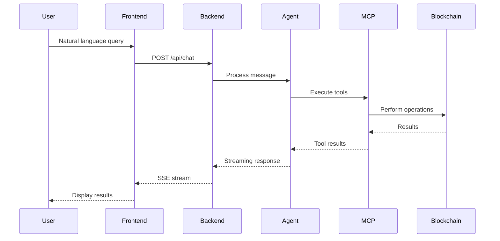

# Aomi Product - Project Index & Roadmap Foundation

## 📋 Executive Summary

**Product Name**: Forge MCP Backend (Aomi)
**Type**: AI-powered blockchain assistant with multi-chain EVM support
**Core Value**: Natural language interface for Web3 operations via Claude AI
**Tech Stack**: Rust (backend), Next.js 15 (frontend), MCP Protocol, Claude API

## 🏗️ System Architecture

### High-Level Components

```
┌─────────────────┐    ┌─────────────────┐    ┌─────────────────┐
│   Next.js Web   │    │  Rust Backend   │    │   MCP Server    │
│    Frontend     │◄──►│     API         │◄──►│   (Tools)       │
└─────────────────┘    └─────────────────┘    └─────────────────┘
         │                      │                       │
         ▼                      ▼                       ▼
┌─────────────────┐    ┌─────────────────┐    ┌─────────────────┐
│  Wallet Mgmt    │    │  Session Mgmt   │    │   Blockchain    │
│   (wagmi)       │    │   & Agent       │    │   Networks      │
└─────────────────┘    └─────────────────┘    └─────────────────┘
```

## 📦 Core Components Breakdown

### 1. **Agent System** (`chatbot/crates/agent/`)
- **Purpose**: Core AI intelligence and conversation handling
- **Key Files**:
  - `agent.rs`: Main agent orchestration
  - `completion.rs`: Claude API streaming
  - `tool_scheduler.rs`: Tool execution coordination
  - `wallet.rs`: Wallet management
  - `accounts.rs`: Account context generation
- **Dependencies**: Anthropic Claude API (claude-sonnet-4)
- **Features**:
  - Multi-turn conversation with context preservation
  - Tool orchestration for blockchain operations
  - Streaming responses via SSE

### 2. **MCP Server** (`chatbot/crates/mcp/`)
- **Purpose**: Model Context Protocol server for blockchain tools
- **Key Tools**:
  - `cast.rs`: Foundry Cast integration (blockchain operations)
  - `etherscan.rs`: Contract ABI retrieval
  - `zerox.rs`: Token swap quotes via 0x Protocol
  - `brave_search.rs`: Web search capabilities
  - `combined_tool.rs`: Tool orchestration layer
- **Networks Supported**: Ethereum, Polygon, Base, Arbitrum (configurable)
- **Port**: 5000 (dev), 5001 (prod)

### 3. **Web Backend** (`chatbot/bin/backend/`)
- **Purpose**: REST API and session management
- **Architecture**:
  - `main.rs`: Server initialization
  - `endpoint.rs`: HTTP route handlers
  - `session.rs`: Session state management
  - `manager.rs`: Session lifecycle
  - `history.rs`: Conversation history tracking
- **Key Endpoints**:
  - `POST /api/chat`: Send message
  - `GET /api/chat/stream`: SSE streaming
  - `GET /api/state`: Session state
  - `POST /api/interrupt`: Stop operations
- **Port**: 8080 (dev), 8081 (prod)

### 4. **Frontend** (`frontend/`)
- **Framework**: Next.js 15 with Turbopack
- **Key Components**:
  - `chat-container.tsx`: Main chat interface
  - `message.tsx`: Message rendering with markdown
  - `terminal-input.tsx`: Command input
  - `wallet-manager.ts`: Web3 wallet integration
  - `chat-manager.ts`: Chat state management
- **Libraries**:
  - wagmi + viem: Ethereum wallet connection
  - react-markdown: Message formatting
  - TanStack Query: Data fetching
  - Tailwind CSS: Styling

### 5. **RAG System** (`chatbot/crates/rag/`)
- **Purpose**: Document retrieval for Uniswap protocol knowledge
- **Features**:
  - Vector embeddings for semantic search
  - In-memory document store
  - Contextual documentation retrieval
- **Documents**: Uniswap V2/V3 protocol documentation

## 🛠️ Technology Stack

### Backend
- **Language**: Rust (Edition 2024, requires nightly)
- **Framework**: Axum (web server)
- **Async Runtime**: Tokio
- **Blockchain**: Alloy (Ethereum library)
- **AI**: Rig (LLM orchestration)
- **Protocol**: MCP (Model Context Protocol)

### Frontend
- **Framework**: Next.js 15.5.3
- **Language**: TypeScript 5
- **UI Library**: React 18.3
- **Styling**: Tailwind CSS 3.4
- **Web3**: wagmi 2.16 + viem 2.37
- **State**: TanStack Query 5.87

### Infrastructure
- **Container**: Docker (multi-stage builds)
- **Blockchain**: Anvil (local testnet)
- **Configuration**: Python-based YAML loader
- **CI/CD**: GitHub Actions + Container Registry

## 🚀 Current Features

### Implemented
✅ Natural language to blockchain operations
✅ Multi-network support (Ethereum, Polygon, Base, Arbitrum)
✅ Token transfers and balance queries
✅ Contract interaction (read/write)
✅ ABI retrieval from Etherscan
✅ Token swap quotes (0x Protocol)
✅ Web search integration (Brave)
✅ Uniswap V2/V3 documentation RAG
✅ Real-time streaming responses
✅ Session management (30-min timeout)
✅ Docker deployment ready

### API Integrations
- ✅ Anthropic Claude (required)
- ✅ Brave Search API (optional)
- ✅ Etherscan API (optional)
- ✅ 0x Protocol API (optional)
- ✅ Alchemy RPC (optional)

## 🎯 Use Cases

### Current Capabilities
1. **Token Operations**
   - Send tokens between addresses
   - Check balances
   - Get swap quotes

2. **Contract Interactions**
   - Deploy contracts
   - Call contract functions
   - Retrieve contract ABIs

3. **Protocol Information**
   - Uniswap V2/V3 documentation
   - Slippage calculations
   - Protocol explanations

4. **Network Management**
   - Switch between networks
   - Gas price queries
   - Transaction status

## 📊 System Requirements

### Development
- Rust nightly (for edition 2024)
- Node.js 20+
- Python 3.8+ (configuration)
- 8GB RAM minimum
- 2GB disk space

### Production
- Docker 24+
- 4GB RAM minimum
- External access for port 3000
- SSL/TLS certificates (recommended)

## 🔄 Data Flow



## 🐛 Known Issues & TODOs

### Code TODOs
- `cast.rs`: Refactor repeated params code into helper function
- `cast.rs`: Add block parameter support for code/codesize queries
- `session.rs`: Eventually migrate to AomiApp structure

### Potential Improvements
- [ ] Health monitoring endpoints
- [ ] Metrics collection (Prometheus)
- [ ] Persistent conversation history
- [ ] Multi-modal support (images/files)
- [ ] Mobile app development
- [ ] Plugin/extension system
- [ ] Advanced DeFi strategies
- [ ] Portfolio analytics dashboard

## 🚦 Deployment Status

### Environments
- **Development**: Local setup with hot reload
- **Production**: Docker containerized deployment
- **CI/CD**: GitHub Actions with automatic image builds

### Configuration Files
- `.env.template`: Environment variable template
- `config.yaml`: Service configuration
- `docker-compose.yml`: Container orchestration
- `Dockerfile`: Multi-stage build configuration

## 📈 Product Roadmap Considerations

### Phase 1 - Foundation (Current)
- ✅ Core blockchain operations
- ✅ Multi-network support
- ✅ Basic Web3 interactions
- ✅ Documentation RAG

### Phase 2 - Enhancement (Next)
- [ ] Persistent user sessions
- [ ] Transaction history
- [ ] Advanced swap routing
- [ ] Gas optimization
- [ ] Batch operations

### Phase 3 - Expansion
- [ ] Mobile application
- [ ] Browser extension
- [ ] Custom strategy builder
- [ ] Social features
- [ ] NFT support

### Phase 4 - Enterprise
- [ ] Multi-user management
- [ ] Role-based access
- [ ] Audit logging
- [ ] Compliance tools
- [ ] API marketplace

## 🔗 Key Dependencies

### Critical (Required)
- Anthropic API key
- Rust nightly compiler
- Node.js runtime
- Docker (for production)

### Optional (Enhanced Features)
- Brave Search API
- Etherscan API
- 0x Protocol API
- Alchemy/Infura RPC

## 📝 Notes for Product Planning

1. **Unique Selling Points**:
   - Natural language interface for complex blockchain operations
   - Multi-chain support out of the box
   - Integrated documentation search
   - Real-time streaming responses

2. **Target Audience**:
   - DeFi users wanting simpler interactions
   - Developers needing quick blockchain operations
   - Traders requiring multi-chain access
   - Teams needing collaborative Web3 tools

3. **Monetization Opportunities**:
   - Premium API keys for enhanced features
   - Enterprise deployment licenses
   - Custom tool development
   - Training data licensing
   - Transaction fee sharing

4. **Competitive Advantages**:
   - Open-source foundation
   - Modular architecture
   - Docker-ready deployment
   - Extensive blockchain tool integration
   - Claude AI's advanced capabilities

---

*This index provides a comprehensive overview of the Aomi product architecture and serves as a foundation for product roadmap development.*