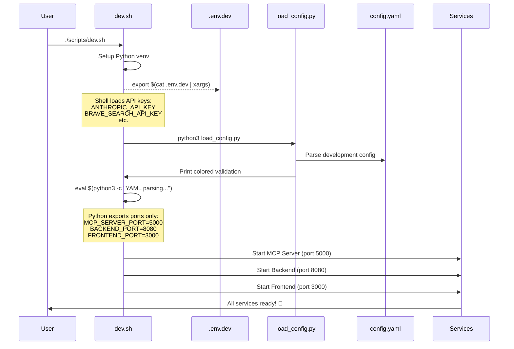

# forge-mcp ≽^•⩊•^≼

Agentic EVM operator with MCP (Model Context Protocol) integration.

## 🚀 Quick Start

### Development Mode
```bash
# 1. Setup environment
cp .env.template .env.dev
# Edit .env.dev and add your API keys

# 2. Start development services  
./scripts/dev.sh
```

### Production Mode
```bash
# 1. Setup environment
cp .env.template .env.prod
# Edit .env.prod and add your API keys

# 2. Start production services
./scripts/prod.sh
```

That's it! The scripts automatically:
- Check if Anvil is running (start it if needed)
- Start all services with proper configurations
- Open your browser to the chat interface

## 📋 Prerequisites

- **Rust** (latest stable)
- **Node.js** (for frontend)
- **Foundry** (for Anvil)

## 🔧 Configuration

The configuration system uses Python for reliable YAML parsing and environment management:



**Key Files:**
- **`.env.dev`** / **`.env.prod`** - API keys per environment
- **`config.yaml`** - Ports and settings per environment  
- **`scripts/load_config.py`** - Python configuration loader
- **`dev.sh`** / **`prod.sh`** - Environment-specific entry points

## 🔑 Required API Keys

Add these to your `.env.dev` or `.env.prod` file:

- **ANTHROPIC_API_KEY** (required) - Get from [console.anthropic.com](https://console.anthropic.com/)
- **BRAVE_SEARCH_API_KEY** (optional) - Web search
- **ETHERSCAN_API_KEY** (optional) - Blockchain data  
- **ZEROX_API_KEY** (optional) - Token swaps

## 🌍 Environment Differences

| Aspect | Development | Production |
|--------|-------------|------------|
| **Ports** | MCP:5000, Backend:8080, Frontend:3000 | MCP:5001, Backend:8081, Frontend:3001 |
| **Hosts** | localhost/127.0.0.1 | 0.0.0.0 (external access) |
| **Build** | Debug builds, faster startup | Release builds, optimized |
| **Features** | --no-docs for speed | Full features enabled |
| **Frontend** | Dev server | Built + preview mode |

## 🧪 Test the Agent

Once running, try these examples:

```
> send 1 ETH from Alice to Bob
> How much USDC does Alice have?
> Is Uniswap V2 Router deployed?
> What's the difference between exactInput and exactOutput?
```

## 🗂️ Project Structure

```
forge-mcp/
├── config.yaml           # Environment-specific configurations
├── .env.template          # Template for environment files
├── scripts/
│   ├── dev.sh            # Development entry point
│   ├── prod.sh           # Production entry point
│   └── load_config.py    # Python configuration loader
├── chatbot/              # Core Rust application
│   ├── bin/
│   │   ├── backend/      # HTTP API server  
│   │   └── tui/          # Chat-style terminal UI
│   └── crates/
│       ├── agent/        # Core rig agent
│       ├── mcp-server/   # MCP server with Cast tools
│       └── rag/          # Vector embeddings
├── aomi-landing/         # Web frontend
└── documents/            # Uniswap documentation
```

## 📖 Documentation

See the comprehensive setup guide: [chatbot/README.md](chatbot/README.md)

## 🐳 Docker & CI/CD

Coming soon - Docker configurations and CI/CD pipelines will be updated for the new environment structure.