# Aomi Terminal

AI-powered blockchain assistant with multi-chain EVM support, enabling natural language interactions for Web3 operations. Built with Rust microservices, Next.js frontend, and Model Context Protocol (MCP) server.

## 🏗️ Architecture Overview

```
┌─────────────────┐    ┌─────────────────┐    ┌─────────────────┐
│   Next.js Web   │    │  Rust Backend   │    │   MCP Server    │
│    Frontend     │◄──►│     API         │◄──►│   (Tools)       │
└─────────────────┘    └─────────────────┘    └─────────────────┘
                                │                       │
                                ▼                       ▼
┌─────────────────┐    ┌─────────────────┐    ┌─────────────────┐
│   Claude API    │    │  Session Mgmt   │    │   Anvil/RPC     │
│   (Anthropic)   │◄──►│   & Agent       │    │   Networks      │
└─────────────────┘    └─────────────────┘    └─────────────────┘
```


### Core Components

#### 🎯 **Agent System** (`aomi/crates/agent/`)
- **Anthropic Claude Integration**: Powers natural language understanding and blockchain operation planning
- **Session Management**: Handles multi-turn conversations with context preservation
- **Tool Orchestration**: Coordinates between various blockchain tools and external APIs
- **Document RAG**: Uniswap documentation search and retrieval for accurate protocol information

#### 🔧 **MCP Server** (`aomi/crates/mcp/`)
- **Cast Integration**: Direct Foundry tool integration for blockchain operations
- **Multi-Network Support**: Ethereum, Polygon, Base, Arbitrum with configurable RPC endpoints
- **External APIs**:
  - **0x Protocol**: Token swap quotes and execution
  - **Etherscan**: Contract ABI retrieval and verification
  - **Brave Search**: Web search for real-time blockchain information
- **Tool Composition**: Combines multiple tools for complex operations

#### 🌐 **Web Backend** (`aomi/bin/backend/`)
- **Modular Architecture**: Separated into `session.rs`, `manager.rs`, and `endpoint.rs`
- **Real-time Communication**: Server-Sent Events (SSE) for streaming responses
- **Session Management**: Multi-user support with automatic cleanup
- **CORS-enabled API**: REST endpoints for all frontend interactions

#### 🖥️ **Frontend** (`frontend/`)
- **Next.js 15**: Modern React framework with Turbopack for fast development
- **Wallet Integration**: wagmi + viem for Ethereum wallet connections
- **Real-time Chat**: Streaming responses with markdown support
- **Network Switching**: Dynamic network selection and configuration

#### 📚 **RAG System** (`aomi/crates/rag/`)
- **Vector Embeddings**: Document chunking and semantic search
- **In-Memory Store**: Fast document retrieval for Uniswap protocol information
- **Contextual Search**: Finds relevant documentation based on user queries

## 🚀 Quick Start

### Prerequisites
- **Rust** (nightly required for edition 2024)
- **Node.js** 20+
- **Python** 3.8+ (for configuration scripts)
- **Docker** & **Docker Compose** (for containerized deployment)
- **Foundry** (for Anvil local blockchain)
- **API Keys**: Anthropic Claude (required), Brave Search, Etherscan, Alchemy (recommended)

### 🏃‍♂️ One-Command Setup

**Development:**
```bash
cp .env.template .env.dev
# Edit .env.dev with your API keys
./scripts/dev.sh
```

**Production (Docker):**
```bash
cp .env.template .env.prod
# Edit .env.prod with your API keys
./scripts/compose-backend-prod.sh latest
```

The scripts automatically:
- Check if Anvil is running (start if needed)
- Start all services with proper configurations
- Open your browser to the chat interface

## 🐳 Docker Workflows

### Local development (release parity)
- Copy `.env.template` to `.env.prod` and populate keys.
- Build monolithic stack locally: `./scripts/compose-build-monolithic.sh`
- Or use pre-built images from GitHub Container Registry:
  ```bash
  export IMAGE_TAG=latest
  docker compose -f docker/docker-compose-backend.yml up -d
  ```
- Services available at:
  - Frontend: `http://localhost:3000`
  - Backend API: `http://localhost:8081`
  - MCP Server: `http://localhost:5001`
  - Anvil RPC: `http://localhost:8545`

> ℹ️ All Docker builds use Rust nightly for edition 2024 support. For development with hot reload, use `scripts/dev.sh` instead of Docker.

### Production Deployment
- Build individual images locally:
  - `docker build --target backend-runtime -t forge-mcp/backend .`
  - `docker build --target mcp-runtime -t forge-mcp/mcp .`
  - `docker build --target frontend-runtime -t forge-mcp/frontend .`
- Run the full production stack: `docker compose up --build -d` (uses `.env.prod`).
- Generate network configuration for MCP: `export CHAIN_NETWORK_URLS_JSON="$(python3 scripts/load_config.py prod --network-urls-only)"`.
- **Cloud Deployment**: Images are automatically built and pushed to GitHub Container Registry on every commit
- **DigitalOcean/AWS/GCP**: Use the pre-built images from `ghcr.io/[your-org]/forge-mcp-backend/[service]:latest`
- **Detailed deployment guide**: See [docker/DEPLOYMENT.md](docker/DEPLOYMENT.md)

## 🔧 Configuration System

The platform uses a Python-based configuration system for reliable YAML parsing:

```mermaid
sequenceDiagram
    participant User
    participant Script
    participant Config
    participant Docker
    participant Services

    User->>Script: ./scripts/dev.sh or compose-backend-prod.sh
    Script->>Config: Load .env.dev/.env.prod
    Script->>Config: python3 configure.py [env]
    Config-->>Script: Validate keys & generate network URLs
    Script->>Docker: Start containers (or native processes)
    Docker->>Services: Launch Backend, MCP, Frontend, Anvil
    Services-->>User: All services ready! 🎉
```



### Manual Setup (If Preferred)

1. **Environment Configuration:**
   ```bash
   cp .env.template .env.dev
   # Edit with your API keys (minimum: ANTHROPIC_API_KEY)
   ```

2. **Start Blockchain Network:**
   ```bash
   # Local testnet forked from Ethereum mainnet
   anvil --fork-url https://eth-mainnet.public.blastapi.io@22419684
   ```

3. **Launch MCP Server:**
   ```bash
   cd aomi
   cargo run -p aomi-mcp
   ```

4. **Start Backend API:**
   ```bash
   cargo run -p backend -- --no-docs  # Skip docs loading for faster startup
   # Or with docs: cargo run -p backend
   ```

5. **Launch Frontend:**
   ```bash
   cd ../frontend
   npm install
   npm run dev
   ```

Access the application at `http://localhost:3000`

### Git Hooks Setup

To ensure code quality and consistency across the team, set up git hooks that automatically check code formatting and linting before commits:

```bash
./scripts/setup-hooks.sh
```

This configures your local git to run the following checks before each commit:
- **cargo fmt**: Ensures code is properly formatted
- **cargo clippy**: Catches common mistakes and enforces best practices

If checks fail, the commit will be blocked until issues are resolved. To bypass hooks temporarily (not recommended):
```bash
git commit --no-verify
```

## 🔑 Environment Variables

### Required
```bash
ANTHROPIC_API_KEY=sk-ant-api03-your-key-here
BACKEND_API_KEYS=key1,key2:l2beat,key3:default|l2beat
```

### Optional (Enhanced Features)
```bash
# Web search capabilities
BRAVE_SEARCH_API_KEY=your_brave_key

# Contract ABI retrieval
ETHERSCAN_API_KEY=your_etherscan_key

# Token swap functionality
ZEROX_API_KEY=your_0x_key

# Additional networks
MAINNET_RPC_URL=https://eth-mainnet.g.alchemy.com/v2/your-key
BASE_RPC_URL=https://base-mainnet.g.alchemy.com/v2/your-key
ARBITRUM_RPC_URL=https://arb-mainnet.g.alchemy.com/v2/your-key
```

## 🌍 Environment Differences

| Aspect | Development | Production |
|--------|-------------|------------|
| **Ports** | MCP:5000, Backend:8080, Frontend:3000, Anvil:8545 | MCP:5001, Backend:8081, Frontend:3000, Anvil:8545 |
| **Hosts** | 127.0.0.1 (localhost only) | 0.0.0.0 (external access) |
| **Build** | Debug builds, hot reload | Release builds, optimized |
| **Rust Edition** | 2024 (requires nightly) | 2024 (nightly in Docker) |
| **Frontend** | Next.js dev server | Next.js standalone build |
| **Configuration** | config.yaml + .env.dev | config.yaml + .env.prod |

## 🎮 Usage Examples

### Basic Operations
```
> send 1 ETH from Alice to Bob
> How much USDC does Alice have?
> What's my ETH balance?
```

### Contract Interactions
```
> Is Uniswap V2 Router deployed on mainnet?
> Call balanceOf on USDC contract for Alice
> Get the ABI for contract 0x7a250d5630B4cF539739dF2C5dAcb4c659F2488D
```

### Protocol Information
```
> How do I calculate slippage for Uniswap V3?
> What's the difference between exactInput and exactOutput?
> Show me the SwapRouter contract interface
```

### Network Operations
```
> Switch to Polygon network
> What's the current gas price on Arbitrum?
> Deploy a simple contract on testnet
```

## 📡 API Reference

### Core Endpoints
- `POST /api/chat` - Send message to agent
- `GET /api/state` - Get current session state
- `GET /api/chat/stream` - Real-time response streaming
- `POST /api/interrupt` - Stop current operation
- `POST /api/system` - Send system messages
- `POST /api/mcp-command` - Execute MCP commands

### Session Management
- Sessions are automatically created and managed
- 30-minute timeout with automatic cleanup
- Multi-user support with session isolation

## 🛠️ Development

### Project Structure
```
forge-mcp/
├── config.yaml              # Environment-specific configurations
├── .env.template            # Template for environment files
├── scripts/
│   ├── dev.sh              # Development entry point
│   ├── prod.sh             # Production entry point
│   └── load_config.py      # Python configuration loader
├── aomi/                # Rust workspace
│   ├── bin/
│   │   ├── backend/        # Web API server
│   │   │   ├── src/session.rs  # Session state management
│   │   │   ├── src/manager.rs  # Session lifecycle management
│   │   │   └── src/endpoint.rs # HTTP endpoints
│   │   └── tui/            # Terminal UI (experimental)
│   ├── crates/
│   │   ├── agent/          # Claude agent & conversation handling
│   │   ├── mcp/            # MCP server with blockchain tools
│   │   └── rag/            # Document search & embeddings
├── docker/                 # Docker configurations
│   ├── docker-compose-backend.yml
│   ├── docker-compose-monolithic.yml
│   ├── entrypoints/        # Container entry scripts
│   └── nginx/              # NGINX reverse proxy setup
├── frontend/               # Next.js 15 web application
├── scripts/                # Automation scripts
└── documents/              # Uniswap documentation for RAG
```

### Adding New Networks
1. Add RPC URL to `.env` file
2. Update network configuration in `config.yaml`
3. Networks are automatically available to the agent

### Adding New Tools
1. Implement tool in `aomi/crates/mcp/src/`
2. Add to `CombinedTool` in `combined_tool.rs`
3. Tools are automatically discovered by the agent

## 🔍 Advanced Features

### Document RAG
- **Uniswap Documentation**: Automatically indexed protocol documentation
- **Semantic Search**: Context-aware document retrieval
- **Skip Loading**: Use `--no-docs` flag for faster startup during development

### Multi-Network Support
- **Dynamic Switching**: Change networks mid-conversation
- **State Preservation**: Wallet addresses persist across networks
- **Configurable RPCs**: Support for any EVM-compatible network

### Real-time Streaming
- **Server-Sent Events**: Live response streaming to frontend
- **Tool Execution Visibility**: See exactly what tools are being called
- **Interruption Support**: Stop long-running operations

## 🐛 Troubleshooting

### Common Issues

**MCP Server Connection Failed:**
```bash
# Check if MCP server is running
curl http://localhost:5000/health

# Restart with verbose logging
RUST_LOG=debug cargo run -p aomi-mcp
```

**Agent Timeout:**
```bash
# Verify Anthropic API key
echo $ANTHROPIC_API_KEY

# Check network connectivity
curl -H "x-api-key: $ANTHROPIC_API_KEY" https://api.anthropic.com/v1/messages
```

**Anvil Connection Issues:**
```bash
# Restart Anvil with correct fork
anvil --fork-url https://eth-mainnet.public.blastapi.io@22419684 --host 0.0.0.0
```

### Performance Optimization

**Fast Startup:**
```bash
# Skip document loading
cargo run -p backend -- --no-docs

# Use development build
cargo run (instead of cargo run --release)
```

**Memory Usage:**
- Document loading uses ~100MB RAM
- Each session uses ~10MB RAM
- Sessions auto-cleanup after 30 minutes

## 🚧 Future Enhancements

### Planned Features
- **Multi-Modal Support**: Image and file upload capabilities
- **Portfolio Analytics**: DeFi position tracking and analysis
- **Advanced Strategies**: Automated yield farming and arbitrage
- **Mobile Support**: React Native companion app
- **Plugin System**: Community-contributed tools and integrations

### Technical Improvements
- **Health Monitoring**: Comprehensive service health checks
- **Metrics & Observability**: Prometheus/Grafana integration
- **Docker Support**: Containerized deployment
- **Conversation History**: Persistent chat history with search
- **Multi-Language Support**: Internationalization framework

## 🤝 Contributing

We welcome contributions! Please see our contributing guidelines for details on:
- Code standards and formatting
- Testing requirements
- Documentation expectations
- Pull request process

## 📄 License

This project is licensed under the MIT License - see the LICENSE file for details.

## 🙏 Acknowledgments

- **Anthropic** - Claude API for natural language processing
- **Foundry** - Ethereum development framework
- **0x Protocol** - Decentralized exchange infrastructure
- **Brave Search** - Privacy-focused search API
- **Uniswap** - Decentralized trading protocol documentation
