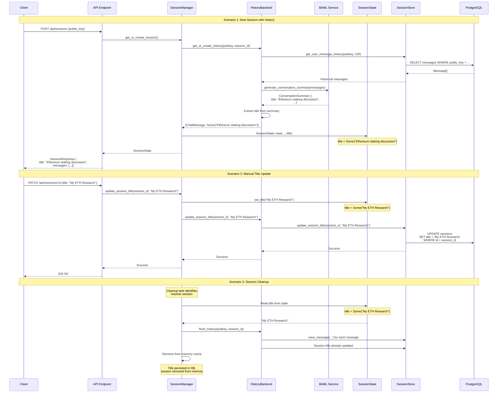
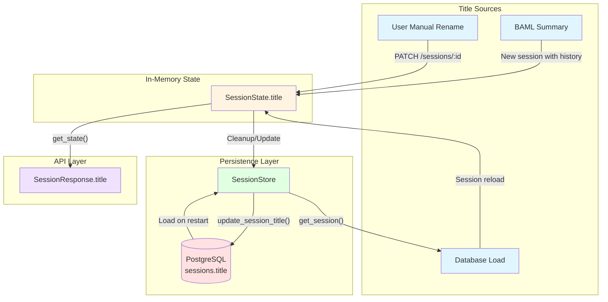

# Implementation Plan: Add Title to SessionState

## Overview
Add a `title` field to `SessionState<S>` that:
- Initially is `None` when session is created
- Gets populated from BAML's conversation summary (the `title` field from `ConversationSummary`)
- Persists to the database `sessions.title` field
- Is exposed via API responses

## Current State Analysis

### Existing Title Flow
1. **Database**: `sessions` table already has a `title` field (TEXT, nullable)
2. **BAML Service**: `ConversationSummary` struct has a `title` field (String)
3. **Session Store**: Can read/write session titles to/from database
4. **Problem**: `SessionState<S>` doesn't have a title field, so it's not accessible at runtime

### Data Flow (Current)
```
BAML Service
  ↓ ConversationSummary { title: "..." }
  ↓
create_summary_system_message() → ChatMessage (title embedded in content)
  ↓
SessionState { messages: [...] } ← title is only in message content, not accessible
  ↓
API Response { messages: [...] } ← no title field
```

## Proposed Architecture

### Data Flow (Proposed)
```
BAML Service
  ↓ ConversationSummary { title: "..." }
  ↓
HistoryBackend::get_or_create_history()
  ↓ returns (ChatMessage, Option<String>)
  ↓
SessionManager::get_or_create_session()
  ↓ passes title to SessionState
  ↓
SessionState { title: Some("..."), messages: [...] }
  ↓
API Response { title: "...", messages: [...] }
  ↓ (on cleanup/update)
SessionStore::update_session_title()
  ↓
Database sessions.title = "..."
```

### Title Propagation Flow Diagram



### Component Interaction Diagram



## Implementation Steps

### Step 1: Modify HistoryBackend Trait
**File**: `crates/backend/src/history.rs`

**Changes**:
1. Update `HistoryBackend::get_or_create_history()` return type:
   ```rust
   // OLD
   async fn get_or_create_history(
       &self,
       pubkey: Option<String>,
       session_id: String,
   ) -> Result<Option<ChatMessage>>;

   // NEW
   async fn get_or_create_history(
       &self,
       pubkey: Option<String>,
       session_id: String,
   ) -> Result<Option<(ChatMessage, Option<String>)>>;
   ```

2. Update `PersistentHistoryBackend::get_or_create_history()` implementation:
   ```rust
   // Around line 211-214, modify the return:
   let summary = match default_api::generate_conversation_summary(&config, request).await {
       Ok(s) => {
           let title = Some(s.title.clone());
           let message = create_summary_system_message(&s);
           Some((message, title))
       }
       Err(_) => None,
   };

   return Ok(summary);
   ```

3. Update all mock implementations in tests to return the new type.

**Impact**: This breaks the interface, requiring updates in SessionManager.

---

### Step 2: Add Title to SessionState
**File**: `crates/backend/src/session.rs`

**Changes**:
1. Add field to `SessionState<S>` struct (around line 72):
   ```rust
   pub struct SessionState<S> {
       pub history_sessions: Vec<HistorySession>,
       pub messages: Vec<ChatMessage>,
       pub title: Option<String>,  // NEW FIELD
       pub is_processing: bool,
       pub pending_wallet_tx: Option<String>,
       pub is_archived: bool,
       pub has_sent_welcome: bool,
       pub sender_to_llm: mpsc::Sender<String>,
       pub receiver_from_llm: mpsc::Receiver<ChatCommand<S>>,
       pub interrupt_sender: mpsc::Sender<()>,
       active_tool_streams: Vec<ActiveToolStream<S>>,
   }
   ```

2. Update `SessionState::new()` signature (around line 113):
   ```rust
   pub async fn new(
       chat_backend: Arc<DynAomiBackend<S>>,
       history: Vec<ChatMessage>,
       history_sessions: Vec<HistorySession>,
       title: Option<String>,  // NEW PARAMETER
   ) -> Result<Self> {
       // ...
       Ok(Self {
           history_sessions,
           messages: initial_history,
           title,  // NEW FIELD
           is_processing: false,
           pending_wallet_tx: None,
           is_archived: false,
           has_sent_welcome,
           sender_to_llm,
           receiver_from_llm,
           interrupt_sender,
           active_tool_streams: Vec::new(),
       })
   }
   ```

3. Add method to update title:
   ```rust
   pub fn set_title(&mut self, title: String) {
       self.title = Some(title);
   }

   pub fn get_title(&self) -> Option<&str> {
       self.title.as_deref()
   }
   ```

4. Update `SessionResponse` struct (around line 472):
   ```rust
   #[derive(Serialize)]
   pub struct SessionResponse {
       pub messages: Vec<ChatMessage>,
       pub title: Option<String>,  // NEW FIELD
       pub is_processing: bool,
       pub pending_wallet_tx: Option<String>,
   }
   ```

5. Update `get_state()` method (around line 447):
   ```rust
   pub fn get_state(&self) -> SessionResponse {
       SessionResponse {
           messages: self.messages.clone(),
           title: self.title.clone(),  // NEW FIELD
           is_processing: self.is_processing,
           pending_wallet_tx: self.pending_wallet_tx.clone(),
       }
   }
   ```

**Impact**: All callers of `SessionState::new()` must pass the title parameter.

---

### Step 3: Update SessionManager
**File**: `crates/backend/src/manager.rs`

**Changes**:
1. Update `get_or_create_session()` to handle title (around line 202-290):
   ```rust
   pub async fn get_or_create_session(
       &self,
       session_id: &str,
       requested_backend: Option<BackendType>,
   ) -> anyhow::Result<Arc<Mutex<DefaultSessionState>>> {
       // ... existing code ...

       match self.sessions.get_mut(session_id) {
           Some(mut session_data) => {
               // ... existing code ...
               Ok(session_data.state.clone())
           }
           None => {
               let mut historical_messages = Vec::new();
               let mut session_title: Option<String> = None;  // NEW

               // Load historical messages and title
               if let Some((msg, title)) = self
                   .history_backend
                   .get_or_create_history(pubkey.clone(), session_id.to_string())
                   .await?
               {
                   historical_messages.push(msg);
                   session_title = title;  // NEW
               }

               // ... existing backend selection code ...

               // Create new session state with title
               let session_state = DefaultSessionState::new(
                   backend,
                   historical_messages,
                   history_sessions,
                   session_title,  // NEW PARAMETER
               ).await?;

               // ... rest of existing code ...
           }
       }
   }
   ```

2. Update `set_session_public_key()` to handle title (around line 163-200):
   ```rust
   pub async fn set_session_public_key(&self, session_id: &str, public_key: Option<String>) {
       if let Some(pk) = public_key {
           // ... existing code ...

           match self
               .history_backend
               .get_or_create_history(Some(pk), session_id.to_string())
               .await
           {
               Ok(historical_summary) => {
                   if let Some(session_data) = self.sessions.get(session_id) {
                       let mut session = session_data.state.lock().await;

                       if let Some((summary, title)) = historical_summary {  // UPDATED
                           tracing::info!(
                               "Historical context loaded for session {}, triggering greeting",
                               session_id
                           );

                           // Update title if available
                           if let Some(t) = title {
                               session.set_title(t);  // NEW
                           }

                           // Trigger the auto-greeting with historical context
                           if let Err(e) = session.sender_to_llm.send(summary.content).await {
                               tracing::error!("Failed to send auto-greeting: {}", e);
                           }
                       }
                   }
               }
               Err(e) => {
                   tracing::error!(
                       "Failed to create session in DB when associating pubkey: {}",
                       e
                   );
               }
           }
       }
   }
   ```

3. Update `replace_backend()` to preserve title (around line 84-121):
   ```rust
   pub async fn replace_backend(
       &self,
       requested_backend: Option<BackendType>,
       state: Arc<Mutex<DefaultSessionState>>,
       current_backend: BackendType,
   ) -> Result<BackendType> {
       // ... existing code ...

       let (current_messages, history_sessions, current_archived, current_title) = {
           let guard = state.lock().await;
           (
               guard.messages.clone(),
               guard.history_sessions.clone(),
               guard.is_archived,
               guard.title.clone(),  // NEW
           )
       };

       let mut session_state = DefaultSessionState::new(
           backend,
           current_messages,
           history_sessions.clone(),
           current_title,  // NEW PARAMETER
       ).await?;

       // Preserve archived flag across backend switches
       session_state.is_archived = current_archived;

       {
           let mut guard = state.lock().await;
           *guard = session_state;
       }

       Ok(target_backend)
   }
   ```

4. Add method to update session title and persist to DB:
   ```rust
   pub async fn update_session_title(&self, session_id: &str, title: String) -> Result<()> {
       // Update in-memory state
       if let Some(session_data) = self.sessions.get(session_id) {
           let mut guard = session_data.state.lock().await;
           guard.set_title(title.clone());
       }

       // Persist to database if session has a pubkey
       if let Some(pubkey) = self.session_public_keys.get(session_id) {
           // Call history backend to update DB
           // This will be implemented in Step 4
       }

       Ok(())
   }
   ```

**Impact**: Ensures title flows through the session lifecycle.

---

### Step 4: Add Database Persistence for Title Updates
**File**: `crates/tools/src/db/session_store.rs`

**Changes**:
1. Add method to update session title (after line 146):
   ```rust
   async fn update_session_title(&self, session_id: &str, title: String) -> Result<()> {
       let now = chrono::Utc::now().timestamp();
       let query = "UPDATE sessions SET title = $1, last_active_at = $2 WHERE id = $3";

       sqlx::query::<Any>(query)
           .bind(title)
           .bind(now)
           .bind(session_id)
           .execute(&self.pool)
           .await?;

       Ok(())
   }
   ```

2. Add to trait definition in `crates/tools/src/db/traits.rs` (after line 61):
   ```rust
   async fn update_session_title(&self, session_id: &str, title: String) -> Result<()>;
   ```

**Impact**: Allows updating session title in database.

---

### Step 5: Add Title Persistence to History Backend
**File**: `crates/backend/src/history.rs`

**Changes**:
1. Add method to update session title:
   ```rust
   impl PersistentHistoryBackend {
       // ... existing methods ...

       pub async fn update_session_title(&self, session_id: &str, title: String) -> Result<()> {
           self.db.update_session_title(session_id, title).await
       }
   }
   ```

2. Update `flush_history()` to also update title if it changed (around line 239):
   ```rust
   async fn flush_history(&self, pubkey: Option<String>, session_id: String) -> Result<()> {
       // ... existing code to save messages ...

       // Update session title if available
       // (This would require passing title as parameter or getting it from SessionState)

       Ok(())
   }
   ```

**Note**: For title updates during cleanup, we'd need to either:
- Pass title as parameter to `flush_history()`, OR
- Have SessionManager call `update_session_title()` separately before cleanup

**Impact**: Title persists to database on session updates.

---

### Step 6: Update API Endpoints
**File**: `bin/backend/src/endpoint.rs`

**Changes**:
1. Update `session_rename_endpoint()` to use the new title update method (around line 309-323):
   ```rust
   async fn session_rename_endpoint(
       State(session_manager): State<SharedSessionManager>,
       Path(session_id): Path<String>,
       Json(payload): Json<HashMap<String, String>>,
   ) -> Result<StatusCode, StatusCode> {
       let title = match payload.get("title").cloned() {
           Some(t) => t,
           None => return Err(StatusCode::BAD_REQUEST),
       };

       // Update in-memory state and persist to DB
       session_manager
           .update_session_title(&session_id, title)
           .await
           .map_err(|_| StatusCode::INTERNAL_SERVER_ERROR)?;

       Ok(StatusCode::OK)
   }
   ```

**Impact**: API now properly updates session title in both memory and database.

---

### Step 7: Update All Tests
**Files**: All test files

**Changes**:
1. Update `MockHistoryBackend` in `crates/backend/src/session.rs` tests (around line 540):
   ```rust
   #[async_trait::async_trait]
   impl HistoryBackend for MockHistoryBackend {
       async fn get_or_create_history(
           &self,
           _pubkey: Option<String>,
           _session_id: String,
       ) -> anyhow::Result<Option<(ChatMessage, Option<String>)>> {  // UPDATED RETURN TYPE
           Ok(None)
       }

       // ... rest unchanged ...
   }
   ```

2. Update all test calls to `SessionState::new()` to pass `None` for title:
   ```rust
   let session_state = DefaultSessionState::new(
       backend,
       vec![],
       vec![],
       None,  // title
   ).await?;
   ```

3. Update tests in `crates/backend/src/history.rs` to verify title handling:
   ```rust
   #[tokio::test]
   async fn test_title_from_summary() -> Result<()> {
       let pool = setup_test_db().await?;
       let backend = PersistentHistoryBackend::new(pool.clone()).await;

       // Create user and populate with messages
       // ...

       // Get history with summary
       let result = backend
           .get_or_create_history(Some(pubkey), session_id)
           .await?;

       assert!(result.is_some());
       let (message, title) = result.unwrap();
       assert!(title.is_some());
       // Verify title matches summary
   }
   ```

**Impact**: All tests pass with new signatures.

---

## Migration Strategy

### Phase 1: Non-Breaking Changes (Preparation)
1. Add new methods to SessionStore (backwards compatible)
2. Add title field to SessionState with default None
3. Update SessionResponse with title field (backwards compatible for clients)

### Phase 2: Breaking Changes (Careful Ordering)
1. Update HistoryBackend trait return type
2. Update all implementations simultaneously:
   - PersistentHistoryBackend
   - MockHistoryBackend
3. Update SessionState::new() signature
4. Update all callers of SessionState::new()
5. Update SessionManager methods

### Phase 3: Feature Completion
1. Add title update methods
2. Connect API endpoints
3. Add tests
4. Update documentation

## Rollout Order

### Commit 1: Database & Store Layer
- Add `update_session_title()` to SessionStoreApi trait
- Implement in SessionStore
- Add tests

### Commit 2: Session State Changes
- Add `title` field to SessionState
- Update `SessionState::new()` to accept title
- Add `set_title()` and `get_title()` methods
- Update SessionResponse struct
- Update tests with None title

### Commit 3: History Backend Changes
- Update HistoryBackend trait return type
- Update PersistentHistoryBackend implementation to extract title
- Update mock implementations
- Update tests

### Commit 4: Session Manager Integration
- Update `get_or_create_session()` to handle title
- Update `set_session_public_key()` to handle title
- Update `replace_backend()` to preserve title
- Add `update_session_title()` method
- Update tests

### Commit 5: API Integration
- Update `session_rename_endpoint()` to use new method
- Update documentation

### Commit 6: Documentation
- Update history.md with title flow
- Add mermaid diagrams showing title propagation
- Document API changes

## Testing Checklist

- [ ] New session without history: title is None
- [ ] New session with history: title is populated from BAML summary
- [ ] Wallet connect mid-session: title updates from summary
- [ ] Manual rename via API: title updates in memory and DB
- [ ] Session cleanup: title is persisted to database
- [ ] Backend switching: title is preserved
- [ ] API responses: title is included in SessionResponse
- [ ] Database persistence: title is stored and retrieved correctly

## Potential Issues & Solutions

### Issue 1: Title Conflicts
**Problem**: BAML-generated title vs user-renamed title

**Solution**:
- Only set title from BAML if current title is None
- User renames always override
- Add a `title_source` field to track origin (optional)

### Issue 2: Title Not Persisting on Cleanup
**Problem**: Cleanup task doesn't have access to current title

**Solution**:
- Update SessionManager cleanup task to read title from SessionState before flushing
- OR: Update title during session activity, not just on cleanup
- Recommended: Update title in database immediately when set

### Issue 3: Race Conditions
**Problem**: Title update while session is being cleaned up

**Solution**:
- Use proper locking (already in place with Arc<Mutex<SessionState>>)
- Ensure cleanup task locks session before reading/updating

### Issue 4: Database Transaction Failures
**Problem**: Title update fails but session continues

**Solution**:
- Log errors but don't fail session operations
- Title updates are non-critical
- Retry on next update or cleanup

## Alternative Approaches Considered

### Alternative 1: Keep Title Only in Database
**Rejected because**:
- Requires database query on every API response
- Adds latency
- Doesn't leverage in-memory cache

### Alternative 2: Title as Part of ChatMessage
**Rejected because**:
- Title is session metadata, not a message
- Harder to update independently
- Semantically incorrect

### Alternative 3: Separate Title Manager
**Rejected because**:
- Over-engineered for simple field
- Adds complexity
- SessionState is the natural place for session metadata

## Success Criteria

1. ✅ SessionState has title field accessible at runtime
2. ✅ Title is populated from BAML conversation summary
3. ✅ Title is None for new sessions without history
4. ✅ Title persists to database on updates
5. ✅ Title is exposed in API responses
6. ✅ Users can manually rename sessions via API
7. ✅ All tests pass
8. ✅ No breaking changes to database schema
9. ✅ Documentation is updated

## Timeline Estimate

- Phase 1 (Preparation): 2-3 hours
- Phase 2 (Breaking Changes): 3-4 hours
- Phase 3 (Feature Completion): 2-3 hours
- Testing & Documentation: 2 hours

**Total**: ~10-12 hours
