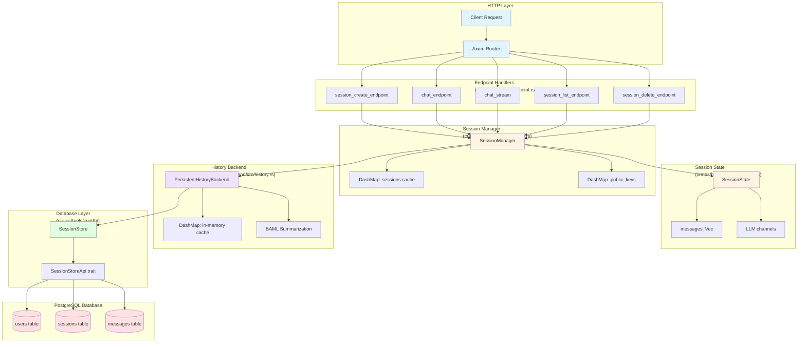
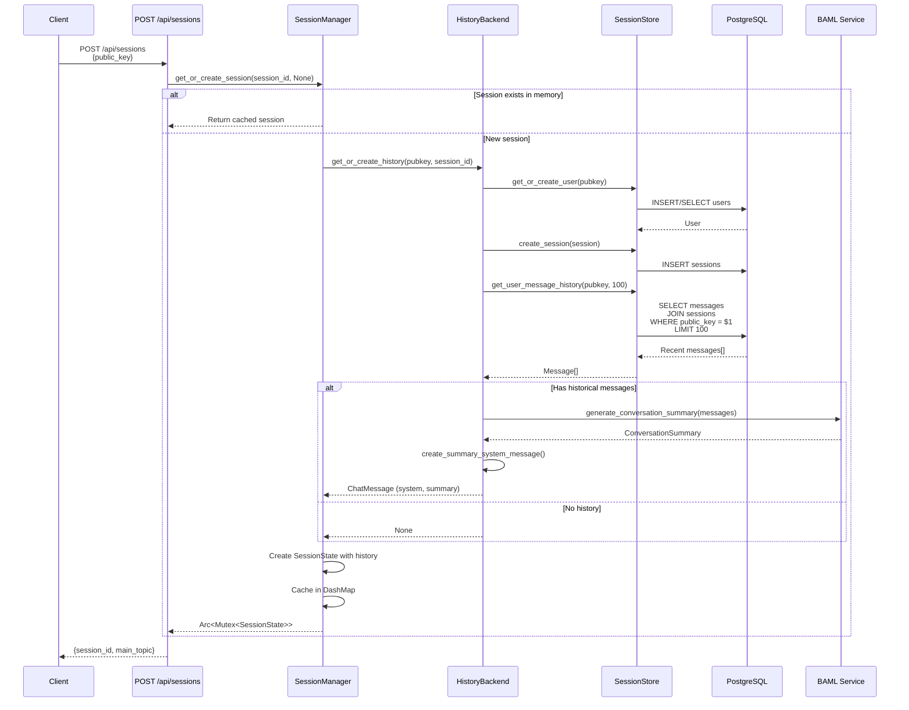
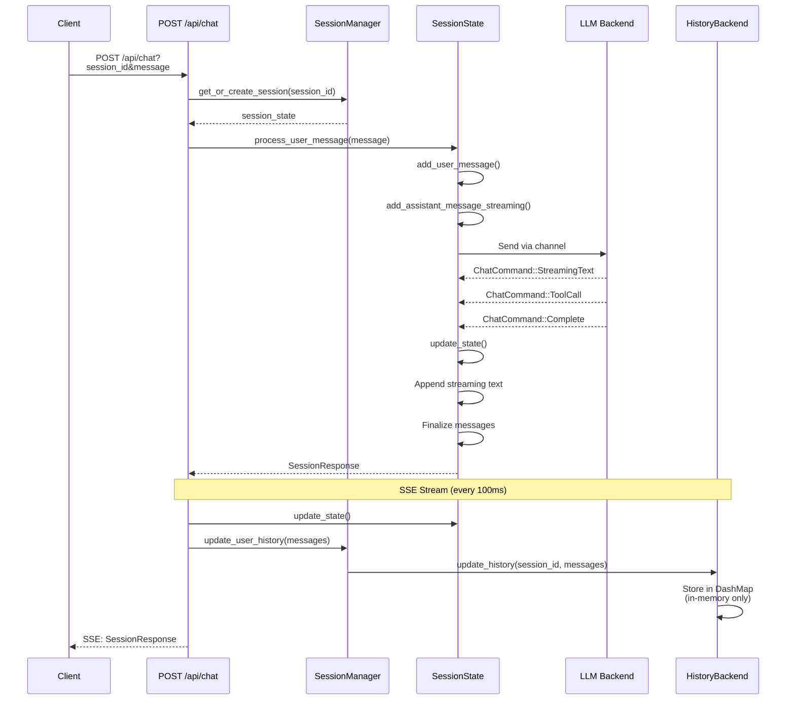
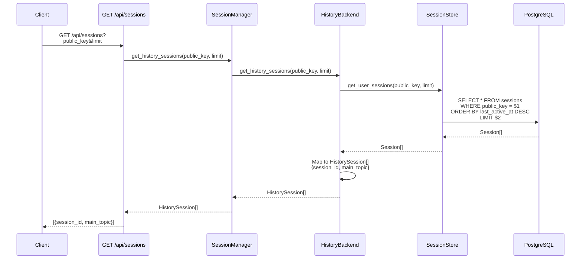
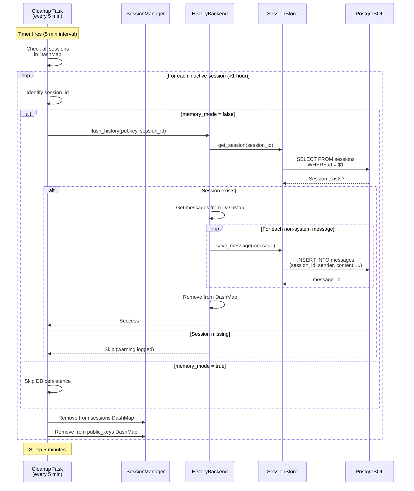
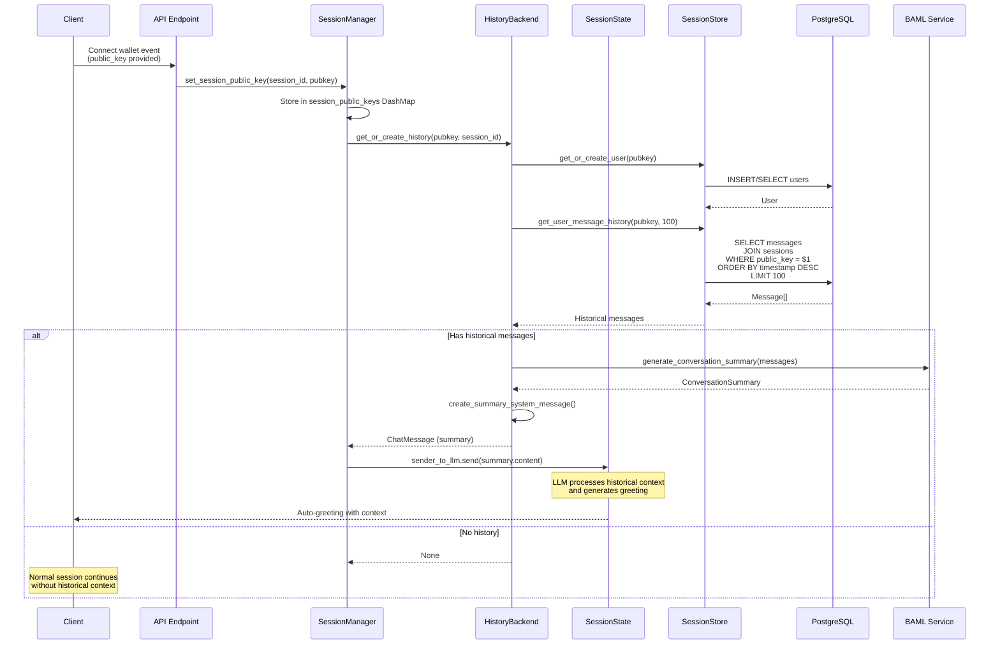
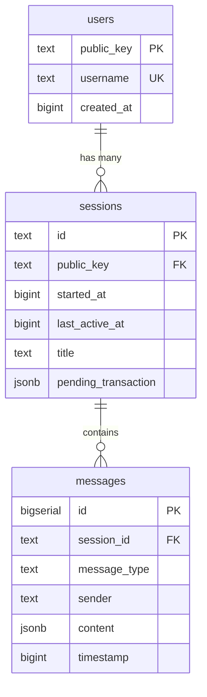

# User Session & History Database Implementation

This document provides a comprehensive overview of the database implementation for user sessions and chat history in the Aomi backend.

## Table of Contents
- [Architecture Diagrams](#architecture-diagrams)
- [Database Schema](#database-schema)
- [Domain Models](#domain-models)
- [Database API Layer](#database-api-layer)
- [History Backend](#history-backend)
- [Session Manager](#session-manager)
- [REST API Endpoints](#rest-api-endpoints)
- [Key Function Entry Points](#key-function-entry-points)

---

## Architecture Diagrams

### Overall Architecture: API to Database



### Flow 1: Create Session & Load History



### Flow 2: Send Chat Message



### Flow 3: List User Sessions



### Flow 4: Session Cleanup & History Persistence



### Flow 5: Set Session Public Key (Wallet Connect)



### Database Schema Relationships



---

## Database Schema

### Migration Files
Located in: `bin/backend/migrations/`

#### 1. Initial Schema (20250109000000_initial_schema.sql)
Creates the base tables for contracts and transactions.

**Tables:**
- `contracts`: Smart contract metadata
- `transaction_records`: Transaction tracking metadata per address
- `transactions`: Individual transaction details

#### 2. Session Persistence (20250110000000_add_session_persistence.sql)
Creates tables for user session management and message history.

**Tables:**

##### `users`
```sql
CREATE TABLE users (
    public_key TEXT PRIMARY KEY,
    username TEXT UNIQUE,
    created_at BIGINT NOT NULL DEFAULT EXTRACT(EPOCH FROM NOW())::BIGINT
);
```
- Stores user information keyed by blockchain public key
- Optional username field (unique)
- Timestamp of user creation

##### `sessions`
```sql
CREATE TABLE sessions (
    id TEXT PRIMARY KEY,
    public_key TEXT REFERENCES users(public_key) ON DELETE SET NULL,
    started_at BIGINT NOT NULL DEFAULT EXTRACT(EPOCH FROM NOW())::BIGINT,
    last_active_at BIGINT NOT NULL DEFAULT EXTRACT(EPOCH FROM NOW())::BIGINT,
    title TEXT,
    pending_transaction JSONB
);
```
- Session ID is a UUID string
- Optional association with a user via public_key (supports anonymous sessions)
- Tracks session start time and last activity
- Optional title for the session
- JSONB field for storing pending transaction data

**Indexes:**
- `idx_sessions_public_key`: Fast lookup by user
- `idx_sessions_last_active`: For cleanup of inactive sessions

##### `messages`
```sql
CREATE TABLE messages (
    id BIGSERIAL PRIMARY KEY,
    session_id TEXT NOT NULL REFERENCES sessions(id) ON DELETE CASCADE,
    message_type TEXT NOT NULL DEFAULT 'chat',
    sender TEXT NOT NULL,
    content JSONB NOT NULL,
    timestamp BIGINT NOT NULL DEFAULT EXTRACT(EPOCH FROM NOW())::BIGINT
);
```
- Auto-incrementing message ID
- Belongs to a session (cascade delete)
- `message_type`: "chat" or "agent_history"
- `sender`: "user", "agent", or "system"
- `content`: JSONB for flexible message content (typically `{"text": "..."}`)
- Unix timestamp

**Indexes:**
- `idx_messages_session_type`: Optimized for queries by session and message type

#### 3. Contracts Schema Update (20250112000000_update_contracts_schema.sql)
Enhances the contracts table with additional metadata fields for better tracking.

---

## Domain Models

Located in: `crates/tools/src/db/mod.rs`

### Session-related Models

#### `User`
```rust
pub struct User {
    pub public_key: String,
    pub username: Option<String>,
    pub created_at: i64,
}
```

#### `Session`
```rust
pub struct Session {
    pub id: String,
    pub public_key: Option<String>,
    pub started_at: i64,
    pub last_active_at: i64,
    pub title: Option<String>,
    pub pending_transaction: Option<serde_json::Value>,
}
```

**Key Methods:**
- `get_pending_transaction() -> Result<Option<PendingTransaction>>`: Deserializes the JSONB field
- `set_pending_transaction(&mut self, tx: Option<PendingTransaction>)`: Serializes and updates

#### `PendingTransaction`
```rust
pub struct PendingTransaction {
    pub created_at: i64,
    pub expires_at: i64,
    pub chain_id: u32,
    pub transaction: serde_json::Value,
    pub user_intent: String,
    pub signature: Option<String>,
}
```

#### `Message`
```rust
pub struct Message {
    pub id: i64,
    pub session_id: String,
    pub message_type: String,  // "chat" or "agent_history"
    pub sender: String,         // "user", "agent", "system"
    pub content: serde_json::Value,
    pub timestamp: i64,
}
```

---

## Database API Layer

### SessionStoreApi Trait
Located in: `crates/tools/src/db/traits.rs`

Defines the interface for all session-related database operations.

#### User Operations
- `get_or_create_user(&self, public_key: &str) -> Result<User>`
- `get_user(&self, public_key: &str) -> Result<Option<User>>`
- `update_user_username(&self, public_key: &str, username: Option<String>) -> Result<()>`

#### Session Operations
- `create_session(&self, session: &Session) -> Result<()>`
- `get_session(&self, session_id: &str) -> Result<Option<Session>>`
- `update_session_activity(&self, session_id: &str) -> Result<()>`
- `update_session_public_key(&self, session_id: &str, public_key: Option<String>) -> Result<()>`
- `get_user_sessions(&self, public_key: &str, limit: i32) -> Result<Vec<Session>>`
- `delete_old_sessions(&self, inactive_since: i64) -> Result<u64>`

#### Pending Transaction Operations
- `update_pending_transaction(&self, session_id: &str, tx: Option<PendingTransaction>) -> Result<()>`

#### Message Operations
- `save_message(&self, message: &Message) -> Result<i64>`
- `get_messages(&self, session_id: &str, message_type: Option<&str>, limit: Option<i32>) -> Result<Vec<Message>>`
- `get_user_message_history(&self, public_key: &str, limit: i32) -> Result<Vec<Message>>`

### SessionStore Implementation
Located in: `crates/tools/src/db/session_store.rs`

Implements `SessionStoreApi` using SQLx with PostgreSQL (also compatible with SQLite for testing).

**Key Implementation Details:**
- Uses `sqlx::Any` for database abstraction
- Handles JSONB serialization/deserialization for `content` and `pending_transaction` fields
- All queries use prepared statements with parameter binding for security
- Returns proper Rust types via `FromRow` implementations

---

## History Backend

Located in: `crates/backend/src/history.rs`

### HistoryBackend Trait

Defines the interface for managing user chat history with pluggable storage backends.

```rust
#[async_trait::async_trait]
pub trait HistoryBackend: Send + Sync {
    async fn get_or_create_history(
        &self,
        pubkey: Option<String>,
        session_id: String,
    ) -> Result<Option<ChatMessage>>;

    fn update_history(&self, session_id: &str, messages: &[ChatMessage]);

    async fn flush_history(&self, pubkey: Option<String>, session_id: String) -> Result<()>;

    async fn get_history_sessions(
        &self,
        public_key: &str,
        limit: usize,
    ) -> Result<Vec<HistorySession>>;
}
```

### PersistentHistoryBackend

Main implementation that persists chat history to the database.

**Architecture:**
- Uses in-memory cache (`DashMap<String, SessionHistory>`) during session lifetime
- Persists to database on session cleanup (persist-on-cleanup model)
- Generates conversation summaries using BAML for context continuity

**Key Fields:**
```rust
pub struct PersistentHistoryBackend {
    db: SessionStore,
    sessions: Arc<DashMap<String, SessionHistory>>,
}
```

**Key Methods:**

#### `get_or_create_history(pubkey, session_id)`
Location: `history.rs:152-219`

1. Returns `None` for anonymous sessions (no pubkey)
2. Creates user in database if needed
3. Creates session record if it doesn't exist
4. Loads recent historical messages (up to 100)
5. Calls BAML service to generate conversation summary
6. Returns summary as a `ChatMessage` for LLM context

#### `update_history(session_id, messages)`
Location: `history.rs:221-237`

1. Filters out streaming messages (incomplete)
2. Updates in-memory session cache
3. Does NOT persist to database (memory only)

#### `flush_history(pubkey, session_id)`
Location: `history.rs:239-296`

1. Only persists if pubkey is provided
2. Verifies session exists in database
3. Saves all non-system messages to `messages` table
4. Removes session from in-memory cache
5. Called during session cleanup (timeout or explicit delete)

#### `get_history_sessions(public_key, limit)`
Location: `history.rs:298-318`

1. Fetches user's sessions from database
2. Maps to `HistorySession` format (id + title)
3. Used for sidebar navigation

**Constants:**
- `MAX_HISTORICAL_MESSAGES = 100`: Limit for context loading
- `HISTORICAL_CONTEXT_MARKER = "Previous session context:"`: Marker for detecting loaded context

---

## Session Manager

Located in: `crates/backend/src/manager.rs`

Manages active sessions in memory with automatic cleanup.

### SessionManager

**Key Fields:**
```rust
pub struct SessionManager {
    sessions: Arc<DashMap<String, SessionData>>,
    session_public_keys: Arc<DashMap<String, String>>,
    cleanup_interval: Duration,  // 5 minutes
    session_timeout: Duration,    // 1 hour
    backends: Arc<HashMap<BackendType, Arc<BackendwithTool>>>,
    history_backend: Arc<dyn HistoryBackend>,
}
```

**SessionData:**
```rust
struct SessionData {
    state: Arc<Mutex<DefaultSessionState>>,
    last_activity: Instant,
    backend_kind: BackendType,
    memory_mode: bool,  // If true, skip database persistence
}
```

### Key Methods

#### `get_or_create_session(session_id, requested_backend)`
Location: `manager.rs:202-290`

**Entry Point**: Primary session initialization

1. Retrieves pubkey for session (if set)
2. Loads user's session list for sidebar
3. If session exists in memory:
   - Handles backend switching if requested
   - Updates last activity
   - Returns existing session
4. If new session:
   - Calls `history_backend.get_or_create_history()` for context
   - Creates new `DefaultSessionState` with historical messages
   - Stores in memory cache
   - Returns new session

#### `set_session_public_key(session_id, public_key)`
Location: `manager.rs:163-200`

**Entry Point**: Called when user connects wallet

1. Stores pubkey mapping
2. Calls `history_backend.get_or_create_history()`
3. If historical context exists, sends auto-greeting to LLM

#### `start_cleanup_task()`
Location: `manager.rs:299-358`

**Background Task**: Runs every 5 minutes

1. Identifies sessions inactive for > 1 hour
2. Calls `history_backend.flush_history()` (unless in memory mode)
3. Removes from in-memory cache
4. Cleans up pubkey mappings

#### Other Key Methods
- `delete_session(session_id)`: Removes from memory (no DB cleanup)
- `rename_session(old_id, title)`: Renames session ID
- `set_session_archived(session_id, archived)`: Sets archive flag
- `set_memory_mode(session_id, enabled)`: Toggles DB persistence
- `update_user_history(session_id, messages)`: Calls `history_backend.update_history()`

---

## REST API Endpoints

Located in: `bin/backend/src/endpoint.rs`

All endpoints receive `SharedSessionManager` (Arc<SessionManager>) as state.

### Session Management Endpoints

#### `POST /api/sessions`
Handler: `session_create_endpoint` (lines 254-276)

**Request Body:**
```json
{
  "public_key": "optional_user_public_key"
}
```

**Response:**
```json
{
  "session_id": "uuid-string",
  "main_topic": "short-id"
}
```

**Flow:**
1. Generates new UUID session ID
2. Sets pubkey association if provided
3. Calls `session_manager.get_or_create_session()`
4. Returns session info

#### `GET /api/sessions?public_key=...&limit=...`
Handler: `session_list_endpoint` (lines 235-252)

**Query Params:**
- `public_key` (required): User's public key
- `limit` (optional): Max sessions to return

**Response:** Array of `HistorySession`
```json
[
  {
    "session_id": "uuid",
    "main_topic": "Session Title"
  }
]
```

**Flow:**
1. Calls `session_manager.get_history_sessions(public_key, limit)`

#### `DELETE /api/sessions/:session_id`
Handler: `session_delete_endpoint` (lines 299-307)

Deletes session from memory cache.

#### `PATCH /api/sessions/:session_id`
Handler: `session_rename_endpoint` (lines 309-323)

**Request Body:**
```json
{
  "title": "New Session Title"
}
```

Renames the session.

#### `POST /api/sessions/:session_id/archive`
Handler: `session_archive_endpoint` (lines 278-287)

Sets `is_archived = true` on session state.

#### `POST /api/sessions/:session_id/unarchive`
Handler: `session_unarchive_endpoint` (lines 289-297)

Sets `is_archived = false` on session state.

### Chat Endpoints

#### `POST /api/chat?session_id=...&public_key=...&message=...`
Handler: `chat_endpoint` (lines 44-74)

**Query Params:**
- `session_id` (optional): Creates new if not provided
- `public_key` (optional): Associates session with user
- `message` (required): User's chat message

**Response:** `SessionResponse`
```json
{
  "messages": [...],
  "is_processing": true,
  "pending_wallet_tx": null
}
```

**Flow:**
1. Gets or creates session
2. Sets pubkey association
3. Processes user message
4. Returns current state

#### `GET /api/chat/stream?session_id=...&public_key=...`
Handler: `chat_stream` (lines 98-145)

**Server-Sent Events (SSE)** endpoint that streams session updates every 100ms.

**Flow:**
1. Gets or creates session
2. Returns SSE stream
3. Each event:
   - Locks session state
   - Calls `state.update_state()`
   - Calls `session_manager.update_user_history()` (in-memory update)
   - Sends `SessionResponse` as JSON event

#### `GET /api/state?session_id=...`
Handler: `state_endpoint` (lines 76-96)

Returns current session state (one-time, non-streaming).

#### `POST /api/interrupt?session_id=...`
Handler: `interrupt_endpoint` (lines 147-170)

Interrupts ongoing LLM processing for the session.

#### `POST /api/system?session_id=...&message=...`
Handler: `system_message_endpoint` (lines 172-203)

Sends a system message to the session (e.g., wallet connection status).

#### `POST /api/memory-mode?session_id=...&memory_mode=true|false`
Handler: `memory_mode_endpoint` (lines 205-233)

Toggles whether session history should be persisted to database.

---

## Key Function Entry Points

### Session Initialization Flow

1. **Client creates session**
   - `POST /api/sessions` → `session_create_endpoint`
   - `SessionManager::get_or_create_session()`
   - `HistoryBackend::get_or_create_history()` (no context yet, anonymous)

2. **Client connects wallet**
   - `SessionManager::set_session_public_key()`
   - `HistoryBackend::get_or_create_history()` (loads context)
   - BAML summarization
   - Auto-greeting sent to LLM with historical context

3. **Client sends message**
   - `POST /api/chat` → `chat_endpoint`
   - `SessionState::process_user_message()`
   - LLM processes with historical context

4. **Client streams updates**
   - `GET /api/chat/stream` → `chat_stream`
   - Every 100ms: `SessionState::update_state()`
   - `SessionManager::update_user_history()` (in-memory)

### Session Cleanup Flow

1. **Background cleanup task** (every 5 minutes)
   - `SessionManager::start_cleanup_task()`
   - Finds sessions inactive > 1 hour
   - `HistoryBackend::flush_history()` (unless memory mode)
   - Writes to database
   - Removes from memory cache

2. **Explicit deletion**
   - `DELETE /api/sessions/:id` → `session_delete_endpoint`
   - `SessionManager::delete_session()`
   - Removes from memory (DB flush happens on cleanup task)

### Database Query Entry Points

#### User Operations
- `SessionStore::get_or_create_user()` → `session_store.rs:21`
  - Called from: `HistoryBackend::get_or_create_history()`
  - Creates user record if first time

#### Session Operations
- `SessionStore::create_session()` → `session_store.rs:66`
  - Called from: `HistoryBackend::get_or_create_history()`
  - Creates session record in DB

- `SessionStore::get_user_sessions()` → `session_store.rs:148`
  - Called from: `HistoryBackend::get_history_sessions()`
  - Used by: Session list API

#### Message Operations
- `SessionStore::save_message()` → `session_store.rs:219`
  - Called from: `HistoryBackend::flush_history()`
  - Persists messages on cleanup

- `SessionStore::get_user_message_history()` → `session_store.rs:305`
  - Called from: `HistoryBackend::get_or_create_history()`
  - Loads recent messages for context

### Session State Management

Located in: `crates/backend/src/session.rs`

#### `SessionState::new(backend, history, history_sessions)`
Location: `session.rs:113-167`

**Entry Point**: Session state initialization

1. Creates message channels (UI ↔ LLM)
2. Checks if welcome message already sent
3. Spawns background task for LLM processing
4. Returns initialized session state

#### `SessionState::process_user_message(message)`
Location: `session.rs:169-193`

**Entry Point**: User message handling

1. Adds user message to state
2. Sends to LLM via channel
3. Adds streaming assistant message placeholder

#### `SessionState::update_state()`
Location: `session.rs:223-336`

**Entry Point**: Called every 100ms from SSE stream

1. Polls LLM command channel
2. Handles different command types:
   - `StreamingText`: Appends to current message
   - `ToolCall`: Creates tool execution message
   - `Complete`: Finalizes all streaming messages
   - `Error`: Adds error message
   - `WalletTransactionRequest`: Sets pending tx
3. Polls active tool streams
4. Updates message state

### Chat Message Models

Located in: `crates/backend/src/session.rs`

```rust
pub enum MessageSender {
    User,
    Assistant,
    System,
}

pub struct ChatMessage {
    pub sender: MessageSender,
    pub content: String,
    pub tool_stream: Option<(String, String)>,  // (topic, content)
    pub timestamp: String,
    pub is_streaming: bool,
}
```

**Conversion to DB:**
- User → "user"
- Assistant → "agent"
- System → "system"

**Conversion to LLM (rig Messages):**
- User → `Message::user(content)`
- Assistant → `Message::assistant(content)`
- System → `Message::user(content)` (system messages as user context)

---

## Data Flow Summary

### New Session with History
```
Client → POST /api/sessions
  ↓
SessionManager::get_or_create_session()
  ↓
HistoryBackend::get_or_create_history()
  ↓
SessionStore::get_or_create_user()
SessionStore::create_session()
SessionStore::get_user_message_history()
  ↓
BAML Summarization Service
  ↓
ChatMessage (system) with summary
  ↓
SessionState::new() with historical context
```

### Message Processing
```
Client → POST /api/chat
  ↓
SessionState::process_user_message()
  ↓
LLM Backend (Anthropic API)
  ↓
ChatCommand stream (StreamingText, ToolCall, Complete)
  ↓
SessionState::update_state() (every 100ms)
  ↓
Client SSE stream
  ↓
SessionManager::update_user_history() (in-memory)
```

### Session Cleanup
```
Cleanup Task (every 5 minutes)
  ↓
SessionManager::start_cleanup_task()
  ↓
Identify inactive sessions (> 1 hour)
  ↓
HistoryBackend::flush_history()
  ↓
SessionStore::save_message() (for each message)
  ↓
Remove from in-memory cache
```

---

## Configuration

### Environment Variables
- `BAML_SERVER_URL`: BAML service endpoint (default: http://localhost:2024)
- `ANTHROPIC_API_KEY`: Required for LLM functionality
- `DATABASE_URL`: PostgreSQL connection string

### Constants
- `SESSION_TIMEOUT = 3600s` (1 hour) - Session inactivity timeout
- `SESSION_LIST_LIMIT = i32::MAX` - Max sessions to fetch
- `MAX_HISTORICAL_MESSAGES = 100` - Context window for history
- Cleanup interval: 300s (5 minutes)
- SSE poll interval: 100ms

---

## Testing

Test files included with PostgreSQL-specific tests marked as `#[ignore]` for SQLite compatibility.

**Test Coverage:**
- User CRUD operations
- Session lifecycle
- Message persistence
- History loading and flushing
- Session cleanup
- Pending transactions
- Message filtering by type

**Run tests:**
```bash
cargo test --package aomi-backend
cargo test --package aomi-tools
```

---

## Session Title Management - Implementation Complete ✅

### Overview

A complete session title management system has been implemented that allows:
1. **Frontend-managed naming**: Frontend sets custom titles like "Chat 1", "Chat 2", etc.
2. **Auto-generated fallback**: Truncated session_id (6 chars) used as default if no title provided
3. **AI-enhanced titles**: Background job auto-generates meaningful titles from conversations using BAML

### Title Sources (Priority Order)

1. **User-provided**: `POST /api/sessions {title: "Chat 1"}` - **Never auto-overwritten**
2. **Auto-generated fallback**: Truncated session_id (6 chars) - Used as default
3. **AI-enhanced**: BAML `SummarizeTitle()` generates meaningful titles - Auto-applied to ≤6 char titles

### Key Implementation Files

- **`crates/backend/src/session.rs`**:
  - Added `title: Option<String>` field to `SessionState<S>`
  - Methods: `set_title(title: String)` and `get_title() -> Option<&str>`
  - Updated `SessionState::new()` to accept `initial_title` parameter
  - Updated `SessionResponse` to include `title` field
  - 14 comprehensive unit tests covering all scenarios

- **`crates/backend/src/manager.rs`**:
  - Updated `get_or_create_session()` signature to accept `initial_title: Option<String>`
  - Added `update_session_title()` method for mid-session title updates
  - Implemented `start_title_summarization_task()` - background job running every 5 seconds
  - Smart detection: only generates titles for sessions with ≤6 char title AND existing messages
  - Calls BAML `summarize_title()` to generate new titles

- **`bin/backend/src/endpoint.rs`**:
  - Updated `session_create_endpoint()` to accept optional `title` in request body
  - Falls back to truncated session_id if no title provided
  - Updated `session_rename_endpoint()` to call `update_session_title()`
  - Returns title in all session responses

- **`crates/l2beat/baml_src/generate_conversation_summary.baml`**:
  - Added new `SessionTitle` data class
  - Added new `SummarizeTitle()` BAML function
  - Generates concise 3-6 word titles from conversation messages

### API Endpoints

**Create session with custom title:**
```bash
POST /api/sessions
{
  "title": "Chat 1",
  "public_key": "optional"
}
# Returns: {session_id, main_topic: "Chat 1"}
```

**Update session title:**
```bash
PATCH /api/sessions/:session_id
{
  "title": "My Research"
}
# Returns: 200 OK
```

**Get session state (includes title):**
```bash
GET /api/state?session_id=abc123
GET /api/chat/stream?session_id=abc123
# Returns: {title, messages, is_processing, pending_wallet_tx, ...}
```

### Testing

All 14 unit tests passing:
- SessionState title initialization (None and Some variants)
- Getter/setter methods
- SessionResponse includes title
- SessionManager CRUD operations
- Backend switching preserves title
- Edge cases (special characters, long content)
- Auto-generated title detection (≤6 char heuristic)

**Run tests:**
```bash
cargo test --package aomi-backend -- title
```

### Design Decisions

- **5-second background job interval**: Fast enough for responsive UX (~5s from message → enhanced title) while being lightweight
- **≤6 character detection**: Matches truncated UUID length, safe threshold for distinguishing auto-generated vs user-provided
- **In-memory only persistence**: Simpler architecture, persistence happens naturally during session cleanup
- **Frontend manages numbering**: Separates concerns (frontend UI logic vs backend session logic)
- **Never overwrites user-provided titles**: Only auto-enhances fallback titles (≤6 chars)
