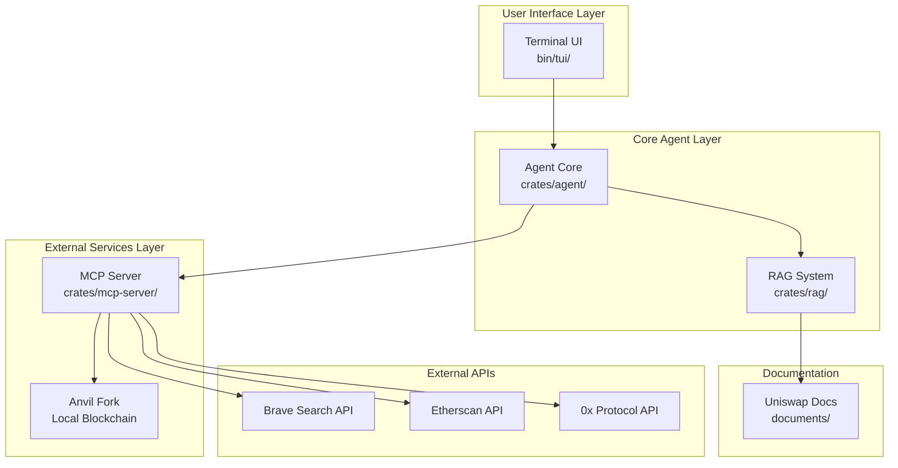
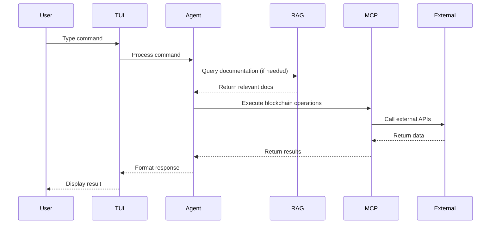

# Foameow Architecture Diagram

## System Overview

Foameow is an agentic EVM operator that provides a chat-based interface for interacting with Ethereum smart contracts, with built-in RAG capabilities for Uniswap documentation and integration with various blockchain tools.

## High-Level Architecture



## Detailed Component Architecture

### 1. Terminal UI (bin/tui/)
```
┌─────────────────────────────────────────────────────────────┐
│                    Terminal UI Layer                        │
├─────────────────────────────────────────────────────────────┤
│  ┌─────────────┐  ┌─────────────┐  ┌─────────────┐        │
│  │    App      │  │   Events    │  │     UI      │        │
│  │  (State)    │  │ (Input/Key) │  │ (Rendering) │        │
│  └─────────────┘  └─────────────┘  └─────────────┘        │
└─────────────────────────────────────────────────────────────┘
```

**Key Features:**
- Chat-style interface using `ratatui`
- Real-time event handling with `crossterm`
- Command-line argument parsing with `clap`
- Async/await support with `tokio`

### 2. Agent Core (crates/agent/)
```
┌─────────────────────────────────────────────────────────────┐
│                     Agent Core Layer                        │
├─────────────────────────────────────────────────────────────┤
│  ┌─────────────┐  ┌─────────────┐  ┌─────────────┐        │
│  │   Agent     │  │ ABI Encoder │  │   Accounts  │        │
│  │ (Main Logic)│  │ (Contract)  │  │ (Wallet Mgmt)│        │
│  └─────────────┘  └─────────────┘  └─────────────┘        │
│  ┌─────────────┐  ┌─────────────┐  ┌─────────────┐        │
│  │    Docs     │  │   Helpers   │  │    Time     │        │
│  │ (RAG Int.)  │  │ (Utilities) │  │ (Unix Time) │        │
│  └─────────────┘  └─────────────┘  └─────────────┘        │
└─────────────────────────────────────────────────────────────┘
```

**Dependencies:**
- `rig-core`: Core agent framework
- `rmcp`: MCP client communication
- `alloy`: Ethereum interaction
- `rag`: Document retrieval

#### ABI Encoder Usage Locations

**1. Agent Core Integration** (`crates/agent/src/agent.rs`)
The ABI encoder is registered as a tool in two places:

- **Line 113** - In `setup_agent()` function:
  ```rust
  .tool(abi_encoder::EncodeFunctionCall)
  ```

- **Line 232** - In `setup_agent_and_handle_messages()` function:
  ```rust
  .tool(abi_encoder::EncodeFunctionCall)
  ```

**2. Tool Registration**
The ABI encoder is registered as a `rig_tool` using the `rig_derive` macro, making it available to the AI agent for function call encoding.

#### How the ABI Encoder Works

**Purpose**
The ABI encoder (`crates/agent/src/abi_encoder.rs`) is a **generalized tool** that allows the AI agent to encode function calls for **any Ethereum smart contract** without needing to know the specific ABI beforehand.

**Functionality**
- **Input**: Takes a function signature (e.g., `"transfer(address,uint256)"`) and an array of argument values
- **Processing**:
  - Parses the function signature to extract function name and parameter types
  - Converts argument values to appropriate Solidity types
  - Generates the function selector (first 4 bytes of keccak256 hash)
  - Encodes the arguments according to the Ethereum ABI specification
- **Output**: Returns hex-encoded calldata ready for blockchain transactions

### 3. MCP Server (crates/mcp-server/)
```
┌─────────────────────────────────────────────────────────────┐
│                    MCP Server Layer                         │
├─────────────────────────────────────────────────────────────┤
│  ┌─────────────┐  ┌─────────────┐  ┌─────────────┐        │
│  │ Combined    │  │    Cast     │  │ Brave Search│        │
│  │   Tool      │  │ (Foundry)   │  │    API      │        │
│  └─────────────┘  └─────────────┘  └─────────────┘        │
│  ┌─────────────┐  ┌─────────────┐  ┌─────────────┐        │
│  │ Etherscan   │  │    0x       │  │ HTTP Server │        │
│  │    API      │  │  Protocol   │  │ (Port 3000) │        │
│  └─────────────┘  └─────────────┘  └─────────────┘        │
└─────────────────────────────────────────────────────────────┘
```

**Tools Provided:**
- **Cast Tools**: Foundry integration for blockchain interaction
- **Brave Search**: Web search capabilities
- **Etherscan**: Contract ABI retrieval
- **0x Protocol**: Token swap functionality

### 4. RAG System (crates/rag/)
```
┌─────────────────────────────────────────────────────────────┐
│                      RAG System Layer                       │
├─────────────────────────────────────────────────────────────┤
│  ┌─────────────┐  ┌─────────────┐  ┌─────────────┐        │
│  │ Documents   │  │ Embeddings  │  │ Vector Store│        │
│  │ (Chunking)  │  │ (FastEmbed) │  │ (In-Memory) │        │
│  └─────────────┘  └─────────────┘  └─────────────┘        │
└─────────────────────────────────────────────────────────────┘
```

**Features:**
- Document chunking and metadata extraction
- FastEmbed for vector embeddings
- In-memory vector store for similarity search
- Support for Uniswap V2/V3 documentation

## Data Flow Architecture



## External Dependencies

### Blockchain Infrastructure
- **Anvil**: Local Ethereum fork for testing
- **Foundry**: Development framework integration

### APIs and Services
- **Anthropic API**: AI model for agent reasoning
- **Brave Search API**: Web search capabilities
- **Etherscan API**: Contract information retrieval
- **0x Protocol API**: Token swap functionality

### Documentation
- **Uniswap V2/V3**: Smart contract documentation
- **Contract ABIs**: Interface definitions

## Communication Protocols

### MCP (Model Context Protocol)
- **Transport**: HTTP over TCP (Port 3000)
- **Session Management**: Local session manager
- **Tools**: Cast, Brave Search, Etherscan, 0x Protocol

### Internal Communication
- **Agent ↔ RAG**: Direct function calls
- **TUI ↔ Agent**: Direct integration
- **Agent ↔ MCP**: RMCP client

## Configuration and Environment

### Required Environment Variables
```bash
ANTHROPIC_API_KEY=your_api_key_here
BRAVE_SEARCH_API_KEY=your_key    # Optional
ETHERSCAN_API_KEY=your_key       # Optional
ZEROX_API_KEY=your_key           # Optional
```

### Startup Sequence
1. **Anvil**: Start forked mainnet
2. **MCP Server**: Start on port 3000
3. **TUI**: Initialize with optional docs loading
4. **Agent**: Connect to MCP server and RAG system

## Performance Considerations

### RAG System
- **Loading Time**: Document ingestion can be slow
- **Memory Usage**: In-memory vector store
- **Optimization**: `--no-docs` flag for faster startup

### MCP Communication
- **Connection**: HTTP-based with session management
- **Retry Logic**: Basic retry mechanisms
- **Error Handling**: Graceful degradation

## Security Model

### API Keys
- Environment variable based configuration
- No hardcoded secrets
- Optional API integrations

### Blockchain Interaction
- Local Anvil fork for safe testing
- No mainnet deployment in current version
- Contract interaction through verified ABIs

## Future Architecture Considerations

### Planned Enhancements
- Health checks and robust retries
- Metrics collection
- Configuration management
- Visual connection status
- Conversation history
- Additional tool integrations

### Scalability
- Replace in-memory RAG with persistent storage
- Add caching layers
- Implement connection pooling
- Support for multiple blockchain networks 