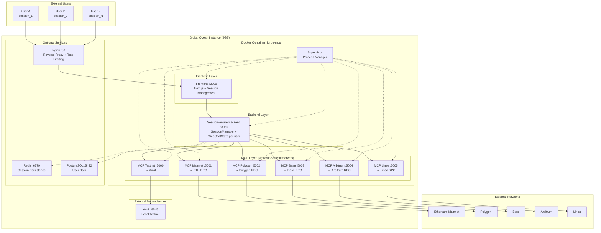

# Multi-User Deployment Guide

## Overview
This guide explains how to deploy forge-mcp with multi-user support on Digital Ocean. The architecture transforms the single-user system into a scalable multi-user platform with session isolation and network-specific MCP servers.

## Architecture Diagram



## File Structure and Purpose

### Core Deployment Files

#### `Dockerfile.multi-user`
**Purpose**: Multi-stage Docker build for the entire application stack
- **Stage 1**: Build Rust backend + MCP servers (`cargo build --release`)
- **Stage 2**: Build Next.js frontend (`npm run build`)
- **Stage 3**: Setup Python config loader dependencies
- **Stage 4**: Combine everything into Ubuntu runtime with Supervisor

**Key Features**:
- Single container with all services
- Supervisor manages 8 processes (6 MCP + backend + frontend)
- Health checks for service monitoring
- Production-optimized builds

#### `docker-compose.multi-user.yml`
**Purpose**: Production deployment orchestration
- **anvil**: Local Ethereum testnet (port 8545)
- **forge-mcp**: Main application container (all services)
- **nginx**: Optional reverse proxy with rate limiting
- **redis/postgres**: Optional persistence layers

**Port Mapping**:
```yaml
ports:
  - "8080:8080"  # Backend API
  - "3000:3000"  # Frontend
  - "5000:5000"  # MCP Testnet
  - "5001:5001"  # MCP Mainnet
  - "5002:5002"  # MCP Polygon
  - "5003:5003"  # MCP Base
  - "5004:5004"  # MCP Arbitrum
  - "5005:5005"  # MCP Linea
```

### Process Management

#### `docker/supervisord.conf`
**Purpose**: Manages 8 concurrent processes in the container

**Processes Managed**:
1. `mcp-testnet` - MCP server for testnet (→ anvil:8545)
2. `mcp-mainnet` - MCP server for mainnet (→ ETH_RPC_URL)
3. `mcp-polygon` - MCP server for Polygon (→ POLYGON_RPC_URL)
4. `mcp-base` - MCP server for Base (→ BASE_RPC_URL)
5. `mcp-arbitrum` - MCP server for Arbitrum (→ ARBITRUM_RPC_URL)
6. `mcp-linea` - MCP server for Linea (→ LINEA_RPC_URL)
7. `backend` - Session-aware backend API (port 8080)
8. `frontend` - Next.js frontend (port 3000)

**Features**:
- Auto-restart on crashes
- Individual log files per service
- Environment-specific configuration

#### `docker/start-multi-user.sh`
**Purpose**: Container startup script
- Validates environment variables
- Loads configuration via Python script
- Starts Supervisor with all processes

### Network & Security

#### `nginx/nginx.conf`
**Purpose**: Production-ready reverse proxy
- **Rate Limiting**: 10 req/s for API, 5 req/s for chat
- **Load Balancing**: Upstream connections to backend/frontend
- **Security Headers**: XSS protection, content-type nosniff
- **SSL Ready**: Commented HTTPS configuration

**Routes**:
- `/` → Frontend (port 3000)
- `/api/*` → Backend (port 8080) with rate limiting
- `/api/chat` → Special handling for SSE streaming
- `/health` → Backend health check (no rate limiting)

### Configuration Management

#### `config.yaml` (Existing)
**Purpose**: Environment-specific configuration
- **Development**: localhost, ports 3000/8080/5000
- **Production**: 0.0.0.0, ports 3001/8081/5001
- **Networks**: RPC URL templates with environment variables

#### `scripts/load_config.py` (Existing)
**Purpose**: Dynamic configuration loading
- Reads `config.yaml` based on environment
- Substitutes environment variables in network URLs
- Exports shell variables for deployment scripts
- Validates required API keys

### Deployment Automation

#### `deploy.sh`
**Purpose**: One-command deployment script for Digital Ocean

**Steps Performed**:
1. **Environment Validation**: Check `.env.prod` exists and has required keys
2. **Cleanup**: Stop existing containers, prune old images
3. **Build**: Create new Docker image with `--no-cache`
4. **Deploy**: Start all services via docker-compose
5. **Health Check**: Verify all services are responding
6. **Optional Setup**: Nginx reverse proxy configuration

## Step-by-Step Deployment

### 1. Prepare Environment File
```bash
# Copy template and fill in your keys
cp .env.template .env.prod

# Edit with your actual API keys and RPC URLs
nano .env.prod
```

**Required Variables**:
```env
ANTHROPIC_API_KEY=your-anthropic-key
BRAVE_SEARCH_API_KEY=your-brave-key
ETHERSCAN_API_KEY=your-etherscan-key
ZEROX_API_KEY=your-0x-key

# Network RPC URLs
ETH_RPC_URL=https://eth-mainnet.g.alchemy.com/v2/your-key
POLYGON_RPC_URL=https://polygon-mainnet.g.alchemy.com/v2/your-key
BASE_RPC_URL=https://base-mainnet.g.alchemy.com/v2/your-key
ARBITRUM_RPC_URL=https://arb-mainnet.g.alchemy.com/v2/your-key
LINEA_RPC_URL=https://linea-mainnet.infura.io/v3/your-key
LINEA_SEPOLIA_RPC_URL=https://linea-sepolia.infura.io/v3/your-key
```

### 2. Deploy to Digital Ocean

#### Option A: Automated Deployment
```bash
# One-command deployment
./deploy.sh

# Follow prompts for nginx setup
```

#### Option B: Manual Deployment
```bash
# Build and start services
docker-compose -f docker-compose.multi-user.yml up -d

# Check logs
docker-compose -f docker-compose.multi-user.yml logs -f

# Health checks
curl http://localhost:8080/health
curl http://localhost:3000
```

### 3. Verify Multi-User Setup

**Test Session Isolation**:
1. Open multiple browser tabs to `http://your-server:3000`
2. Each tab gets unique session ID
3. Chat in one tab doesn't appear in others
4. Network switching is independent per tab

**Test Network Isolation**:
1. User A switches to mainnet
2. User B switches to polygon
3. Both can use their respective networks simultaneously
4. No conflicts between network states

## Resource Allocation (2GB Server)

### Memory Usage Breakdown
```
Component               Memory    Description
─────────────────────────────────────────────────
Anvil                   ~200MB    Local testnet
MCP Testnet             ~80MB     Network-specific server
MCP Mainnet             ~80MB     Network-specific server
MCP Polygon             ~80MB     Network-specific server
MCP Base                ~80MB     Network-specific server
MCP Arbitrum            ~80MB     Network-specific server
MCP Linea               ~80MB     Network-specific server
Backend                 ~100MB    Session manager
Frontend                ~50MB     Next.js server
System Overhead         ~100MB    Ubuntu + Supervisor
─────────────────────────────────────────────────
Base Usage              ~930MB
Available for Sessions  ~1070MB
Max Concurrent Users    ~21       (50MB per session)
Recommended Load        15-18     (comfortable margin)
```

### CPU Usage
- **Normal Load**: 0.5-1.0 CPU cores
- **Peak Load**: 1.5-2.0 CPU cores (multiple concurrent chats)
- **MCP Operations**: CPU-intensive during blockchain calls

## Monitoring and Maintenance

### Health Checks
```bash
# Backend health
curl http://localhost:8080/health

# Service status
docker-compose -f docker-compose.multi-user.yml ps

# Resource usage
docker stats
```

### Log Monitoring
```bash
# All services
docker-compose -f docker-compose.multi-user.yml logs -f

# Specific service
docker-compose -f docker-compose.multi-user.yml logs -f forge-mcp

# Inside container (supervisor logs)
docker exec -it forge-mcp-forge-mcp-1 tail -f /var/log/*.log
```

### Scaling Considerations
- **Vertical**: Upgrade to 4GB for 40+ concurrent users
- **Horizontal**: Add load balancer + multiple backend instances
- **Database**: Add Redis/PostgreSQL for session persistence
- **CDN**: Add Cloudflare for static asset caching

## Troubleshooting

### Common Issues

#### Services Not Starting
```bash
# Check logs
docker-compose -f docker-compose.multi-user.yml logs

# Restart specific service
docker-compose -f docker-compose.multi-user.yml restart forge-mcp
```

#### Memory Issues
```bash
# Check memory usage
docker stats

# Reduce concurrent users or upgrade server
```

#### Network RPC Failures
- Verify RPC URLs in `.env.prod`
- Check API key quotas
- Monitor RPC provider status

#### Port Conflicts
- Ensure ports 3000, 5000-5005, 8080, 8545 are available
- Check firewall settings
- Verify no other services using these ports

## Security Considerations

### Production Hardening
1. **Firewall**: Only expose ports 80, 443 publicly
2. **SSL**: Use Let's Encrypt or custom certificates
3. **Rate Limiting**: Configured in nginx.conf
4. **API Keys**: Never commit to git, use environment variables
5. **Updates**: Regular Docker image updates

### Network Security
- MCP servers only accessible via backend proxy
- No direct external access to MCP ports
- Session isolation prevents data leakage between users

This architecture provides a production-ready, multi-user deployment that scales efficiently within the constraints of a 2GB Digital Ocean droplet while maintaining complete session isolation and network independence.