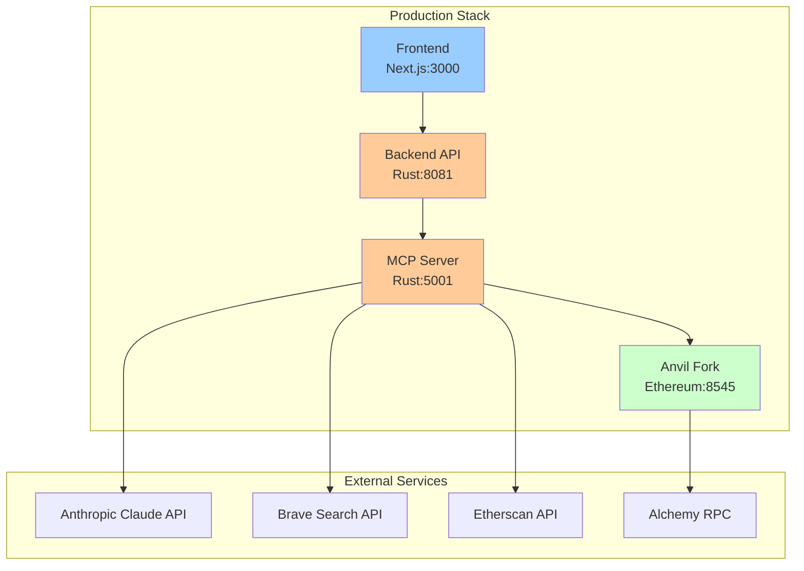

# Production Deployment Guide

Comprehensive guide for deploying the Forge MCP Backend platform to production environments.

## Table of Contents
- [Architecture Overview](#architecture-overview)
- [Deployment Options](#deployment-options)
- [Prerequisites](#prerequisites)
- [Quick Start](#quick-start)
- [Detailed Deployment Steps](#detailed-deployment-steps)
- [Environment Configuration](#environment-configuration)
- [Security Hardening](#security-hardening)
- [Monitoring & Maintenance](#monitoring--maintenance)
- [Troubleshooting](#troubleshooting)

## Architecture Overview

The platform consists of four core services that can be deployed together or separately:



## Deployment Options

### Option 1: Monolithic Docker Deployment (Recommended for Single Server)
- All services in one docker-compose stack
- Suitable for single VPS/dedicated server
- Easiest to manage and monitor

### Option 2: Distributed Deployment (For Scale)
- Backend services on one server
- Frontend on CDN/Vercel
- Database/cache on managed services
- Better for high traffic scenarios

### Option 3: Kubernetes Deployment (Enterprise)
- Full orchestration with auto-scaling
- Service mesh for internal communication
- Advanced monitoring and observability

### Option 4: Managed Cloud Services
- AWS ECS/Fargate
- Google Cloud Run
- Azure Container Instances
- DigitalOcean App Platform

## Prerequisites

### System Requirements
- **OS**: Ubuntu 22.04 LTS or compatible Linux distribution
- **CPU**: 4+ cores recommended
- **RAM**: 8GB minimum, 16GB recommended
- **Storage**: 50GB+ SSD
- **Network**: Static IP, ports 80/443 open

### Software Requirements
```bash
# Install Docker
curl -fsSL https://get.docker.com -o get-docker.sh
sudo sh get-docker.sh

# Install Docker Compose
sudo curl -L "https://github.com/docker/compose/releases/latest/download/docker-compose-$(uname -s)-$(uname -m)" -o /usr/local/bin/docker-compose
sudo chmod +x /usr/local/bin/docker-compose

# Install Python 3 (for configuration scripts)
sudo apt update && sudo apt install -y python3 python3-pip python3-yaml

# Install Git
sudo apt install -y git
```

### API Keys Required
1. **Anthropic Claude** (Required): https://console.anthropic.com/
2. **Brave Search** (Recommended): https://api.search.brave.com/
3. **Etherscan** (Recommended): https://etherscan.io/apis
4. **Alchemy** (Recommended): https://www.alchemy.com/

## Quick Start

```bash
# 1. Clone the repository
git clone https://github.com/your-org/forge-mcp-backend.git
cd forge-mcp-backend

# 2. Set up environment
cp .env.template .env.prod
nano .env.prod  # Add your API keys

# 3. Deploy using pre-built images
./scripts/compose-backend-prod.sh latest

# 4. Verify deployment
curl http://your-server-ip:8081/health
```

## Detailed Deployment Steps

### Step 1: Server Preparation

```bash
# Update system
sudo apt update && sudo apt upgrade -y

# Set up firewall
sudo ufw allow 22/tcp    # SSH
sudo ufw allow 80/tcp    # HTTP
sudo ufw allow 443/tcp   # HTTPS
sudo ufw allow 3000/tcp  # Frontend
sudo ufw allow 8081/tcp  # Backend API
sudo ufw allow 5001/tcp  # MCP Server
sudo ufw allow 8545/tcp  # Anvil RPC
sudo ufw enable

# Create deployment user
sudo useradd -m -s /bin/bash forge
sudo usermod -aG docker forge
sudo su - forge
```

### Step 2: Repository Setup

```bash
# Clone repository
git clone https://github.com/your-org/forge-mcp-backend.git
cd forge-mcp-backend

# Create environment file
cp .env.template .env.prod
```

### Step 3: Configure Environment

Edit `.env.prod` with your API keys:

```bash
# Required
ANTHROPIC_API_KEY=sk-ant-api03-your-key-here

# Recommended for full functionality
BRAVE_SEARCH_API_KEY=your-brave-key
ETHERSCAN_API_KEY=your-etherscan-key
ALCHEMY_API_KEY=your-alchemy-key

# Optional
ZEROX_API_KEY=your-0x-key

# Network RPC URLs (if using custom endpoints)
ETH_RPC_URL=https://eth-mainnet.g.alchemy.com/v2/${ALCHEMY_API_KEY}
BASE_RPC_URL=https://base-mainnet.g.alchemy.com/v2/${ALCHEMY_API_KEY}
ARBITRUM_RPC_URL=https://arb-mainnet.g.alchemy.com/v2/${ALCHEMY_API_KEY}
```

### Step 4: Build or Pull Docker Images

#### Option A: Use Pre-built Images (Faster)
```bash
# Pull from GitHub Container Registry
export IMAGE_TAG=latest
docker pull ghcr.io/your-org/forge-mcp-backend/backend:$IMAGE_TAG
docker pull ghcr.io/your-org/forge-mcp-backend/mcp:$IMAGE_TAG
docker pull ghcr.io/your-org/forge-mcp-backend/frontend:$IMAGE_TAG
```

#### Option B: Build Locally (Customizable)
```bash
# Build all images
./scripts/compose-build-monolithic.sh

# Or build individually
docker build --target backend-runtime -t forge-mcp/backend .
docker build --target mcp-runtime -t forge-mcp/mcp .
docker build --target frontend-runtime -t forge-mcp/frontend .
```

### Step 5: Deploy Services

#### Backend Services Only (No Frontend)
```bash
docker compose -f docker/docker-compose-backend.yml up -d
```

#### Full Stack (All Services)
```bash
docker compose -f docker/docker-compose-monolithic.yml up -d
```

### Step 6: Set Up NGINX Reverse Proxy (Optional but Recommended)

```bash
cd docker/nginx
cp .env.template .env

# Edit .env with your domains
nano .env

# Run setup script for SSL certificates
./setup.sh api.yourdomain.com admin@yourdomain.com

# Start NGINX proxy
docker compose up -d
```

### Step 7: Verify Deployment

```bash
# Check container status
docker ps

# Test backend health
curl http://localhost:8081/health

# Test MCP server
curl http://localhost:5001/health

# Check logs
docker compose logs -f backend
docker compose logs -f mcp
```

## Environment Configuration

### Port Configuration

Default production ports can be customized via environment variables:

```bash
# In .env.prod or docker-compose override
BACKEND_PORT=8081        # Backend API port
MCP_SERVER_PORT=5001     # MCP server port
FRONTEND_PORT=3000       # Frontend port
ANVIL_PORT=8545         # Anvil RPC port
```

### Network Configuration

The `config.yaml` file controls network endpoints:

```yaml
production:
  networks:
    testnet:
      url: "http://anvil:8545"  # Internal Docker network
    mainnet:
      url: "https://eth-mainnet.g.alchemy.com/v2/{$ALCHEMY_API_KEY}"
    base:
      url: "https://base-mainnet.g.alchemy.com/v2/{$ALCHEMY_API_KEY}"
```

### CORS Configuration

For frontend on different domain:

```bash
# In .env.prod
BACKEND_ALLOWED_ORIGINS=https://app.yourdomain.com,https://yourdomain.com
# Or append to defaults
BACKEND_EXTRA_ALLOWED_ORIGINS=https://preview.yourdomain.com
```

## Security Hardening

### 1. Use Environment-Specific Secrets

```bash
# Generate strong random values
openssl rand -hex 32  # For session secrets

# Store in secure location
chmod 600 .env.prod
```

### 2. Enable HTTPS (Required for Production)

Use the NGINX proxy setup with Let's Encrypt:

```bash
cd docker/nginx
./setup.sh api.yourdomain.com admin@yourdomain.com
```

### 3. Implement Rate Limiting

Add to NGINX configuration:

```nginx
http {
    limit_req_zone $binary_remote_addr zone=api:10m rate=10r/s;
    
    server {
        location /api/ {
            limit_req zone=api burst=20 nodelay;
            # ... existing config
        }
    }
}
```

### 4. Docker Security

```bash
# Run containers as non-root
docker run --user 1000:1000 ...

# Use read-only filesystem where possible
docker run --read-only ...

# Limit resources
docker run --memory="2g" --cpus="2" ...
```

### 5. Network Isolation

```yaml
# docker-compose.yml
networks:
  frontend:
    driver: bridge
  backend:
    driver: bridge
    internal: true  # No external access
```

## Monitoring & Maintenance

### Health Checks

```bash
# Create health check script
cat > health_check.sh << 'EOF'
#!/bin/bash
services=("backend:8081" "mcp:5001" "anvil:8545")

for service in "${services[@]}"; do
    IFS=':' read -r name port <<< "$service"
    if curl -f -s "http://localhost:$port/health" > /dev/null 2>&1; then
        echo "✅ $name is healthy"
    else
        echo "❌ $name is down"
        # Send alert (email, Slack, etc.)
    fi
done
EOF

chmod +x health_check.sh

# Add to crontab
crontab -e
# Add: */5 * * * * /path/to/health_check.sh
```

### Log Management

```bash
# View logs
docker compose logs -f --tail=100

# Log rotation
cat > /etc/logrotate.d/docker-forge << EOF
/var/lib/docker/containers/*/*.log {
    daily
    rotate 7
    compress
    delaycompress
    missingok
    notifempty
}
EOF
```

### Backup Strategy

```bash
# Backup configuration
tar -czf backup-$(date +%Y%m%d).tar.gz .env.prod config.yaml

# Backup Docker volumes (if any)
docker run --rm -v forge_data:/data -v $(pwd):/backup alpine tar czf /backup/data-backup.tar.gz /data
```

### Updates and Maintenance

```bash
# Update to latest images
docker compose pull
docker compose up -d

# Clean up old images
docker system prune -a -f

# Update system packages
sudo apt update && sudo apt upgrade -y
```

## Troubleshooting

### Common Issues and Solutions

#### 1. Backend Can't Connect to MCP Server
```bash
# Check if MCP is running
docker ps | grep mcp

# Check network connectivity
docker exec backend ping mcp

# Review MCP logs
docker logs mcp --tail=50
```

#### 2. Anvil Fork Fails
```bash
# Verify RPC URL
echo $ETH_RPC_URL

# Test RPC endpoint
curl -X POST -H "Content-Type: application/json" \
  --data '{"jsonrpc":"2.0","method":"eth_blockNumber","params":[],"id":1}' \
  $ETH_RPC_URL

# Restart Anvil with verbose logging
docker compose restart anvil
docker logs anvil -f
```

#### 3. Frontend Can't Connect to Backend
```bash
# Check CORS settings
curl -I -X OPTIONS http://localhost:8081/api/health \
  -H "Origin: http://localhost:3000"

# Verify environment variables
docker exec frontend env | grep BACKEND
```

#### 4. SSL Certificate Issues
```bash
# Renew certificates manually
docker compose -f docker/nginx/docker-compose.yml run --rm certbot renew

# Check certificate expiry
openssl x509 -enddate -noout -in /etc/letsencrypt/live/yourdomain/cert.pem
```

#### 5. High Memory Usage
```bash
# Check container stats
docker stats

# Limit memory usage
docker update --memory="1g" container_name

# Or in docker-compose.yml:
services:
  backend:
    mem_limit: 1g
```

### Debug Mode

Enable debug logging for troubleshooting:

```bash
# Set in .env.prod
RUST_LOG=debug
RUST_BACKTRACE=full

# Restart services
docker compose restart
```

## Performance Optimization

### 1. Enable Build Cache
```yaml
# docker-compose.yml
services:
  backend:
    build:
      cache_from:
        - ghcr.io/your-org/forge-mcp-backend/backend:cache
```

### 2. Use CDN for Frontend
- Deploy frontend to Vercel/Netlify
- Use CloudFlare for static assets
- Enable gzip compression

### 3. Database Optimization (Future)
- Add Redis for session caching
- Use PostgreSQL for persistent data
- Implement connection pooling

### 4. Horizontal Scaling
```yaml
# docker-compose.yml
services:
  backend:
    deploy:
      replicas: 3
```

## Support and Resources

- **Documentation**: [Main README](../README.md)
- **Issues**: GitHub Issues
- **Discord**: Community support channel
- **Email**: support@yourdomain.com

## License

This deployment guide is part of the Forge MCP Backend project. See LICENSE file for details.