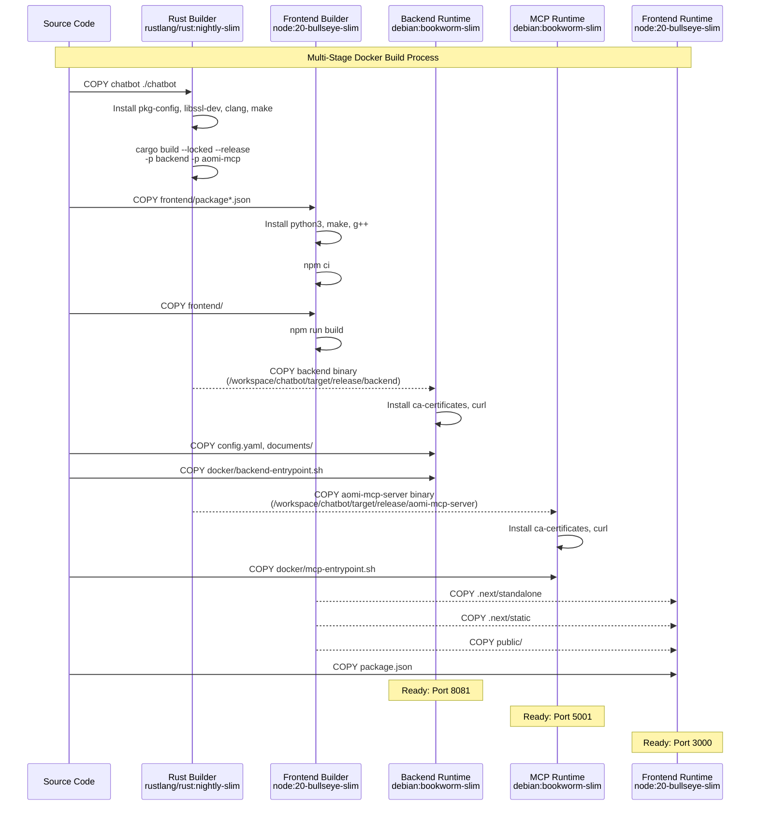
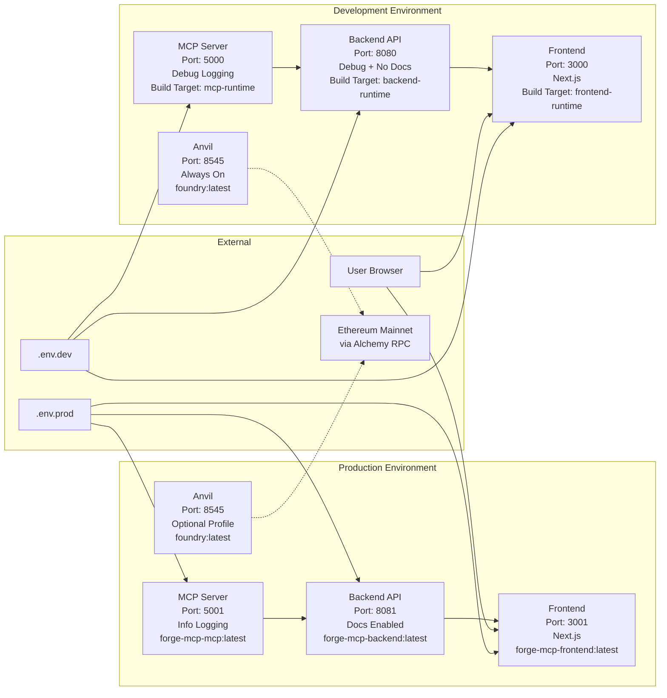
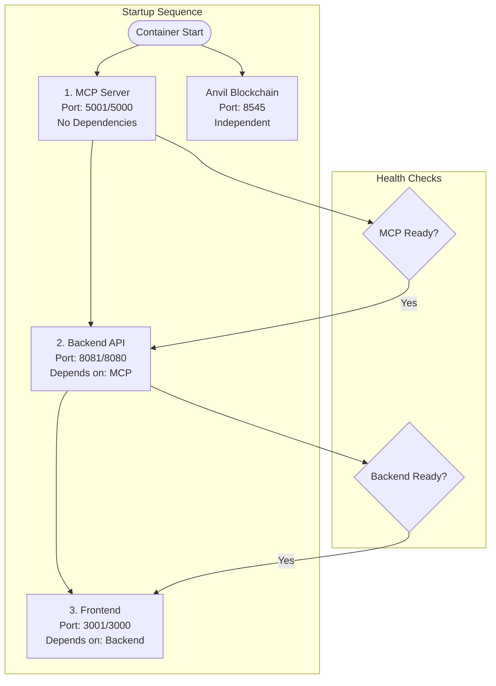

# Docker Build Process Documentation

## 1. Multi-Stage Build Process

The Docker build process uses a multi-stage approach with three main build stages:





### Stage 1: Rust Builder
- **Base Image**: `rustlang/rust:nightly-slim` (required for Rust edition 2024)
- **Dependencies**: pkg-config, libssl-dev, clang, make
- **Output**: Compiles `backend` and `aomi-mcp-server` binaries
- **Build Command**: `cargo build --locked --release -p backend -p aomi-mcp`

### Stage 2: Frontend Builder
- **Base Image**: `node:20-bullseye-slim`
- **Dependencies**: python3, python-is-python3, make, g++
- **Process**:
  1. Install dependencies with `npm ci`
  2. Build Next.js application with `npm run build`
  3. Generates standalone output for production

### Stage 3: Runtime Images
Creates three separate minimal runtime containers:

#### Backend Runtime (`backend-runtime`)
- **Base**: `debian:bookworm-slim`
- **Port**: 8081
- **Binary**: `/usr/local/bin/backend`
- **Config**: Copies `config.yaml` and `documents/` directory
- **Entrypoint**: `/entrypoint.sh` with optional `--no-docs` flag

#### MCP Runtime (`mcp-runtime`)
- **Base**: `debian:bookworm-slim`
- **Port**: 5001
- **Binary**: `/usr/local/bin/aomi-mcp-server`
- **Config**: Supports `MCP_NETWORK_URLS_JSON` environment variable
- **Entrypoint**: `/entrypoint.sh` with flexible argument handling

#### Frontend Runtime (`frontend-runtime`)
- **Base**: `node:20-bullseye-slim`
- **Port**: 3000
- **Files**: Copies `.next/standalone`, `.next/static`, `public/`, `package.json`
- **Command**: `node server.js`

## 2. Docker Compose Service Architecture



### Production Configuration (`docker-compose.yml`)
```yaml
services:
  mcp:      # Port 5001, depends on: none
  backend:  # Port 8081, depends on: mcp
  frontend: # Port 3001, depends on: backend
  anvil:    # Port 8545, optional (profiles: dev, anvil)
```

### Development Configuration (`docker-compose.dev.yml`)
```yaml
services:
  mcp:      # Port 5000, debug logging
  backend:  # Port 8080, debug logging, docs disabled
  frontend: # Port 3000
  anvil:    # Port 8545, always enabled
```


## 3. Environment Configuration

### Production Environment (`.env.prod`)
- **Backend**: Port 8081, info logging, docs enabled
- **MCP**: Port 5001, info logging
- **Frontend**: Port 3001, backend URL points to port 8081

### Development Environment (`.env.dev`)
- **Backend**: Port 8080, debug logging, docs disabled
- **MCP**: Port 5000, debug logging
- **Frontend**: Port 3000, backend URL points to port 8080

### Key Environment Variables
- `BACKEND_SKIP_DOCS`: Controls documentation generation
- `MCP_NETWORK_URLS_JSON`: JSON configuration for MCP server
- `ETH_RPC_URL`: Ethereum RPC endpoint for Anvil fork
- `RUST_LOG`: Logging level (info/debug)

## 4. Build Optimization Features

### .dockerignore
Excludes development files and build artifacts:
- Git repository (`.git/`)
- Node modules (`frontend/node_modules/`)
- Rust build artifacts (`chatbot/target/`)
- Development tools (`.vscode/`, `.idea/`)
- Large documentation bundles (`docs/`)

### Dependency Caching
- **Rust**: Uses `--locked` flag for reproducible builds
- **Node.js**: Copies `package*.json` first for layer caching
- **System packages**: Removes package lists after installation

## 5. Service Dependencies and Startup Order



1. **MCP Server** starts first (no dependencies)
2. **Backend** waits for MCP server to be ready
3. **Frontend** waits for backend to be ready
4. **Anvil** runs independently for blockchain simulation

## 6. Image Naming Convention
- `forge-mcp-backend:latest`
- `forge-mcp-mcp:latest`
- `forge-mcp-frontend:latest`

## 7. Entrypoint Scripts

### Backend Entrypoint (`docker/backend-entrypoint.sh`)
- Conditionally adds `--no-docs` flag based on `BACKEND_SKIP_DOCS`
- Supports additional command line arguments

### MCP Entrypoint (`docker/mcp-entrypoint.sh`)
- Supports command line arguments
- Falls back to `MCP_NETWORK_URLS_JSON` environment variable
- Defaults to running server without arguments
