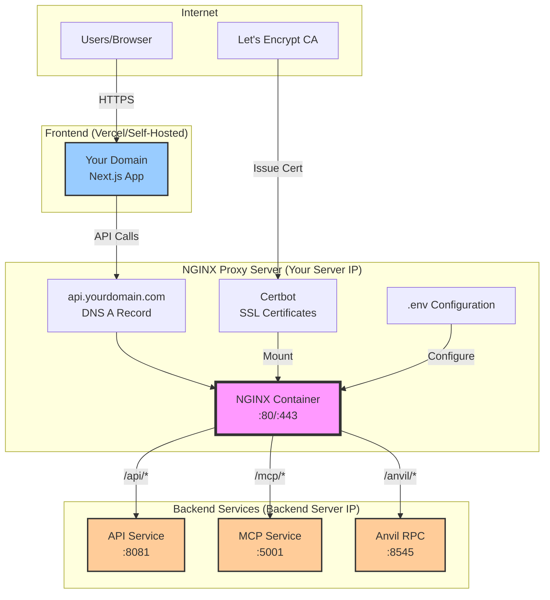
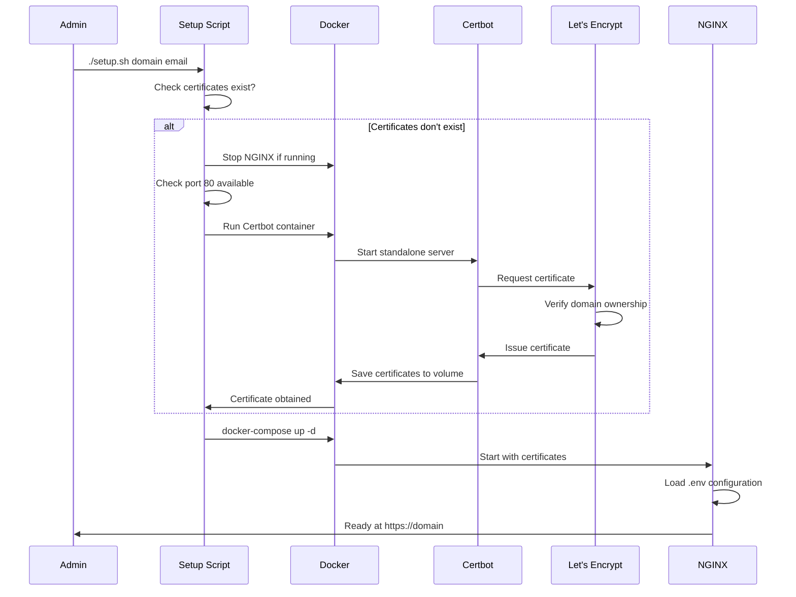

# NGINX Proxy Setup Guide

## Overview

This NGINX proxy server acts as a centralized API gateway for the AOMI platform, providing:
- SSL/TLS termination with Let's Encrypt certificates
- Load balancing and routing to backend services
- CORS handling for frontend applications
- Flexible backend endpoint configuration via environment variables

## Architecture



## Setup Script (`setup.sh`)

The `setup.sh` script automates the SSL certificate acquisition and NGINX deployment process.

### What It Does

1. **Certificate Check**
   - Verifies if SSL certificates exist for the specified domain
   - If certificates exist, starts NGINX immediately
   - Shows certificate expiration date if available

2. **Certificate Acquisition** (if needed)
   - Stops any running NGINX containers
   - Verifies port 80 is available
   - Runs Certbot in standalone mode to obtain certificates
   - No manual DNS configuration needed (assumes DNS is already pointing to server)

3. **NGINX Deployment**
   - Automatically starts NGINX container after certificate acquisition
   - Mounts certificates and configuration
   - Applies environment variables for backend routing

### Usage

```bash
# Navigate to nginx directory
cd /path/to/docker/nginx

# Run with specific domain and email
./setup.sh api.yourdomain.com admin@yourdomain.com

# Or run with defaults (reads from .env)
./setup.sh
```

### Prerequisites

- Docker and Docker Compose installed
- Domain DNS A record pointing to proxy server IP
- Port 80 and 443 available
- `.env` file configured with backend endpoints

## Configuration

### Environment Variables (.env)

```bash
# Frontend domain (for CORS)
AOMI_DOMAIN=yourdomain.com

# API domain served by this proxy
AOMI_API_DOMAIN=api.yourdomain.com

# Backend service endpoints (replace with your actual IPs)
BACKEND_API_ORIGIN=http://backend-server-ip:8081
MCP_SERVICE_ORIGIN=http://backend-server-ip:5001
ANVIL_RPC_ORIGIN=http://backend-server-ip:8545
```

### Routing Rules

| Path Pattern | Backend Service | Example URL |
| `/api/*` | Backend API (8081) | `api.yourdomain.com/api/chat` |
| `/mcp/*` | MCP Service (5001) | `api.yourdomain.com/mcp/rpc` |
| `/anvil/*` | Anvil RPC (8545) | `api.yourdomain.com/anvil` |
| `/health` | Backend Health Check | `api.yourdomain.com/health` |

## Deployment Flow



## Maintenance

### Certificate Renewal

Certificates auto-renew via the Certbot container defined in `docker-compose.yml`. It runs every 12 hours to check and renew certificates nearing expiration.

### Updating Backend Endpoints

1. Edit `.env` file with new backend IPs/ports
2. Restart NGINX to apply changes:
   ```bash
   docker-compose restart api-proxy
   ```

### Viewing Logs

```bash
# NGINX access/error logs
docker-compose logs -f api-proxy

# Check certificate renewal logs
docker-compose logs certbot
```

### Health Checks

```bash
# Test proxy health
curl https://api.yourdomain.com/health

# Test backend API
curl https://api.yourdomain.com/api/health

# Test MCP service
curl https://api.yourdomain.com/mcp/health
```

## Troubleshooting

| Issue | Solution |
|-------|----------|
| Certificate failed to obtain | Ensure DNS points to server IP, port 80 is open |
| NGINX won't start | Check certificates exist: `ls ../certbot/conf/live/` |
| 502 Bad Gateway | Verify backend services are running and accessible |
| CORS errors | Check `AOMI_DOMAIN` in `.env` matches frontend domain |

## Security Considerations

- Certificates stored in `../certbot/conf/` - ensure proper permissions
- Backend services can be on private network (only proxy needs public IP)
- NGINX handles all CORS headers - backends shouldn't set their own
- SSL/TLS terminates at proxy - backend communication can be HTTP

## Benefits of This Architecture

1. **Flexibility**: Change backend locations without updating frontend
2. **Security**: Single point for SSL termination and CORS handling  
3. **Scalability**: Easy to add load balancing or multiple backend instances
4. **Maintenance**: Centralized logging and monitoring point
5. **Cost**: One SSL certificate for all backend services
6. **Performance**: HTTP/2 support with connection reuse
7. **Reliability**: Automatic certificate renewal via Certbot