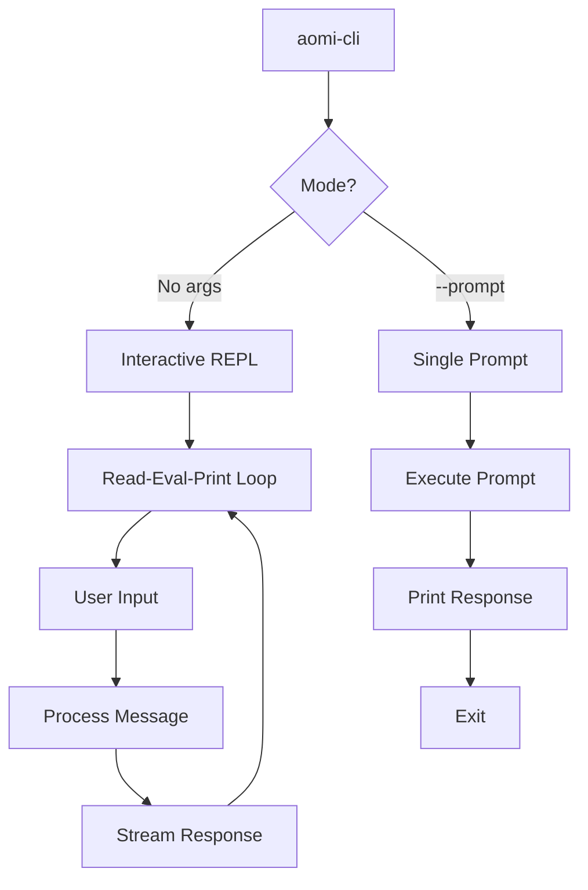
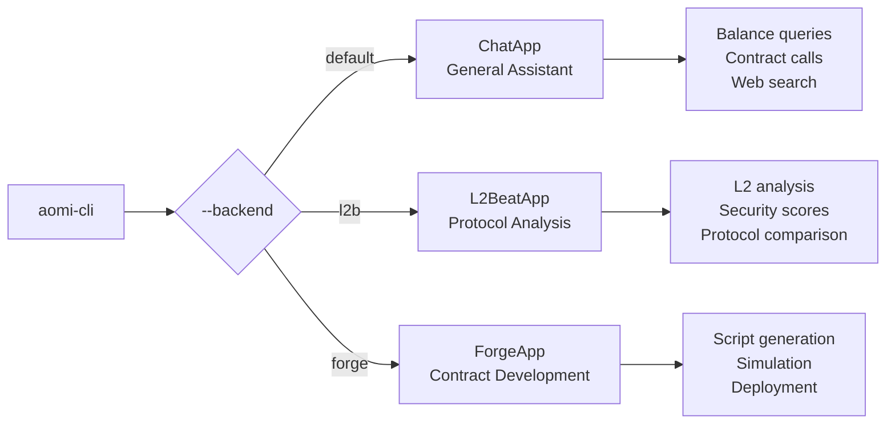

# AOMI CLI

The AOMI CLI provides interactive and scriptable access to AI-powered blockchain operations from your terminal.

## Installation

### Homebrew (macOS/Linux)

```bash
brew tap aomi-labs/aomi
brew install aomi-cli
```

### From Source

```bash
git clone https://github.com/aomi-labs/product-mono.git
cd product-mono/aomi
cargo install --path bin/cli
```

### Verify Installation

```bash
aomi-cli --help
```

## Usage



### Interactive Mode

Start an interactive session:

```bash
aomi-cli
```

```
Interactive Aomi CLI ready.
Commands: :help, :backend <default|l2b|forge>, :exit
> What is the ETH balance of vitalik.eth?

The ETH balance of vitalik.eth (0xd8dA6BF26964aF9D7eEd9e03E53415D37aA96045) is:
- 1,234.56 ETH

[Tool: Get account info] ✓
>
```

### Single Prompt Mode

Execute a single prompt and exit:

```bash
aomi-cli --prompt "What is the current gas price on Ethereum?"
```

Useful for scripting:

```bash
#!/bin/bash
ETH_BALANCE=$(aomi-cli --prompt "Get ETH balance for $WALLET_ADDRESS" 2>/dev/null)
echo "Balance: $ETH_BALANCE"
```

## Command-Line Options

| Option | Short | Description | Default |
|--------|-------|-------------|---------|
| `--prompt <TEXT>` | `-p` | Single prompt mode | - |
| `--backend <NAME>` | | Select backend | `default` |
| `--no-docs` | | Skip loading documentation | false |
| `--skip-mcp` | | Skip MCP connections | false |
| `--debug-file <PATH>` | | Write debug logs to file | - |
| `--log-level <LEVEL>` | | Log filter level | `debug` |
| `--show-tool` | | Show full tool output | false |

### Examples

```bash
# Use Forge backend for contract development
aomi-cli --backend forge

# Use L2Beat backend for protocol analysis
aomi-cli --backend l2b

# Skip docs for faster startup
aomi-cli --no-docs

# Enable debug logging
aomi-cli --debug-file ./aomi.log --log-level trace

# Show complete tool output
aomi-cli --show-tool
```

## REPL Commands

Inside interactive mode, use `:` prefix for commands:

| Command | Description |
|---------|-------------|
| `:help` | Show available commands |
| `:backend <name>` | Switch backend (default, l2b, forge) |
| `:test-events` | Emit mock system events (debugging) |
| `:exit` / `:quit` | Exit the CLI |

### Switching Backends

```
> :backend forge
Switched to Forge backend.

> Help me deploy an ERC20 token

I'll help you deploy an ERC20 token. Let me set up an execution plan...
```

## Backends



### Default Backend

General-purpose blockchain assistant:

- Query account balances and transaction history
- Call view functions on contracts
- Simulate transactions
- Search for blockchain information
- Encode function calls

```bash
aomi-cli
> What are the top holders of USDC?
```

### L2Beat Backend

Layer 2 protocol analysis:

- Analyze L2 security properties
- Compare protocols
- Evaluate data availability
- Assess bridge risks

```bash
aomi-cli --backend l2b
> Compare the security of Arbitrum and Optimism
```

### Forge Backend

Smart contract development:

- Generate Forge scripts
- Compile and simulate
- Plan multi-step deployments
- Execute transactions

```bash
aomi-cli --backend forge
> Deploy a simple ERC20 token with 1M supply
```

## Environment Variables

### Required

| Variable | Description |
|----------|-------------|
| `ANTHROPIC_API_KEY` | Claude API key for LLM |

### Optional

| Variable | Description |
|----------|-------------|
| `BRAVE_SEARCH_API_KEY` | Enable web search |
| `ETHERSCAN_API_KEY` | Contract data lookups |
| `ALCHEMY_API_KEY` | RPC endpoint access |
| `BAML_SERVER_URL` | Structured AI server |

### Setup

```bash
# Add to ~/.bashrc or ~/.zshrc
export ANTHROPIC_API_KEY="sk-ant-..."
export ETHERSCAN_API_KEY="..."
export BRAVE_SEARCH_API_KEY="..."

# Or use .env file
cp .env.template .env
# Edit .env with your keys
```

## Output Formatting

### Tool Output

By default, only tool names are shown:

```
> Check ETH balance of vitalik.eth

[Tool: Get account info] ✓

The balance is 1,234.56 ETH.
```

With `--show-tool`, full output is displayed:

```
> Check ETH balance of vitalik.eth

[Tool: Get account info]
{
  "address": "0xd8dA6BF26964aF9D7eEd9e03E53415D37aA96045",
  "balance": "1234560000000000000000",
  "balance_formatted": "1234.56 ETH"
}

The balance is 1,234.56 ETH.
```

### System Events

System events are rendered separately from chat:

```
> Send 0.1 ETH to alice.eth

[System] Transaction pending approval...
[Inline] {"type": "wallet_request", "to": "0x...", "value": "0.1"}

Please approve the transaction in your wallet.
```

## Debugging

### Debug Logs

Enable structured logging to a file:

```bash
aomi-cli --debug-file ./debug.log --log-level trace
```

Log levels: `trace`, `debug`, `info`, `warn`, `error`

### Custom Filters

Filter logs by module:

```bash
aomi-cli --debug-file ./debug.log --log-level "aomi_cli=debug,aomi_tools=trace"
```

### Test Events

Emit mock system events for debugging:

```
> :test-events

[Inline] {"type": "test_inline", "message": "InlineDisplay mock payload"}
[System] SystemNotice mock message
[Error] SystemError mock message
[Async] {"type": "test_async", "message": "AsyncUpdate mock payload"}
```

## Scripting Examples

### Balance Check Script

```bash
#!/bin/bash

ADDRESSES=(
    "vitalik.eth"
    "0x742d35Cc6634C0532925a3b844Bc9e7595f..."
)

for addr in "${ADDRESSES[@]}"; do
    echo "Checking $addr..."
    aomi-cli --prompt "Get ETH balance of $addr" --no-docs
    echo ""
done
```

### Contract Verification

```bash
#!/bin/bash

CONTRACT=$1
NETWORK=${2:-ethereum}

aomi-cli --prompt "
Verify the contract at $CONTRACT on $NETWORK:
1. Fetch the ABI and source code
2. Check if it's a proxy
3. List the main functions
" --no-docs
```

### Daily Report

```bash
#!/bin/bash

DATE=$(date +%Y-%m-%d)
OUTPUT="report-$DATE.md"

aomi-cli --prompt "
Generate a summary of the top DeFi protocols:
- Total TVL
- 24h volume
- Notable events
Format as markdown.
" > "$OUTPUT"

echo "Report saved to $OUTPUT"
```

## Troubleshooting

### "ANTHROPIC_API_KEY not set"

Set your API key:

```bash
export ANTHROPIC_API_KEY="sk-ant-..."
```

### "MCP connection failed"

Skip MCP if not needed:

```bash
aomi-cli --skip-mcp
```

### Slow Startup

Skip documentation loading:

```bash
aomi-cli --no-docs
```

### No Output

Check debug logs:

```bash
aomi-cli --debug-file ./debug.log --log-level debug
# Then check debug.log for errors
```
