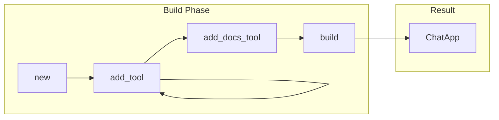
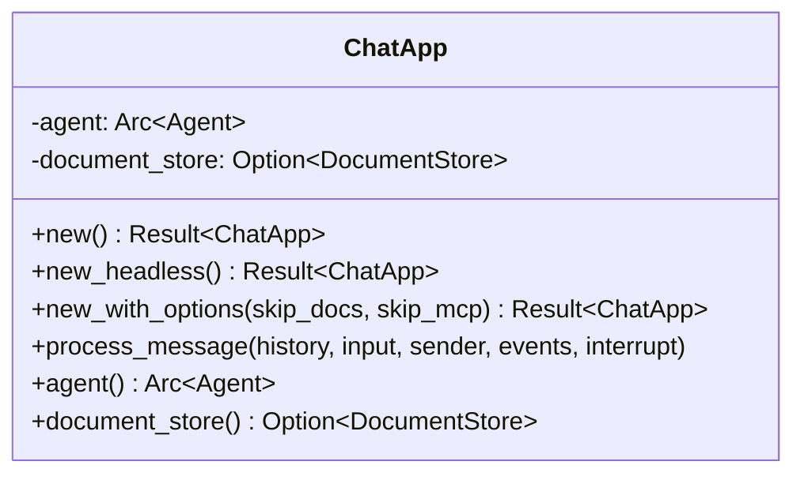
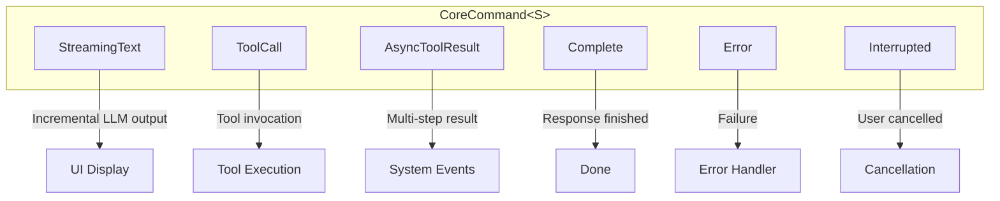
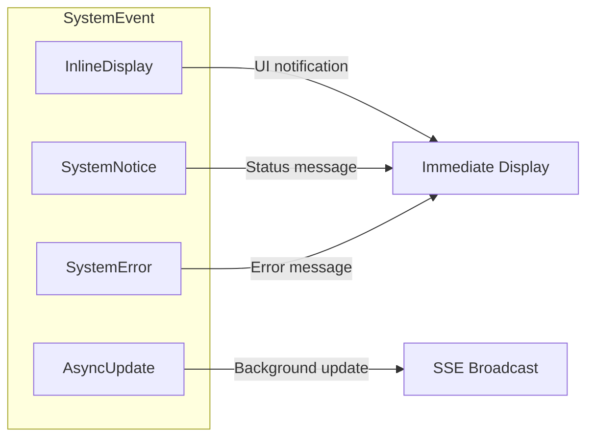

# AOMI SDK

The AOMI SDK provides a builder-pattern API for creating AI-powered blockchain agents. Build custom agentic applications with just a few lines of code.

## Quick Start

```rust
use aomi_chat::{ChatApp, CoreAppBuilder};

// Minimal setup
let app = ChatApp::new().await?;

// Or with custom configuration
let app = CoreAppBuilder::new(&my_preamble).await?
    .add_tool(MyCustomTool)?
    .build(false, None, None).await?;
```

## CoreAppBuilder

The builder pattern provides flexible app configuration:



### Constructor Methods

#### `new(preamble: &str)`

Create a builder with Anthropic connection and core tools:

```rust
let builder = CoreAppBuilder::new("You are a helpful assistant.").await?;
```

This automatically registers core tools:
- `SendTransactionToWallet`
- `EncodeFunctionCall`
- `GetCurrentTime`
- `CallViewFunction`
- `SimulateContractCall`
- `GetAccountInfo`
- `GetAccountTransactionHistory`
- `BraveSearch`
- `GetContractABI`
- `GetContractSourceCode`
- `GetContractFromEtherscan`

#### `new_with_model_connection(preamble, sender, no_tools, system_events)`

Full control over initialization:

```rust
let builder = CoreAppBuilder::new_with_model_connection(
    &preamble,
    Some(&command_sender),  // Optional UI channel
    false,                 // Include tools
    Some(&system_events), // Optional event queue
).await?;
```

#### `new_for_tests(system_events)`

Lightweight test mode without Anthropic connection:

```rust
#[cfg(test)]
let builder = CoreAppBuilder::new_for_tests(Some(&events)).await?;
let scheduler = builder.scheduler_for_tests();
```

### Builder Methods

#### `add_tool<T>(tool: T)`

Register a custom tool implementing `rig::tool::Tool`:

```rust
builder.add_tool(MyCustomTool)?;
builder.add_tool(AnotherTool)?;
```

Tools are registered in both:
1. The `ToolScheduler` (for execution)
2. The `AgentBuilder` (for LLM awareness)

#### `add_docs_tool(loading_sender, command_sender)`

Add RAG documentation search:

```rust
builder.add_docs_tool(
    Some(loading_sender),  // Progress updates
    Some(&command_sender),   // Error notifications
).await?;
```

#### `build(skip_mcp, system_events, command_sender)`

Finalize into a `ChatApp`:

```rust
let app = builder.build(
    false,                 // Connect to MCP server
    Some(&system_events), // Event queue
    Some(&command_sender),  // UI channel
).await?;
```

## ChatApp

The main application interface:



### Factory Methods

```rust
// Full-featured app
let app = ChatApp::new().await?;

// For evaluation (no docs, no MCP, no tools)
let app = ChatApp::new_headless().await?;

// Custom options
let app = ChatApp::new_with_options(
    true,   // skip_docs
    false,  // skip_mcp
).await?;

// With UI integration
let app = ChatApp::new_with_senders(
    &command_sender,
    loading_sender,
    &system_events,
    false,  // skip_docs
).await?;
```

### Processing Messages

```rust
app.process_message(
    &mut history,           // Conversation history
    user_input,             // User message
    &command_sender,          // Response channel
    &system_events,         // Event queue
    &mut interrupt_receiver, // Interrupt signal
).await?;
```

## Streaming Response

Use `stream_completion` for low-level streaming control:

```rust
use aomi_chat::{stream_completion, CoreCommand};
use futures::StreamExt;

let scheduler = ToolScheduler::get_or_init().await?;
let handler = scheduler.get_handler();

let mut stream = stream_completion(
    agent,
    handler,
    &input,
    history.clone(),
    system_events.clone(),
).await;

while let Some(result) = stream.next().await {
    match result {
        Ok(CoreCommand::StreamingText(text)) => {
            // Append incremental text
            response.push_str(&text);
        }
        Ok(CoreCommand::ToolCall { topic, stream }) => {
            // Handle tool invocation
            println!("Tool: {}", topic);
            // stream contains results
        }
        Ok(CoreCommand::AsyncToolResult { call_id, tool_name, result }) => {
            // Multi-step tool result
            println!("{}: {:?}", tool_name, result);
        }
        Ok(CoreCommand::Complete) => {
            break;
        }
        Ok(CoreCommand::Error(e)) => {
            eprintln!("Error: {}", e);
        }
        Ok(CoreCommand::Interrupted) => {
            println!("Interrupted by user");
            break;
        }
        Err(e) => {
            eprintln!("Stream error: {}", e);
        }
    }
}
```

## CoreCommand Variants



| Variant | Description | Fields |
|---------|-------------|--------|
| `StreamingText(String)` | Incremental LLM output | Text chunk |
| `ToolCall { topic, stream }` | Tool invocation | Tool name, result stream |
| `AsyncToolResult { call_id, tool_name, result }` | Multi-step tool result | Call ID, name, JSON result |
| `Complete` | Response finished | - |
| `Error(String)` | Processing error | Error message |
| `Interrupted` | User cancelled | - |

## System Events

### SystemEventQueue

Thread-safe event buffer for out-of-band communication:

```rust
use aomi_chat::{SystemEventQueue, SystemEvent};

let queue = SystemEventQueue::new();

// Push events
queue.push(SystemEvent::SystemNotice("Connected".into()));
queue.push(SystemEvent::InlineDisplay(json!({"type": "progress", "value": 50})));

// Read events (non-consuming)
let events = queue.slice_from(0);

// Check length
let count = queue.len();
```

### SystemEvent Variants



| Variant | Purpose | Usage |
|---------|---------|-------|
| `InlineDisplay(Value)` | UI notifications | Tool progress, wallet requests |
| `SystemNotice(String)` | Status messages | Connection status |
| `SystemError(String)` | Error messages | API failures |
| `AsyncUpdate(Value)` | Background updates | Title changes, task completion |

## Custom Tools

### Using `#[rig_tool]` Macro

The simplest way to create tools:

```rust
use rig::tool;
use serde::{Deserialize, Serialize};
use schemars::JsonSchema;

#[derive(Debug, Deserialize, JsonSchema, Clone)]
pub struct GetPriceParams {
    /// The token symbol (e.g., "ETH", "BTC")
    pub symbol: String,
    /// Currency for price (default: USD)
    #[serde(default = "default_currency")]
    pub currency: String,
}

fn default_currency() -> String { "USD".into() }

#[derive(Debug, Serialize, Clone)]
pub struct PriceResult {
    pub symbol: String,
    pub price: f64,
    pub currency: String,
}

#[tool(description = "Get the current price of a cryptocurrency")]
pub async fn get_crypto_price(
    params: GetPriceParams,
) -> Result<PriceResult, ToolError> {
    // Fetch price from API
    let price = fetch_price(&params.symbol, &params.currency).await?;

    Ok(PriceResult {
        symbol: params.symbol,
        price,
        currency: params.currency,
    })
}
```

Register with the builder:

```rust
builder.add_tool(get_crypto_price)?;
```

### Implementing AomiTool

For more control, implement the trait directly:

```rust
use aomi_tools::{AomiTool, AnyApiTool};

#[derive(Clone)]
pub struct MyTool;

impl AomiTool for MyTool {
    type ApiRequest = MyParams;
    type ApiResponse = MyResult;
    type MultiStepResults = ();  // Single-result tool
    type Error = MyError;

    fn name(&self) -> &'static str {
        "my_tool"
    }

    fn description(&self) -> &'static str {
        "Does something useful"
    }

    fn check_input(&self, request: Self::ApiRequest) -> bool {
        // Validate input
        !request.value.is_empty()
    }

    async fn call(&self, request: Self::ApiRequest) -> Result<Self::ApiResponse, Self::Error> {
        // Implementation
        Ok(MyResult { /* ... */ })
    }
}
```

### Multi-Step Tools

For long-running tools that stream results:

```rust
use aomi_tools::MultiStepApiTool;
use tokio::sync::mpsc::Sender;
use futures::future::BoxFuture;

#[derive(Clone)]
pub struct LongRunningTool;

impl MultiStepApiTool for LongRunningTool {
    type ApiRequest = LongRunningParams;
    type Error = anyhow::Error;

    fn name(&self) -> &'static str {
        "long_running_tool"
    }

    fn description(&self) -> &'static str {
        "Performs a long-running operation with progress updates"
    }

    fn validate(&self, request: &Self::ApiRequest) -> eyre::Result<()> {
        // Validate request
        Ok(())
    }

    fn call_stream(
        &self,
        request: Self::ApiRequest,
        sender: Sender<eyre::Result<Value>>,
    ) -> BoxFuture<'static, eyre::Result<()>> {
        async move {
            // Send progress updates
            sender.send(Ok(json!({"status": "starting"}))).await?;

            // Do work...
            tokio::time::sleep(Duration::from_secs(1)).await;
            sender.send(Ok(json!({"status": "processing", "progress": 50}))).await?;

            // More work...
            tokio::time::sleep(Duration::from_secs(1)).await;
            sender.send(Ok(json!({"status": "complete", "result": "done"}))).await?;

            Ok(())
        }.boxed()
    }
}
```

Register multi-step tools:

```rust
use aomi_tools::MultiStepToolWrapper;

let wrapper = MultiStepToolWrapper { inner: LongRunningTool };
scheduler.register_any_tool(Arc::new(wrapper))?;
```

## Tool Scheduler

Access the global tool scheduler:

```rust
use aomi_tools::ToolScheduler;

// Get or create the global scheduler
let scheduler = ToolScheduler::get_or_init().await?;

// Register a tool
scheduler.register_tool(MyTool)?;

// Get a handler for request processing
let handler = scheduler.get_handler();

// Check if a tool is multi-step
let is_multi = handler.is_multi_step("my_tool");
```

## Complete Example

```rust
use aomi_chat::{ChatApp, CoreAppBuilder, SystemEventQueue, CoreCommand};
use tokio::sync::mpsc;
use futures::StreamExt;

#[tokio::main]
async fn main() -> eyre::Result<()> {
    // Create channels
    let (tx, mut rx) = mpsc::channel::<CoreCommand>(100);
    let system_events = SystemEventQueue::new();

    // Build the app
    let preamble = "You are a DeFi assistant. Help users with token swaps and portfolio management.";

    let app = CoreAppBuilder::new(preamble).await?
        .add_tool(GetTokenPrice)?
        .add_tool(SwapTokens)?
        .build(true, Some(&system_events), Some(&tx)).await?;

    // Process a message
    let mut history = vec![];
    let (interrupt_tx, mut interrupt_rx) = mpsc::channel(1);

    app.process_message(
        &mut history,
        "What's the current price of ETH?".into(),
        &tx,
        &system_events,
        &mut interrupt_rx,
    ).await?;

    // Consume responses
    while let Some(cmd) = rx.recv().await {
        match cmd {
            CoreCommand::StreamingText(text) => print!("{}", text),
            CoreCommand::Complete => break,
            _ => {}
        }
    }

    Ok(())
}
```
