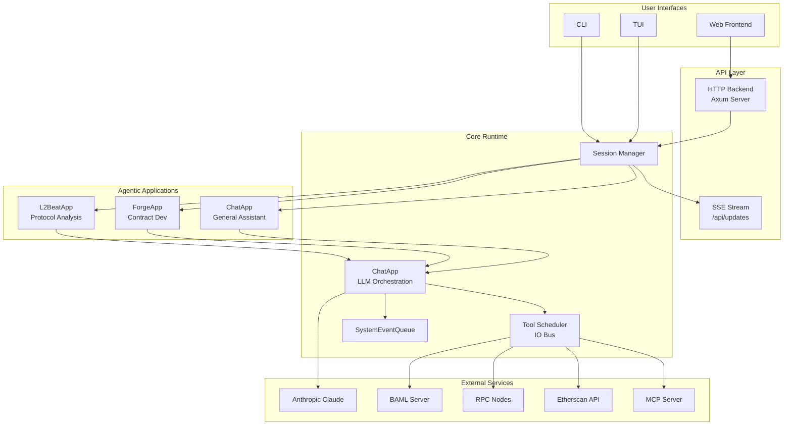
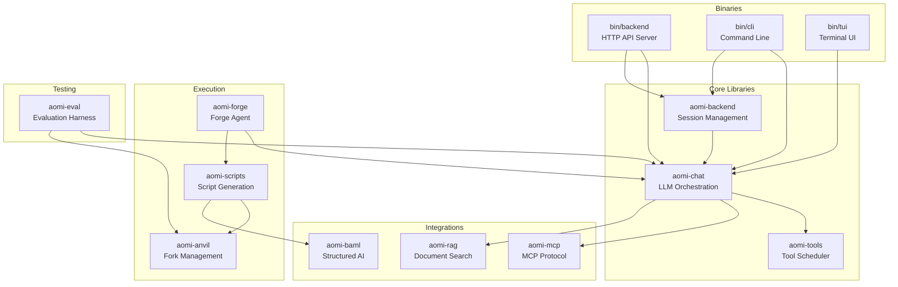
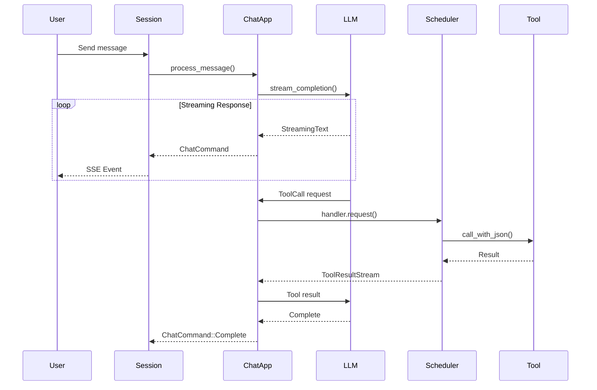
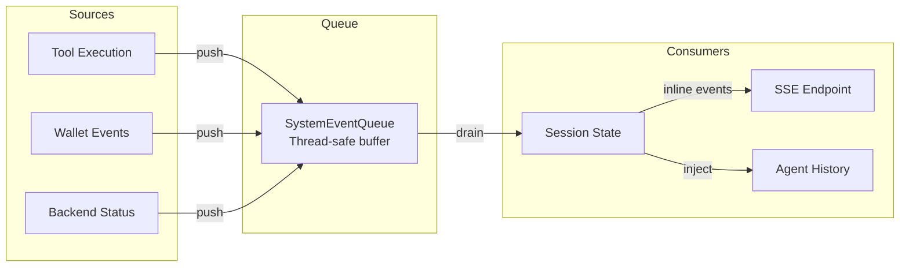
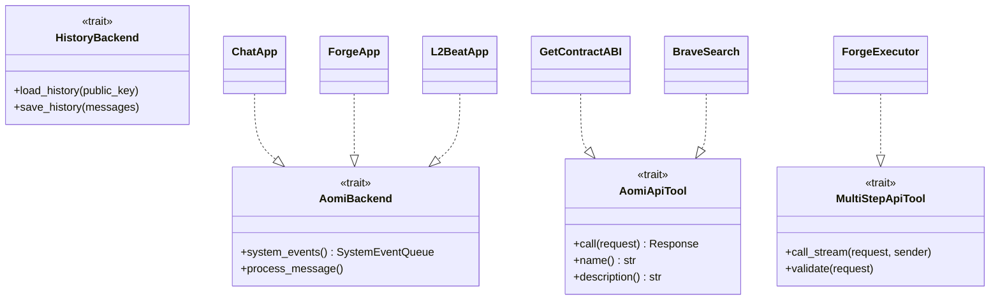
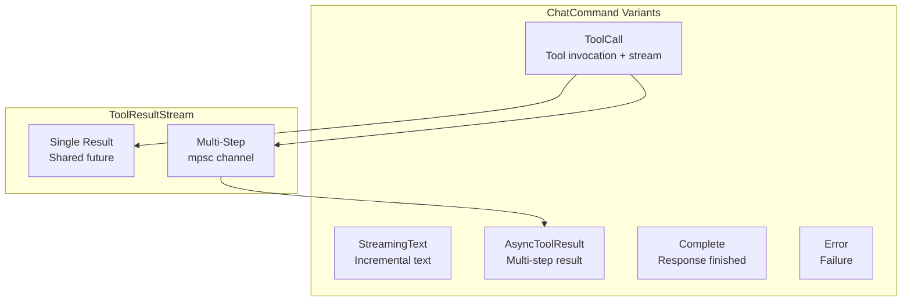
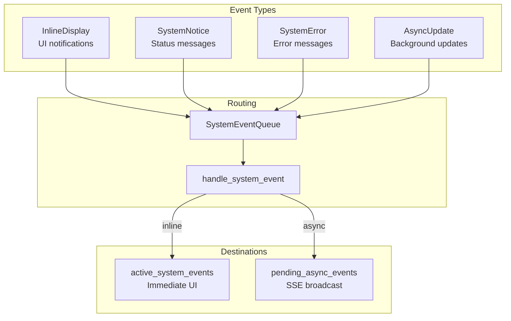

# AOMI Architecture

AOMI is an AI-powered blockchain operations assistant that transforms natural language into Web3 operations. Built with a streaming-first, modular design, it enables conversational interactions for querying blockchain state, executing swaps, calling smart contracts, and sending transactions.

## System Overview



## Crate Dependency Graph

The workspace is organized into binary crates (executables) and library crates (shared functionality):



## Core Crates

### aomi-chat

The heart of LLM orchestration. Manages agent creation, streaming completions, and system events.

| Component | Purpose |
|-----------|---------|
| `ChatApp` | Main application wrapper |
| `ChatAppBuilder` | Builder pattern for app configuration |
| `stream_completion` | Async generator for LLM responses |
| `SystemEventQueue` | Thread-safe event buffer |
| `ChatCommand` | Streaming response variants |

### aomi-backend

Session and history management for multi-user scenarios.

| Component | Purpose |
|-----------|---------|
| `SessionManager` | Manages concurrent sessions |
| `SessionState` | Per-session state machine |
| `HistoryBackend` | Pluggable persistence |
| `ChatMessage` | Message representation |

### aomi-tools

Centralized tool management via IO Scheduler pattern.

| Component | Purpose |
|-----------|---------|
| `ToolScheduler` | Global tool registry and executor |
| `ToolApiHandler` | Per-request handler |
| `ToolResultStream` | Streaming tool results |
| `AomiApiTool` | Tool trait for single-result tools |
| `MultiStepApiTool` | Tool trait for streaming tools |

### aomi-anvil

Anvil fork management for transaction simulation.

| Component | Purpose |
|-----------|---------|
| `ForkProvider` | Managed or external fork |
| `AnvilInstance` | Spawned Anvil process |
| `ForkSnapshot` | Fork state capture |

### aomi-scripts

Forge script generation and execution.

| Component | Purpose |
|-----------|---------|
| `ForgeExecutor` | Dependency-aware executor |
| `ScriptAssembler` | Script generation |
| `SourceFetcher` | Background contract fetching |
| `ExecutionPlan` | Operation grouping |

### aomi-eval

Evaluation framework for testing agent behavior.

| Component | Purpose |
|-----------|---------|
| `EvalHarness` | Test runner |
| `EvalCase` | Test case definition |
| `Assertion` | Balance/state assertions |

## Data Flow

### Message Processing



### System Events Flow



## Key Patterns

### Builder Pattern

All agentic applications use the builder pattern for flexible configuration:

```rust
let app = ChatAppBuilder::new(&preamble).await?
    .add_tool(GetContractABI)?
    .add_tool(SimulateTransaction)?
    .add_docs_tool(sender, None).await?
    .build(skip_mcp, system_events, sender).await?;
```

### Trait-Based Abstractions

Core components use traits for testability and extensibility:



### Streaming-First Design

All LLM responses and tool results stream via async generators:



### Event Bus Architecture

The SystemEventQueue acts as a central event bus:



## External Integrations

| Service | Crate | Purpose |
|---------|-------|---------|
| Anthropic Claude | aomi-chat | LLM inference |
| MCP Server | aomi-mcp | Extended tool protocol |
| Etherscan | aomi-tools | Contract data |
| Brave Search | aomi-tools | Web search |
| BAML Server | aomi-baml | Structured AI outputs |
| Alchemy/Infura | aomi-tools | RPC endpoints |

## Configuration

### Environment Variables

| Variable | Required | Purpose |
|----------|----------|---------|
| `ANTHROPIC_API_KEY` | Yes | Claude API access |
| `DATABASE_URL` | Yes | PostgreSQL/SQLite connection |
| `BRAVE_SEARCH_API_KEY` | No | Web search |
| `ETHERSCAN_API_KEY` | No | Contract data |
| `ALCHEMY_API_KEY` | No | RPC endpoints |
| `BAML_SERVER_URL` | No | Structured AI |

### Network Configuration

Networks are configured via `config.yaml`:

```yaml
networks:
  ethereum:
    rpc_url: "https://eth-mainnet.g.alchemy.com/v2/{key}"
    chain_id: 1
  base:
    rpc_url: "https://base-mainnet.g.alchemy.com/v2/{key}"
    chain_id: 8453
```

## Build & Run

```bash
# Development
cargo run --bin backend     # HTTP API server
cargo run --bin cli         # Interactive CLI
cargo run --bin tui         # Terminal UI

# Testing
cargo test --all            # All tests
cargo test --package aomi-tools  # Specific crate

# Production
docker build --target backend-runtime -t aomi-backend .
```
