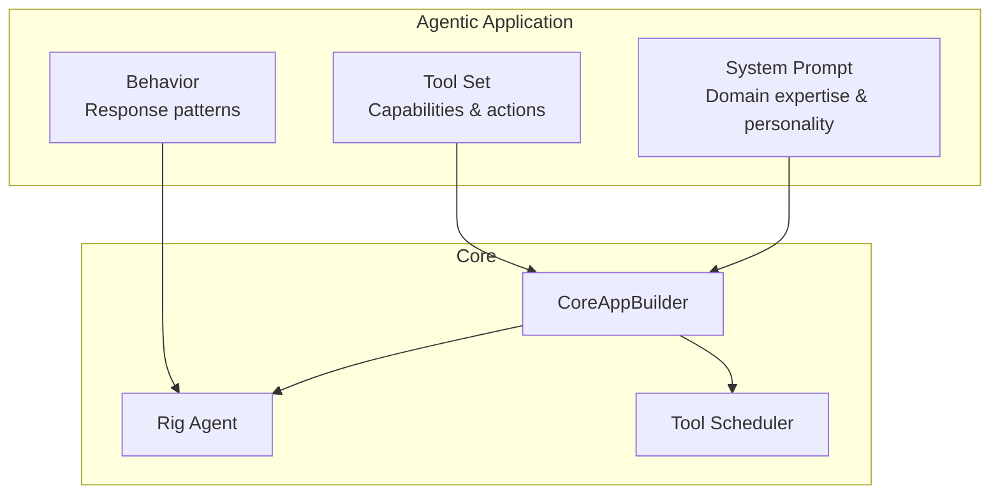
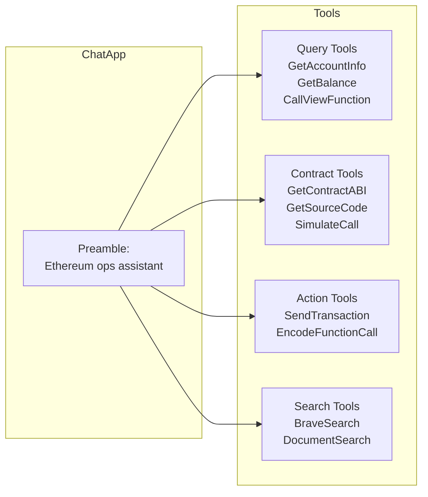
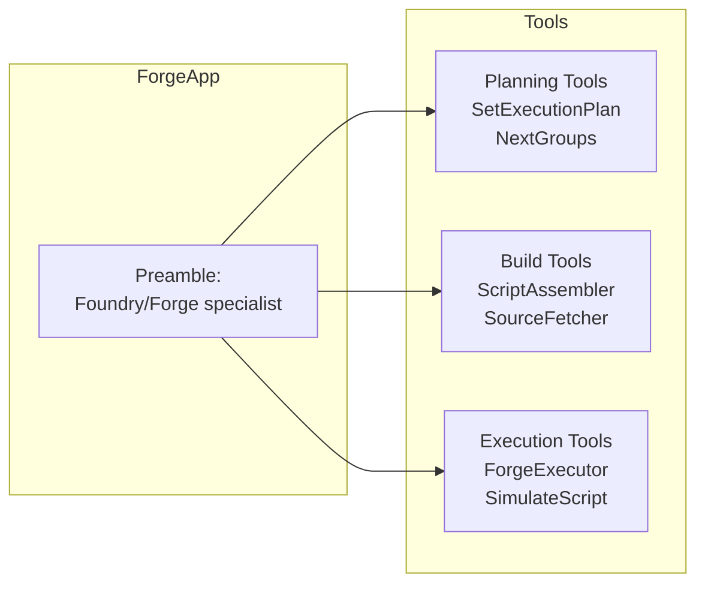
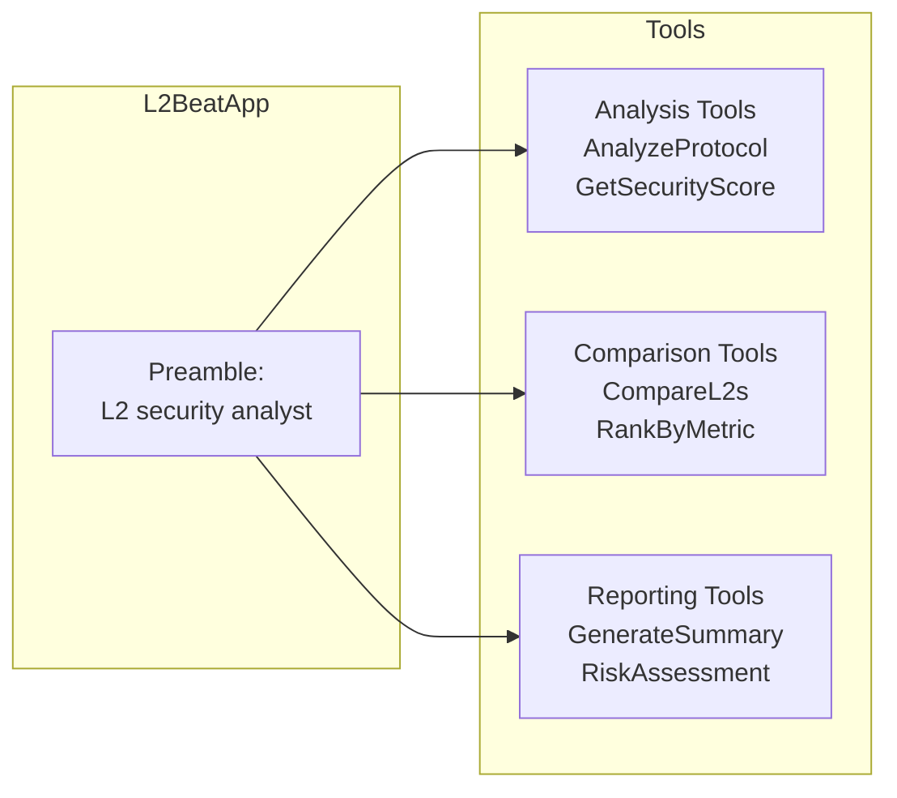
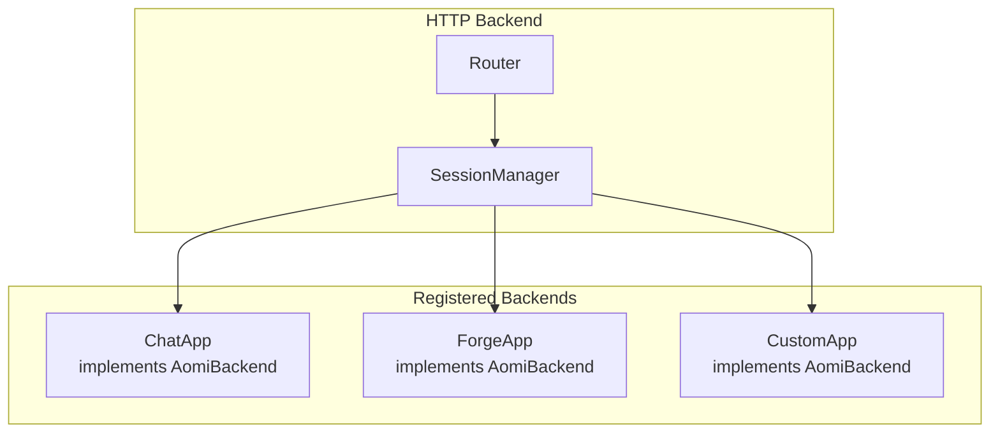
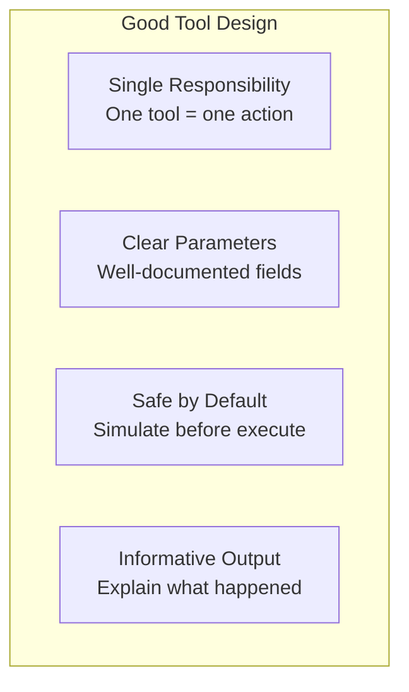

# Building Agentic Applications

An agentic application is a self-contained AI agent with a custom system prompt, specialized tools, and domain-specific behavior. This guide shows how to build your own agentic apps with just a few lines of code.

## What is an Agentic App?



Each agentic app defines:

| Component | Purpose | Example |
|-----------|---------|---------|
| **Preamble** | System prompt defining role and constraints | "You are a DeFi trading assistant..." |
| **Tools** | Available actions the agent can take | `SwapTokens`, `GetPrice`, `CheckBalance` |
| **Behavior** | Response patterns and workflows | "Always simulate before executing" |

## Quick Start

### Minimal App (5 Lines)

```rust
use aomi_chat::{CoreAppBuilder};

let app = CoreAppBuilder::new("You are a helpful blockchain assistant.").await?
    .add_tool(GetAccountInfo)?
    .add_tool(GetContractABI)?
    .build(true, None, None).await?;
```

### With Full Options

```rust
use aomi_chat::{CoreAppBuilder, SystemEventQueue};
use tokio::sync::mpsc;

let (tx, rx) = mpsc::channel(100);
let system_events = SystemEventQueue::new();

let preamble = include_str!("./prompts/defi_assistant.txt");

let mut builder = CoreAppBuilder::new(preamble).await?;

// Add domain-specific tools
builder.add_tool(SwapTokens)?;
builder.add_tool(GetPoolLiquidity)?;
builder.add_tool(CalculateSlippage)?;

// Add documentation search
builder.add_docs_tool(None, Some(&tx)).await?;

// Build with MCP integration
let app = builder.build(false, Some(&system_events), Some(&tx)).await?;
```

## Example: ChatApp (General Assistant)

The default `ChatApp` is a general-purpose blockchain assistant:



```rust
pub struct ChatApp {
    agent: Arc<Agent<CompletionModel>>,
    document_store: Option<Arc<Mutex<DocumentStore>>>,
}

impl ChatApp {
    pub async fn new() -> Result<Self> {
        let mut builder = CoreAppBuilder::new(&preamble()).await?;

        // Query tools
        builder.add_tool(GetAccountInfo)?;
        builder.add_tool(GetAccountTransactionHistory)?;

        // Contract tools
        builder.add_tool(CallViewFunction)?;
        builder.add_tool(SimulateContractCall)?;
        builder.add_tool(GetContractABI)?;
        builder.add_tool(GetContractSourceCode)?;
        builder.add_tool(GetContractFromEtherscan)?;

        // Action tools
        builder.add_tool(SendTransactionToWallet)?;
        builder.add_tool(EncodeFunctionCall)?;

        // Search tools
        builder.add_tool(BraveSearch)?;
        builder.add_tool(GetCurrentTime)?;

        builder.build(false, None, None).await
    }
}
```

## Example: ForgeApp (Contract Development)

The `ForgeApp` specializes in smart contract development and deployment:



```rust
fn forge_preamble() -> String {
    r#"You are an AI assistant specialized in Ethereum smart contract
development and deployment using Foundry/Forge.

Your role is to help users deploy and interact with smart contracts by:
- Understanding user intents and translating them into operations
- Planning and structuring operations for safe execution
- Simulating transactions before broadcast

General workflow:
1. Understand the user's intent
2. Gather contract information (ABIs, addresses)
3. Structure operations with proper sequencing
4. Build and simulate the script
5. Present transactions for approval

Key principles:
- Always simulate before suggesting real transactions
- Validate addresses and contract existence
- Break down complex operations into clear steps"#.into()
}

pub struct ForgeApp {
    chat_app: ChatApp,
}

impl ForgeApp {
    pub async fn new() -> Result<Self> {
        let mut builder = CoreAppBuilder::new(&forge_preamble()).await?;

        // Forge-specific tools
        builder.add_tool(SetExecutionPlan)?;
        builder.add_tool(NextGroups)?;

        // Contract tools (inherited)
        builder.add_tool(GetContractABI)?;
        builder.add_tool(GetContractSourceCode)?;

        let chat_app = builder.build(false, None, None).await?;
        Ok(Self { chat_app })
    }
}
```

## Example: L2BeatApp (Protocol Analysis)

The `L2BeatApp` specializes in Layer 2 protocol analysis:



```rust
fn l2beat_preamble() -> String {
    r#"You are an AI assistant specialized in analyzing Layer 2 protocols.

You help users understand:
- L2 security properties and assumptions
- Data availability solutions
- Bridge and rollup mechanisms
- Protocol-specific risks

When analyzing protocols:
1. Identify the L2 type (optimistic, zk, validium)
2. Assess the security model
3. Evaluate data availability guarantees
4. Compare with similar protocols"#.into()
}

pub struct L2BeatApp {
    chat_app: ChatApp,
}

impl L2BeatApp {
    pub async fn new() -> Result<Self> {
        let mut builder = CoreAppBuilder::new(&l2beat_preamble()).await?;

        // L2Beat-specific tools
        builder.add_tool(AnalyzeProtocol)?;
        builder.add_tool(CompareL2s)?;
        builder.add_tool(GetSecurityScore)?;

        let chat_app = builder.build(false, None, None).await?;
        Ok(Self { chat_app })
    }
}
```

## Creating Custom Tools

### Using the #[rig_tool] Macro

The simplest way to create tools:

```rust
use rig::tool;
use serde::{Deserialize, Serialize};
use schemars::JsonSchema;

#[derive(Debug, Deserialize, JsonSchema, Clone)]
pub struct GetTokenPriceParams {
    /// Token symbol or address
    pub token: String,
    /// Quote currency (default: USD)
    #[serde(default = "default_currency")]
    pub currency: String,
}

fn default_currency() -> String {
    "USD".into()
}

#[derive(Debug, Serialize, Clone)]
pub struct TokenPrice {
    pub token: String,
    pub price: f64,
    pub currency: String,
    pub timestamp: u64,
}

/// Get the current price of a token from DEX aggregators
#[tool(description = "Get the current price of a token")]
pub async fn get_token_price(params: GetTokenPriceParams) -> Result<TokenPrice, ToolError> {
    let price = fetch_price_from_aggregator(&params.token, &params.currency).await?;

    Ok(TokenPrice {
        token: params.token,
        price,
        currency: params.currency,
        timestamp: chrono::Utc::now().timestamp() as u64,
    })
}
```

### Tool Documentation

The LLM uses your documentation to understand when and how to use tools:

```rust
#[derive(Debug, Deserialize, JsonSchema, Clone)]
pub struct SwapParams {
    /// The token to sell (symbol or address)
    pub from_token: String,

    /// The token to buy (symbol or address)
    pub to_token: String,

    /// Amount to swap in human-readable format (e.g., "1.5" for 1.5 tokens)
    pub amount: String,

    /// Maximum acceptable slippage as percentage (e.g., "0.5" for 0.5%)
    #[serde(default = "default_slippage")]
    pub max_slippage: String,

    /// Network to execute on (default: ethereum)
    #[serde(default = "default_network")]
    pub network: String,
}

/// Execute a token swap on the best available DEX
///
/// This tool will:
/// 1. Find the best route across DEX aggregators
/// 2. Simulate the swap to verify output
/// 3. Queue the transaction for wallet approval
///
/// The transaction is NOT executed automatically - user must approve in wallet.
#[tool(description = "Execute a token swap on the best available DEX")]
pub async fn swap_tokens(params: SwapParams) -> Result<SwapResult, ToolError> {
    // Implementation
}
```

### Multi-Step Tools

For long-running operations that need progress updates:

```rust
use aomi_tools::MultiStepApiTool;
use futures::future::BoxFuture;
use tokio::sync::mpsc::Sender;

#[derive(Clone)]
pub struct BatchTransferTool;

impl MultiStepApiTool for BatchTransferTool {
    type ApiRequest = BatchTransferParams;
    type Error = anyhow::Error;

    fn name(&self) -> &'static str {
        "batch_transfer"
    }

    fn description(&self) -> &'static str {
        "Execute multiple token transfers in a single transaction batch"
    }

    fn validate(&self, request: &Self::ApiRequest) -> eyre::Result<()> {
        if request.transfers.is_empty() {
            return Err(eyre::eyre!("No transfers specified"));
        }
        Ok(())
    }

    fn call_stream(
        &self,
        request: Self::ApiRequest,
        sender: Sender<eyre::Result<Value>>,
    ) -> BoxFuture<'static, eyre::Result<()>> {
        async move {
            let total = request.transfers.len();

            for (i, transfer) in request.transfers.iter().enumerate() {
                // Progress update
                sender.send(Ok(json!({
                    "status": "processing",
                    "current": i + 1,
                    "total": total,
                    "transfer": transfer,
                }))).await?;

                // Process transfer
                process_transfer(transfer).await?;
            }

            // Final result
            sender.send(Ok(json!({
                "status": "complete",
                "processed": total,
            }))).await?;

            Ok(())
        }.boxed()
    }
}
```

## Preamble Composition

### Using PromptSection

Structure your preambles with clear sections:

```rust
use aomi_chat::prompts::{agent_preamble_builder, PromptSection};

fn my_agent_preamble() -> String {
    agent_preamble_builder()
        .section(PromptSection::titled("Role")
            .paragraph("You are a DeFi portfolio manager assistant.")
            .paragraph("You help users manage their token holdings across multiple chains."))

        .section(PromptSection::titled("Capabilities")
            .bullet("Check balances across chains")
            .bullet("Execute swaps and transfers")
            .bullet("Analyze portfolio composition")
            .bullet("Track historical performance"))

        .section(PromptSection::titled("Workflow")
            .numbered("Understand user's goal")
            .numbered("Gather current portfolio state")
            .numbered("Propose actions with simulations")
            .numbered("Execute approved transactions"))

        .section(PromptSection::titled("Constraints")
            .paragraph("Always simulate transactions before execution.")
            .paragraph("Never execute transactions without user approval.")
            .paragraph("Warn about high slippage or gas costs."))

        .section(PromptSection::titled("Account Context")
            .paragraph(generate_account_context()))

        .build()
}
```

### Dynamic Preambles

Include runtime context:

```rust
fn contextual_preamble(user: &UserProfile) -> String {
    let mut builder = agent_preamble_builder()
        .section(PromptSection::titled("Role")
            .paragraph("You are a personalized DeFi assistant."));

    // Add user context
    if let Some(risk_level) = &user.risk_preference {
        builder = builder.section(PromptSection::titled("User Preferences")
            .paragraph(format!("Risk tolerance: {}", risk_level))
            .paragraph(format!("Preferred networks: {}", user.networks.join(", "))));
    }

    builder.build()
}
```

## Running on Server

To expose your agentic app via HTTP, implement the `AomiBackend` trait:



```rust
use aomi_backend::{AomiBackend, BackendwithTool};
use aomi_chat::{CoreCommand, SystemEventQueue};
use tokio::sync::mpsc;
use async_trait::async_trait;

#[async_trait]
impl AomiBackend for MyCustomApp {
    fn system_events(&self) -> SystemEventQueue {
        self.system_events.clone()
    }

    async fn process_message(
        &self,
        history: &mut Vec<Message>,
        input: String,
        sender_to_ui: &mpsc::Sender<CoreCommand>,
        system_events: &SystemEventQueue,
        interrupt_receiver: &mut mpsc::Receiver<()>,
    ) -> Result<()> {
        // Delegate to inner ChatApp
        self.chat_app.process_message(
            history,
            input,
            sender_to_ui,
            system_events,
            interrupt_receiver,
        ).await
    }
}

// Register with SessionManager
let my_app: Arc<BackendwithTool> = Arc::new(MyCustomApp::new().await?);
backends.insert(BackendType::Custom, my_app);
```

## Best Practices

### Tool Design



| Principle | Description |
|-----------|-------------|
| **Single Responsibility** | Each tool does one thing well |
| **Clear Parameters** | Document all fields with examples |
| **Safe by Default** | Simulate transactions, require confirmation |
| **Informative Output** | Return enough context for LLM to explain |

### Preamble Writing

| Do | Don't |
|-----|-------|
| Be specific about capabilities | Make vague claims |
| Define clear workflows | Leave behavior ambiguous |
| Set explicit constraints | Assume common sense |
| Include examples | Use jargon without explanation |

### Error Handling

```rust
#[tool(description = "...")]
pub async fn my_tool(params: Params) -> Result<Output, ToolError> {
    // Validate early
    if params.address.is_empty() {
        return Err(ToolError::InvalidInput("Address required".into()));
    }

    // Handle external failures gracefully
    let result = external_api.call(&params).await
        .map_err(|e| ToolError::ExternalError(format!("API failed: {}", e)))?;

    // Return structured output
    Ok(Output {
        success: true,
        data: result,
        message: "Operation completed successfully".into(),
    })
}
```
