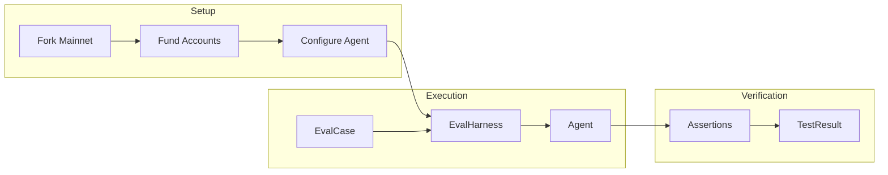
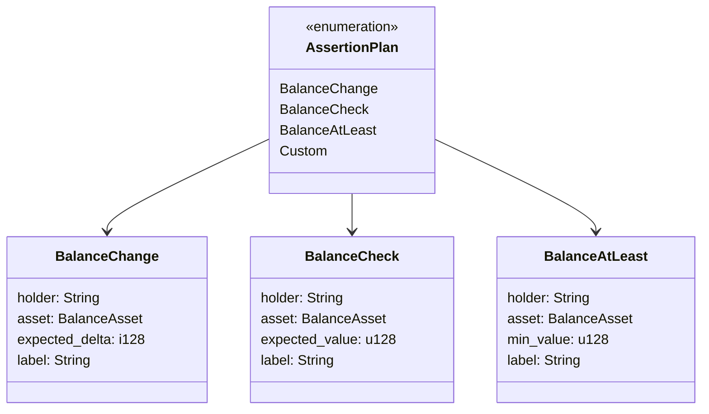
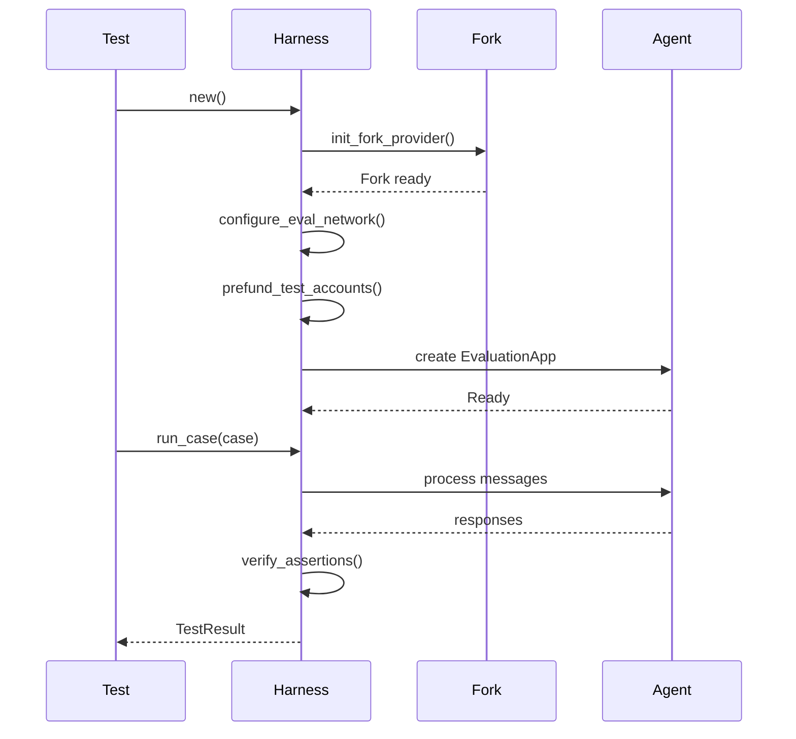
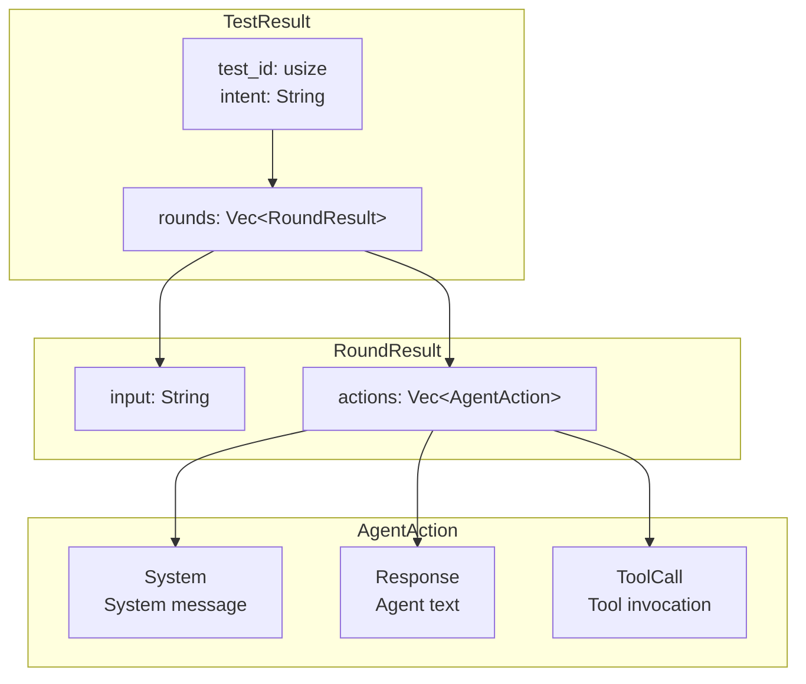
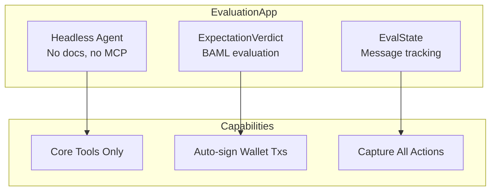
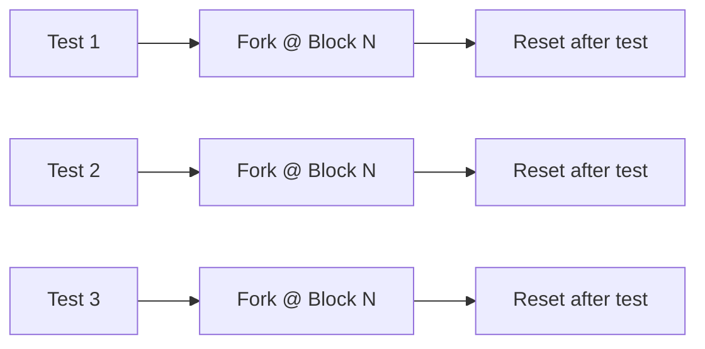

# Evaluation Framework

The AOMI evaluation framework enables testing agent behavior with deterministic assertions. Run tests against forked mainnet state to verify that agents correctly execute blockchain operations.

## Overview



## EvalCase

### Building Test Cases

```rust
use aomi_eval::{EvalCase, BalanceChange, BalanceAsset};

// Simple test case
let case = EvalCase::new("What is the ETH balance of vitalik.eth?");

// With expected behavior
let case = EvalCase::new("Transfer 0.1 ETH to alice.eth")
    .with_expectation("Transaction should be simulated and queued");

// With balance assertions
let case = EvalCase::new("Transfer 0.1 ETH to alice.eth")
    .with_balance_change(BalanceChange {
        holder: "alice.eth".into(),
        asset: BalanceAsset::eth(),
        expected_delta: parse_units("0.1", 18),
        label: "Alice receives ETH".into(),
    });
```

### Assertion Types



```rust
use aomi_eval::{AssertionPlan, BalanceChange, BalanceCheck, BalanceAsset};

// Balance change (delta)
let change = AssertionPlan::BalanceChange(BalanceChange {
    holder: "0xAlice...".into(),
    asset: BalanceAsset::eth(),
    expected_delta: 100_000_000_000_000_000, // +0.1 ETH
    label: "Alice receives ETH".into(),
});

// Exact balance check
let check = AssertionPlan::BalanceCheck(BalanceCheck {
    holder: "0xBob...".into(),
    asset: BalanceAsset::usdc("0xA0b86991c...")?,
    expected_value: 1_000_000_000, // 1000 USDC
    label: "Bob has 1000 USDC".into(),
});

// Minimum balance
let at_least = AssertionPlan::BalanceAtLeast {
    holder: "0xCharlie...".into(),
    asset: BalanceAsset::eth(),
    min_value: 1_000_000_000_000_000_000, // >= 1 ETH
    label: "Charlie has at least 1 ETH".into(),
};
```

### BalanceAsset

```rust
use aomi_eval::BalanceAsset;

// Native ETH
let eth = BalanceAsset::eth();

// Generic native token
let matic = BalanceAsset::native("MATIC", 18);

// ERC20 tokens
let usdc = BalanceAsset::usdc("0xA0b86991c6218b36c1d19D4a2e9Eb0cE3606eB48")?;
let usdt = BalanceAsset::usdt("0xdAC17F958D2ee523a2206206994597C13D831ec7")?;

// Custom ERC20
let weth = BalanceAsset::erc20(
    "WETH",
    "0xC02aaA39b223FE8D0A0e5C4F27eAD9083C756Cc2",
    18,
)?;
```

## EvalHarness

### Setup



```rust
use aomi_eval::{EvalHarness, EvalCase};

#[tokio::test]
async fn test_eth_transfer() -> anyhow::Result<()> {
    // Skip if no API key
    if skip_if_missing_anthropic_key()? {
        return Ok(());
    }

    // Create harness (initializes fork, funds accounts)
    let harness = EvalHarness::new().await?;

    // Define test case
    let case = EvalCase::new("Transfer 0.1 ETH to 0xAlice...")
        .with_balance_change(BalanceChange {
            holder: "0xAlice...".into(),
            asset: BalanceAsset::eth(),
            expected_delta: parse_units("0.1", 18),
            label: "Alice receives ETH".into(),
        });

    // Run evaluation
    let result = harness.run_case(case).await?;

    // Check results
    assert!(!result.is_empty(), "Agent should produce actions");
    assert!(result.has_tool_call("send_transaction_to_wallet"));

    Ok(())
}
```

### Test Accounts

```rust
// Pre-configured eval accounts
pub const EVAL_ACCOUNTS: &[&str] = &[
    "0x1234...",  // Account 0 - funded with ETH
    "0x5678...",  // Account 1 - funded with ETH + USDC
    // ...
];

// Accounts are pre-funded at harness initialization:
// - 100 ETH each
// - 2000 USDC each (from whale impersonation)
```

## TestResult

### Structure



```rust
use aomi_eval::{TestResult, RoundResult, AgentAction, ToolCall};

let result: TestResult = harness.run_case(case).await?;

// Inspect results
println!("Test: {}", result.intent);
println!("Rounds: {}", result.total_rounds());
println!("Tool calls: {}", result.total_tool_calls());
println!("Responses: {}", result.total_responses());

// Check for specific tool calls
if result.has_tool_call("get_account_info") {
    println!("Agent checked account info");
}

// Get all calls to a tool
let transfer_calls = result.get_tool_calls("send_transaction_to_wallet");
for call in transfer_calls {
    println!("Transfer: {} => {}", call.topic, call.content);
}

// Iterate rounds
for (i, round) in result.rounds.iter().enumerate() {
    println!("\nRound {}:", i + 1);
    println!("  Input: {}", round.input);
    for action in &round.actions {
        match action {
            AgentAction::ToolCall(tc) => println!("  [tool] {}", tc.topic),
            AgentAction::Response(text) => println!("  [response] {}", text),
            AgentAction::System(msg) => println!("  [system] {}", msg),
        }
    }
}
```

### Printing Results

```rust
// TestResult implements Display
println!("{}", result);

// Output:
// Test #1: Transfer 0.1 ETH to alice.eth
//
// Round 1:
// >> Transfer 0.1 ETH to alice.eth
//   [00] [tool] get_account_info => {"address": "0x...", "balance": "10.5"}
//   [01] [tool] send_transaction_to_wallet => {"to": "0x...", "value": "0.1"}
//   [02] [response] I've queued a transaction to transfer 0.1 ETH...
```

## Assertions

### Running Assertions

```rust
use aomi_eval::{Assertion, AssertionResult};

// Assertions run after all rounds complete
let case = EvalCase::new("Transfer 1 USDC to bob.eth")
    .with_balance_change(BalanceChange {
        holder: "bob.eth".into(),
        asset: BalanceAsset::usdc(USDC_CONTRACT)?,
        expected_delta: 1_000_000, // 1 USDC
        label: "Bob receives USDC".into(),
    });

let result = harness.run_case(case).await?;

// Assertions are verified automatically
// Failures are included in TestResult
```

### Custom Assertions

```rust
use aomi_eval::Assertion;
use async_trait::async_trait;

pub struct ContractDeployedAssertion {
    pub expected_address: Option<Address>,
    pub bytecode_hash: B256,
}

#[async_trait]
impl Assertion for ContractDeployedAssertion {
    async fn verify(&self, provider: &impl Provider) -> AssertionResult {
        // Check if contract exists
        let code = provider.get_code(self.expected_address?, None).await?;

        if code.is_empty() {
            return AssertionResult::Failed {
                label: "Contract not deployed".into(),
                reason: "No bytecode at expected address".into(),
            };
        }

        let hash = keccak256(&code);
        if hash != self.bytecode_hash {
            return AssertionResult::Failed {
                label: "Wrong contract".into(),
                reason: format!("Expected hash {:?}, got {:?}", self.bytecode_hash, hash),
            };
        }

        AssertionResult::Passed {
            label: "Contract deployed correctly".into(),
        }
    }
}
```

## EvaluationApp

### Specialized Agent



```rust
use aomi_eval::eval_app::EvaluationApp;

// Create headless agent for evaluation
let app = EvaluationApp::new().await?;

// Process a prompt
let messages = app.process_prompt("Check ETH balance of vitalik.eth").await?;

// Messages contain all agent actions
for msg in messages {
    if let Some((tool_name, result)) = &msg.tool_stream {
        println!("Tool: {} => {}", tool_name, result);
    }
}
```

### Auto-signing

For evaluation, wallet transactions can be auto-signed:

```rust
// Set environment variable to enable auto-signing
std::env::set_var("LOCAL_TEST_WALLET_AUTOSIGN", "true");

// Transactions will be automatically approved in eval mode
let result = harness.run_case(transfer_case).await?;
```

## Test Patterns

### Basic Query Test

```rust
#[tokio::test]
async fn test_balance_query() -> anyhow::Result<()> {
    let harness = EvalHarness::new().await?;

    let case = EvalCase::new("What is the ETH balance of vitalik.eth?");
    let result = harness.run_case(case).await?;

    assert!(result.has_tool_call("get_account_info"));
    assert!(result.total_responses() >= 1);

    Ok(())
}
```

### Transaction Test

```rust
#[tokio::test]
async fn test_eth_transfer() -> anyhow::Result<()> {
    let harness = EvalHarness::new().await?;

    let alice = EVAL_ACCOUNTS[1];
    let initial_balance = harness.get_balance(alice, BalanceAsset::eth()).await?;

    let case = EvalCase::new(format!("Transfer 0.5 ETH to {}", alice))
        .with_balance_change(BalanceChange {
            holder: alice.into(),
            asset: BalanceAsset::eth(),
            expected_delta: parse_units("0.5", 18),
            label: "Alice receives 0.5 ETH".into(),
        });

    let result = harness.run_case(case).await?;

    assert!(result.has_tool_call("send_transaction_to_wallet"));

    Ok(())
}
```

### Multi-Step Test

```rust
#[tokio::test]
async fn test_swap_tokens() -> anyhow::Result<()> {
    let harness = EvalHarness::new().await?;

    let case = EvalCase::new("Swap 100 USDC for ETH using Uniswap")
        .with_expectation("Should approve USDC and execute swap")
        .with_balance_change(BalanceChange {
            holder: EVAL_ACCOUNTS[0].into(),
            asset: BalanceAsset::usdc(USDC_CONTRACT)?,
            expected_delta: -100_000_000, // -100 USDC
            label: "USDC spent".into(),
        });

    let result = harness.run_case(case).await?;

    // Should have multiple tool calls
    assert!(result.total_tool_calls() >= 2);
    assert!(result.has_tool_call("get_contract_abi")); // Fetch router ABI
    assert!(result.has_tool_call("send_transaction_to_wallet"));

    Ok(())
}
```

### Negative Test

```rust
#[tokio::test]
async fn test_insufficient_funds() -> anyhow::Result<()> {
    let harness = EvalHarness::new().await?;

    // Try to transfer more than available
    let case = EvalCase::new("Transfer 1000000 ETH to alice.eth")
        .with_expectation("Should fail or warn about insufficient funds");

    let result = harness.run_case(case).await?;

    // Agent should handle gracefully
    let responses: Vec<_> = result.rounds.iter()
        .flat_map(|r| r.actions.iter())
        .filter_map(|a| match a {
            AgentAction::Response(text) => Some(text.to_lowercase()),
            _ => None,
        })
        .collect();

    let mentions_insufficient = responses.iter()
        .any(|r| r.contains("insufficient") || r.contains("not enough"));

    assert!(mentions_insufficient, "Agent should mention insufficient funds");

    Ok(())
}
```

## Running Evaluations

### CLI

```bash
# Run all eval tests
cargo test --package aomi-eval --features eval-test

# Run specific test
cargo test --package aomi-eval test_eth_transfer --features eval-test

# With debug output
DEBUG=1 cargo test --package aomi-eval --features eval-test -- --nocapture
```

### Environment Setup

```bash
# Required
export ANTHROPIC_API_KEY="sk-ant-..."

# Optional - for BAML expectations
export BAML_SERVER_URL="http://localhost:2024"

# Enable auto-signing for eval
export LOCAL_TEST_WALLET_AUTOSIGN="true"
```

### CI Configuration

```yaml
# .github/workflows/eval.yml
name: Evaluations

on:
  push:
    branches: [main]
  schedule:
    - cron: '0 0 * * *'  # Daily

jobs:
  eval:
    runs-on: ubuntu-latest
    steps:
      - uses: actions/checkout@v4

      - name: Setup Rust
        uses: actions-rs/toolchain@v1

      - name: Run Evaluations
        env:
          ANTHROPIC_API_KEY: ${{ secrets.ANTHROPIC_API_KEY }}
          ALCHEMY_API_KEY: ${{ secrets.ALCHEMY_API_KEY }}
        run: |
          cargo test --package aomi-eval --features eval-test
```

## Best Practices

### Test Isolation



### Guidelines

| Practice | Description |
|----------|-------------|
| **Fork at specific block** | Ensure reproducible state |
| **Pre-fund accounts** | Avoid flaky balance issues |
| **Reset after each test** | Isolate test state |
| **Use deterministic inputs** | Avoid random addresses |
| **Check tool calls** | Verify agent behavior |
| **Validate outputs** | Assert on final state |
