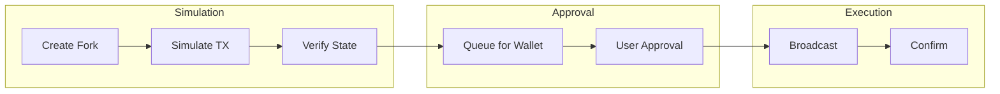
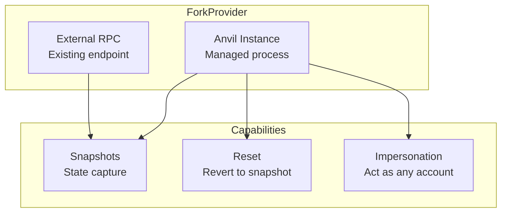
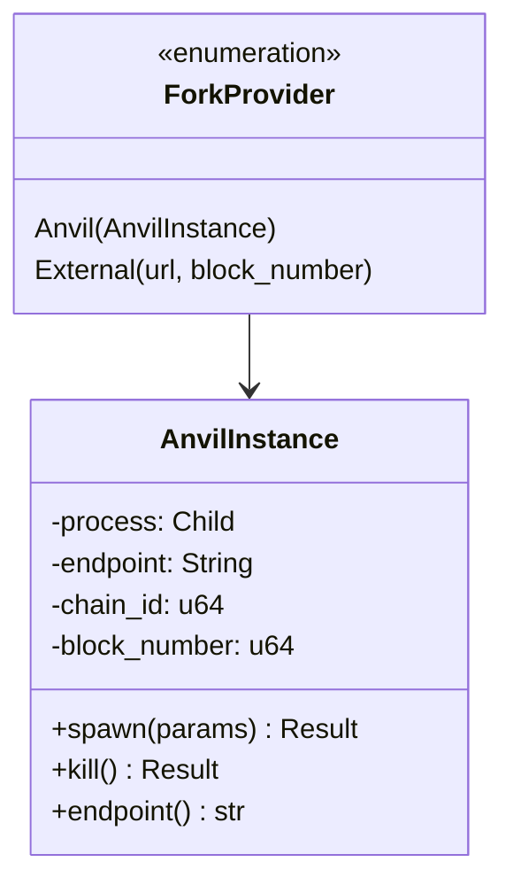
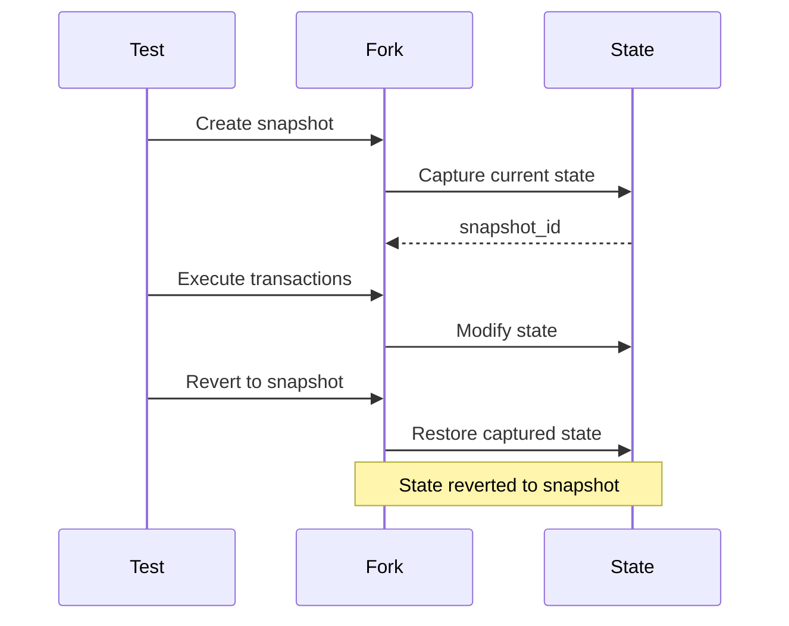
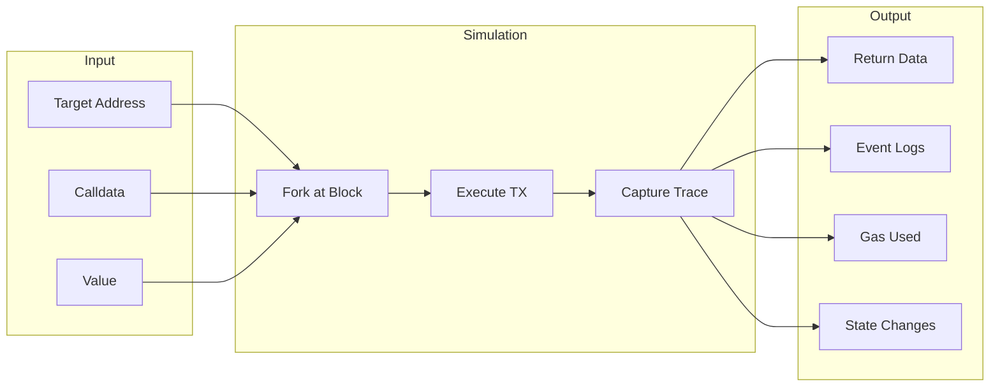
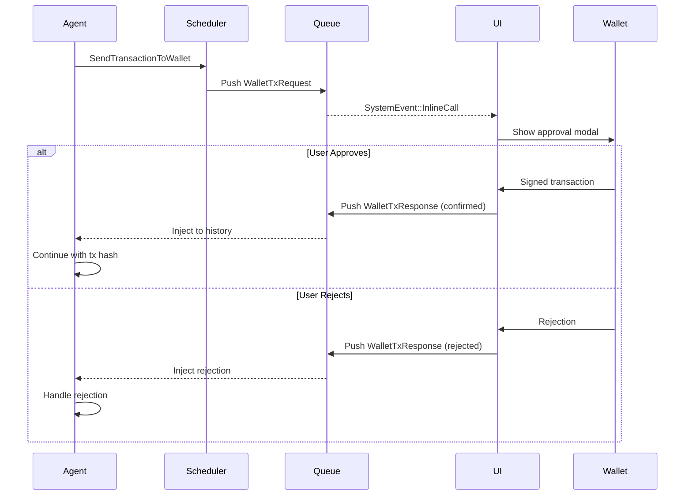
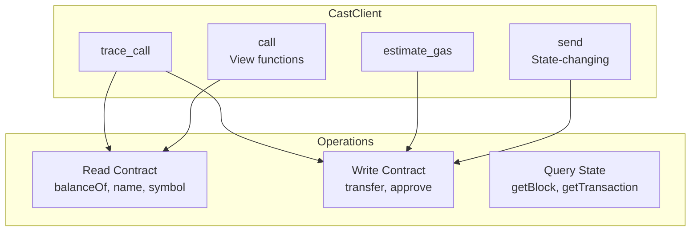
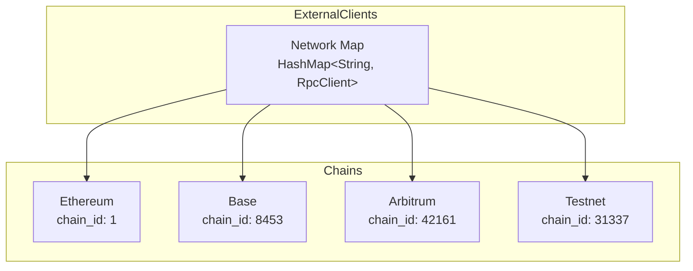
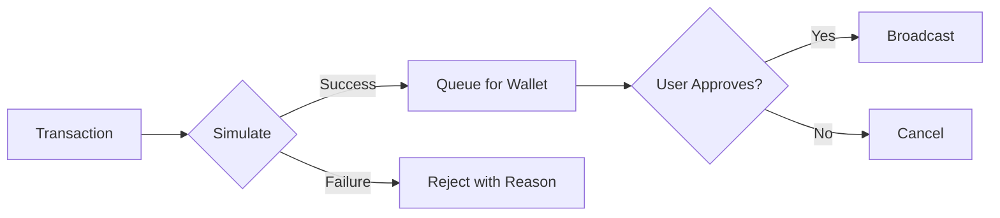

# Transaction Execution

AOMI provides safe transaction execution through simulation-first workflows. All transactions are simulated on Anvil forks before being sent to user wallets for approval.

## Overview



## Fork Management

### ForkProvider

The `aomi-anvil` crate manages Anvil forks for transaction simulation:



### Initialization

```rust
use aomi_anvil::{
    init_fork_provider, fork_endpoint, ForkProvider,
    AnvilParams, ForksConfig,
};

// Initialize from configuration
let config = ForksConfig::from_yaml("config.yaml")?;
init_fork_providers(config).await?;

// Or initialize a single fork
let params = AnvilParams {
    fork_url: "https://eth-mainnet.g.alchemy.com/v2/YOUR_KEY".into(),
    fork_block_number: Some(18_500_000),
    chain_id: Some(1),
    port: Some(8545),
};

init_fork_provider(params).await?;

// Get the endpoint
let rpc_url = fork_endpoint()?;
println!("Fork running at: {}", rpc_url);
```

### Provider Types



```rust
// Managed Anvil instance
let provider = ForkProvider::spawn(params).await?;
assert!(provider.is_managed());

// External RPC (no process management)
let provider = ForkProvider::external("http://localhost:8545").await?;
assert!(!provider.is_managed());

// Common interface
println!("Endpoint: {}", provider.endpoint());
println!("Block: {}", provider.block_number());
```

## Snapshots

### Capturing State



```rust
use aomi_anvil::{fork_snapshot, ForkSnapshot};

// Capture current state
let snapshot: ForkSnapshot = fork_snapshot()?;
println!("Snapshot at block: {}", snapshot.block_number());

// Execute some transactions
execute_test_transactions().await?;

// Revert to snapshot (reinitialize fork)
shutdown_and_reinit_all().await?;
```

### Snapshot Properties

```rust
#[derive(Clone, Debug)]
pub struct ForkSnapshot {
    endpoint: String,
    chain_id: Option<u64>,
    is_spawned: bool,
    block_number: u64,
}

impl ForkSnapshot {
    pub fn endpoint(&self) -> &str { &self.endpoint }
    pub fn chain_id(&self) -> Option<u64> { self.chain_id }
    pub fn is_spawned(&self) -> bool { self.is_spawned }
    pub fn block_number(&self) -> u64 { self.block_number }
}
```

## Transaction Simulation

### SimulateContractCall Tool



```rust
use aomi_tools::cast::SimulateContractCall;

#[derive(Debug, Deserialize, JsonSchema)]
pub struct SimulateParams {
    /// Target contract address
    pub to: String,

    /// Encoded calldata (hex)
    pub data: String,

    /// Value to send in ETH
    #[serde(default)]
    pub value: String,

    /// Sender address to simulate from
    pub from: String,

    /// Network to simulate on
    #[serde(default = "default_network")]
    pub network: String,
}

#[tool(description = "Simulate a contract call without broadcasting")]
pub async fn simulate_contract_call(
    params: SimulateParams,
) -> Result<SimulationResult, ToolError> {
    let client = external_clients().await.cast_client(&params.network)?;

    let result = client.simulate(
        &params.from,
        &params.to,
        &params.data,
        &params.value,
    ).await?;

    Ok(SimulationResult {
        success: result.success,
        return_data: result.output,
        gas_used: result.gas_used,
        logs: result.logs,
    })
}
```

### Batch Simulation

```rust
// Simulate multiple transactions in sequence
let fork_url = fork_endpoint()?;
let provider = ProviderBuilder::new().on_http(fork_url.parse()?);

let mut results = Vec::new();

for tx in transactions {
    // Impersonate sender
    provider.anvil_impersonate_account(tx.from).await?;

    // Execute transaction
    let result = provider.send_transaction(tx.clone()).await?;
    let receipt = result.get_receipt().await?;

    results.push(SimulationResult {
        tx_hash: receipt.transaction_hash,
        success: receipt.status(),
        gas_used: receipt.gas_used,
    });
}

// Revert all changes
shutdown_and_reinit_all().await?;
```

## Wallet Integration

### Transaction Flow



### SendTransactionToWallet Tool

```rust
use aomi_tools::wallet::SendTransactionToWallet;

#[derive(Debug, Deserialize, JsonSchema)]
pub struct SendTxParams {
    /// Target address
    pub to: String,

    /// Value in ETH
    pub value: String,

    /// Encoded calldata (optional)
    #[serde(default)]
    pub data: String,

    /// Network
    #[serde(default = "default_network")]
    pub network: String,

    /// Human-readable description
    pub description: String,
}

#[tool(description = "Queue a transaction for wallet approval")]
pub async fn send_transaction_to_wallet(
    params: SendTxParams,
) -> Result<String, ToolError> {
    // Build transaction request
    let tx_request = TransactionRequest {
        to: params.to.parse()?,
        value: parse_ether(&params.value)?,
        data: params.data.parse()?,
        chain_id: network_to_chain_id(&params.network),
    };

    // Queue for wallet (don't execute directly)
    let request_id = queue_wallet_request(tx_request, &params.description).await?;

    Ok(format!(
        "Transaction queued for approval (request_id: {}). \
         Waiting for wallet confirmation.",
        request_id
    ))
}
```

### System Event Flow

```rust
// When tool queues transaction
system_events.push(SystemEvent::InlineCall(json!({
    "type": "wallet_tx_request",
    "request_id": request_id,
    "to": params.to,
    "value": params.value,
    "description": params.description,
})));

// When user responds
system_events.push(SystemEvent::InlineCall(json!({
    "type": "wallet_tx_response",
    "request_id": request_id,
    "status": "confirmed",  // or "rejected"
    "tx_hash": "0x...",
})));
```

## Cast Client

### RPC Operations



```rust
use aomi_tools::clients::{CastClient, external_clients};

let clients = external_clients().await;
let cast = clients.cast_client("ethereum")?;

// Call view function
let balance = cast.call(
    token_address,
    "balanceOf(address)",
    &[wallet_address],
).await?;

// Estimate gas
let gas = cast.estimate_gas(
    from_address,
    to_address,
    calldata,
    value,
).await?;

// Trace call for debugging
let trace = cast.trace_call(
    from_address,
    to_address,
    calldata,
).await?;
```

### CallViewFunction Tool

```rust
#[derive(Debug, Deserialize, JsonSchema)]
pub struct CallViewParams {
    /// Contract address
    pub contract: String,

    /// Function signature (e.g., "balanceOf(address)")
    pub function: String,

    /// Function arguments
    pub args: Vec<String>,

    /// Network
    #[serde(default = "default_network")]
    pub network: String,
}

#[tool(description = "Call a view/pure function on a contract")]
pub async fn call_view_function(
    params: CallViewParams,
) -> Result<String, ToolError> {
    let cast = external_clients().await.cast_client(&params.network)?;

    let result = cast.call(
        &params.contract,
        &params.function,
        &params.args,
    ).await?;

    Ok(result)
}
```

## Multi-Network Support

### Network Configuration

```yaml
# config.yaml
networks:
  ethereum:
    rpc_url: "https://eth-mainnet.g.alchemy.com/v2/${ALCHEMY_KEY}"
    chain_id: 1

  base:
    rpc_url: "https://base-mainnet.g.alchemy.com/v2/${ALCHEMY_KEY}"
    chain_id: 8453

  arbitrum:
    rpc_url: "https://arb-mainnet.g.alchemy.com/v2/${ALCHEMY_KEY}"
    chain_id: 42161

  testnet:
    rpc_url: "http://localhost:8545"
    chain_id: 31337
```

### Network Routing



```rust
// Get client for specific network
let eth_client = clients.cast_client("ethereum")?;
let base_client = clients.cast_client("base")?;

// Network-aware operations
let balance = eth_client.get_balance(address).await?;
let base_balance = base_client.get_balance(address).await?;
```

## Error Handling

### Common Errors

| Error | Cause | Resolution |
|-------|-------|------------|
| `ForkNotInitialized` | `init_fork_provider` not called | Initialize before use |
| `SimulationReverted` | Transaction would fail | Check calldata and state |
| `InsufficientFunds` | Not enough ETH/tokens | Fund the account |
| `GasEstimationFailed` | Complex transaction | Provide manual gas limit |
| `RpcError` | Network issues | Retry or switch RPC |

### Retry Strategies

```rust
use tokio::time::{sleep, Duration};

async fn with_retry<F, T, E>(f: F, max_attempts: u32) -> Result<T, E>
where
    F: Fn() -> futures::future::BoxFuture<'static, Result<T, E>>,
    E: std::fmt::Debug,
{
    let mut attempts = 0;
    let mut delay = Duration::from_secs(1);

    loop {
        match f().await {
            Ok(result) => return Ok(result),
            Err(e) if attempts < max_attempts => {
                attempts += 1;
                tracing::warn!("Attempt {} failed: {:?}, retrying...", attempts, e);
                sleep(delay).await;
                delay *= 2; // Exponential backoff
            }
            Err(e) => return Err(e),
        }
    }
}

// Usage
let result = with_retry(|| {
    Box::pin(cast.call(contract, function, args))
}, 3).await?;
```

## Security Considerations

### Simulation First



### Best Practices

| Practice | Description |
|----------|-------------|
| **Always simulate** | Never skip simulation step |
| **Show state changes** | Display balance deltas clearly |
| **Require confirmation** | Never auto-execute transactions |
| **Validate addresses** | Check checksums and formats |
| **Warn on high value** | Alert for large transfers |
| **Check approvals** | Verify token approvals before swaps |
