# Agentic Runtime

The agentic runtime is the core execution loop that orchestrates user history, LLM completion calls, and concurrent on-chain execution. This guide covers the key patterns that make AOMI highly concurrent and configurable.

## Overview

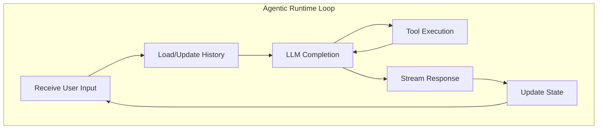

## Concurrency Model

### OS Thread per Active Conversation

Each active conversation runs on its own OS thread, enabling true parallel execution across sessions with isolated failure domains:

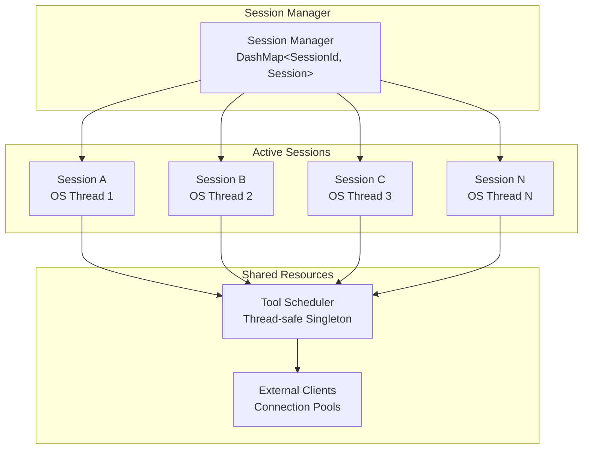

### Benefits

| Aspect | Benefit |
|--------|---------|
| **Isolation** | Session failures don't cascade |
| **Parallelism** | Multiple LLM calls execute simultaneously |
| **Responsiveness** | Long tool calls don't block other users |
| **Scalability** | Linear scaling with CPU cores |

## User History

### Public Key Binding

History is linked to the user's public key (wallet address), enabling cross-session context and wallet-aware conversations:

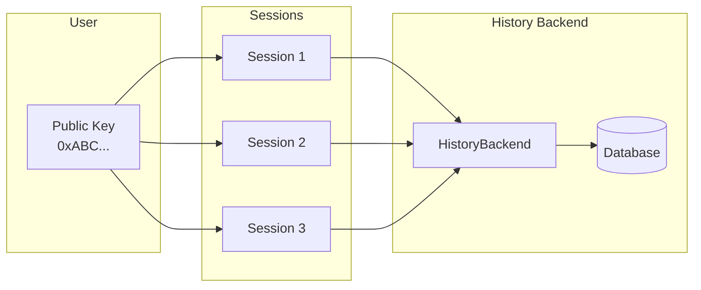

```rust
// History loads automatically based on public key
let session = session_manager
    .get_or_create_session(
        &session_id,
        backend,
        Some(public_key), // Links history to wallet
    )
    .await?;
```

### Configurable History Loading

The `HistoryBackend` trait allows pluggable persistence strategies:

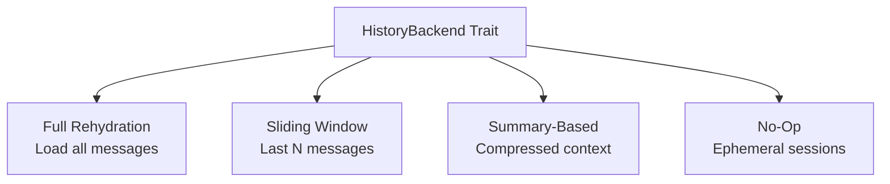

```rust
pub trait HistoryBackend: Send + Sync {
    /// Load history for a public key
    async fn load_history(&self, public_key: &str) -> Result<Vec<Message>>;

    /// Save messages to history
    async fn save_history(&self, public_key: &str, messages: &[Message]) -> Result<()>;

    /// Flush pending writes
    async fn flush(&self) -> Result<()>;
}
```

### Persistent History

```rust
// PostgreSQL/SQLite persistence
let backend = PersistentHistoryBackend::new(db_pool).await?;

// History is automatically:
// 1. Loaded on session creation
// 2. Updated after each message
// 3. Flushed periodically in background
```

## Tool Execution

### Concurrent Multi-Tool Calls

When the LLM requests multiple tools, they execute in parallel:

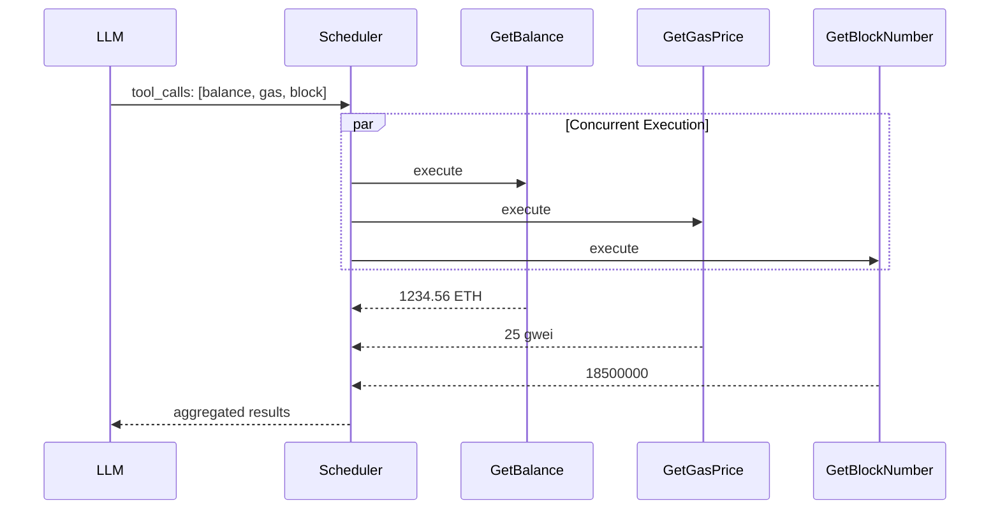

### Request Flow

```rust
// 1. LLM requests tool call
let tool_call = ToolCall {
    name: "get_account_info",
    arguments: json!({"address": "vitalik.eth"}),
};

// 2. Scheduler routes to handler
let handler = scheduler.get_handler();
handler.request(&tool_call.name, tool_call.arguments, call_id)?;

// 3. Handler executes and streams result
let stream = handler.take_last_stream();
```

### Multi-Step Async Tools

Long-running tools stream results over time without blocking:

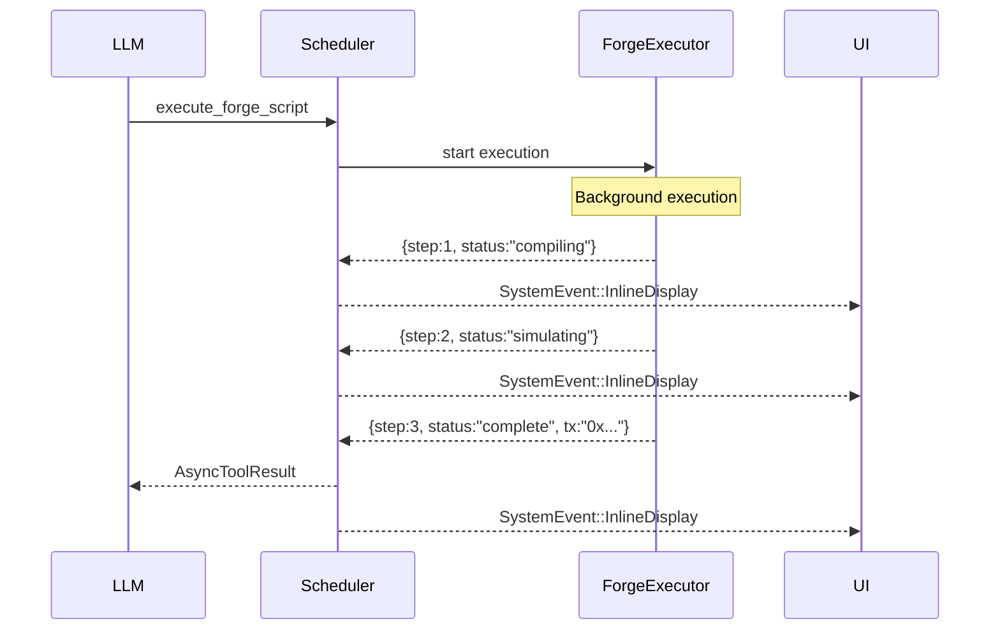

```rust
impl AsyncApiTool for ForgeExecutor {
    async fn call_stream(
        &self,
        request: ExecuteParams,
        sender: Sender<Result<Value>>,
    ) -> Result<()> {
        // Stream progress updates
        sender.send(Ok(json!({"status": "compiling"}))).await?;

        let compiled = self.compile(&request).await?;
        sender.send(Ok(json!({"status": "simulating"}))).await?;

        let result = self.simulate(compiled).await?;
        sender.send(Ok(json!({"status": "complete", "result": result}))).await?;

        Ok(())
    }
}
```

## IO Scheduler Architecture

### Centralized Tool Management

The `ToolScheduler` acts as an IO Bus, centralizing all tool execution and routing to appropriate backends:

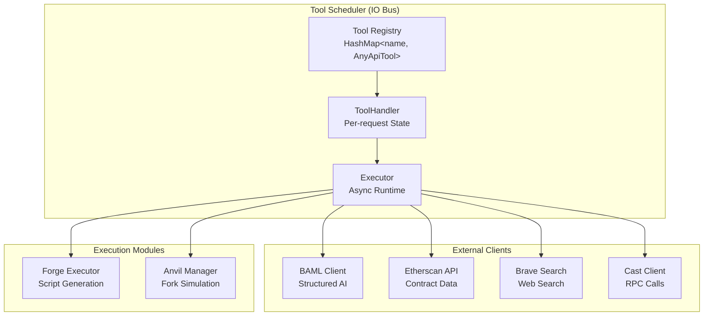

### Global Singleton Pattern

```rust
// Get or create the global scheduler
let scheduler = ToolScheduler::get_or_init().await?;

// The scheduler is thread-safe and shared across all sessions
// Tools are registered once at startup
scheduler.register_tool(GetContractABI)?;
scheduler.register_tool(SimulateTransaction)?;
```

### External Clients

The IO Bus manages connections to external services:

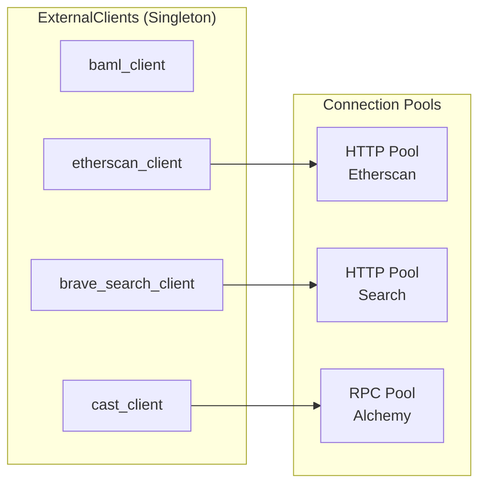

```rust
// External clients are initialized once and shared
let clients = external_clients().await;

// Access specific clients
let baml = clients.baml_client()?;
let etherscan = clients.etherscan_client()?;
let cast = clients.cast_client("ethereum")?;
```

### IO Bus Benefits

| Benefit | Description |
|---------|-------------|
| **Unified Management** | Single source of truth for API clients |
| **Connection Pooling** | Shared connections reduce overhead |
| **Rate Limiting** | Centralized throttling prevents abuse |
| **Error Handling** | Consistent retry and fallback logic |
| **Observability** | Centralized logging and metrics |

## Stream Processing

### Tool Result Streams

Results flow through typed streams:

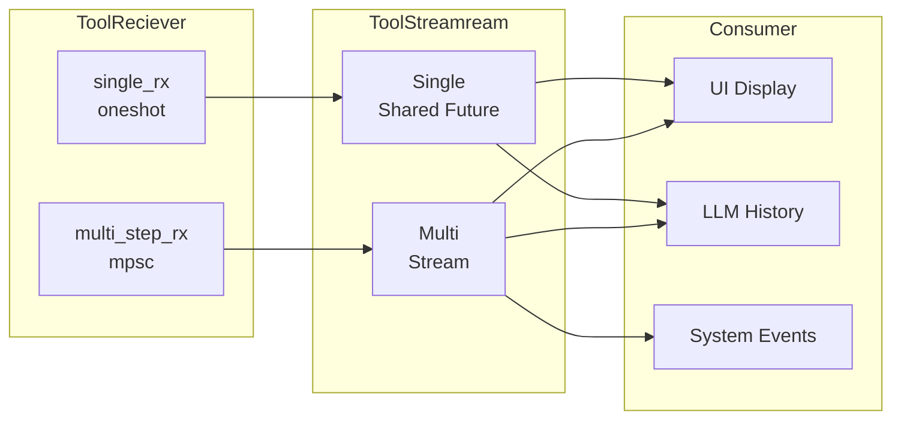

### Polling Streams

```rust
// Poll all pending streams for next result
while let Some(completion) = handler.poll_streams_to_next_result().await {
    let ToolCompletion {
        call_id,
        tool_name,
        is_multi_step,
        result,
    } = completion;

    if is_multi_step {
        // Route to system events for UI updates
        yield CoreCommand::AsyncToolResult { call_id, tool_name, result };
    }

    // Always finalize in chat history
    finalize_tool_result(&mut history, call_id, result);
}
```

## Session State Machine

### State Transitions

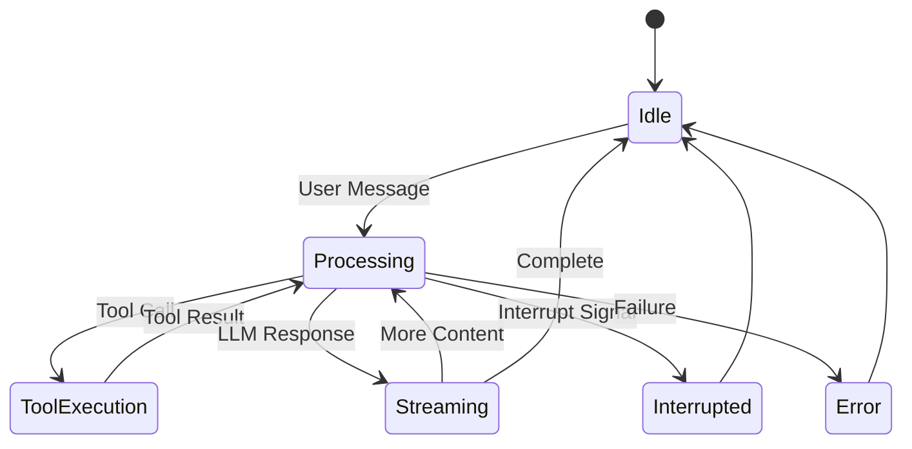

### Update Loop

```rust
pub async fn update_state(&mut self) {
    // 1. Process CoreCommand stream (LLM responses)
    while let Ok(msg) = self.receiver_from_llm.try_recv() {
        match msg {
            CoreCommand::StreamingText(text) => {
                self.append_streaming_text(text);
            }
            CoreCommand::ToolCall { topic, stream } => {
                self.handle_tool_call(topic, stream).await;
            }
            CoreCommand::Complete => {
                self.finalize_response();
            }
            // ...
        }
    }

    // 2. Drain system events
    let new_events = self.system_event_queue.slice_from(self.processed_idx);
    self.processed_idx += new_events.len();

    for event in new_events {
        self.handle_system_event(event).await;
    }
}
```

## Performance Considerations

### Memory Management

- **Session State**: Kept minimal, messages flushed to database
- **Tool Results**: Streamed, not buffered entirely
- **History**: Sliding window prevents unbounded growth

### Backpressure

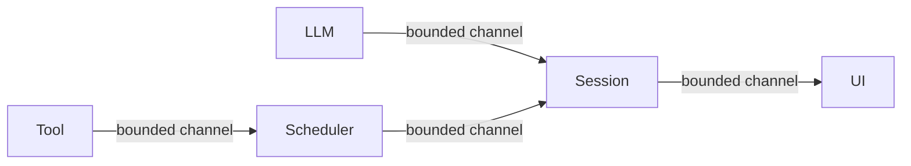

Bounded channels prevent memory exhaustion:

```rust
// UI channel with backpressure
let (tx, rx) = mpsc::channel::<CoreCommand>(100);

// Tool result channel
let (tool_tx, tool_rx) = mpsc::channel::<Result<Value>>(16);
```

### Graceful Degradation

```rust
// Timeouts on external calls
let result = tokio::time::timeout(
    Duration::from_secs(30),
    client.fetch_contract_abi(address),
).await??;

// Retry with exponential backoff
let result = retry_with_backoff(|| async {
    etherscan.get_source_code(address).await
}, 3).await?;
```
