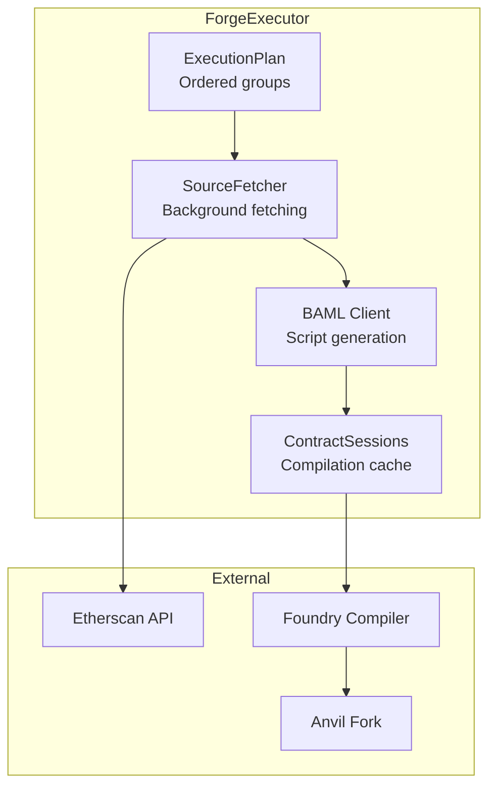
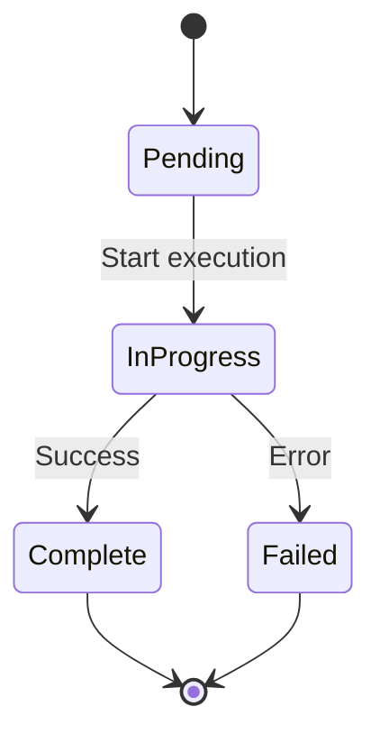
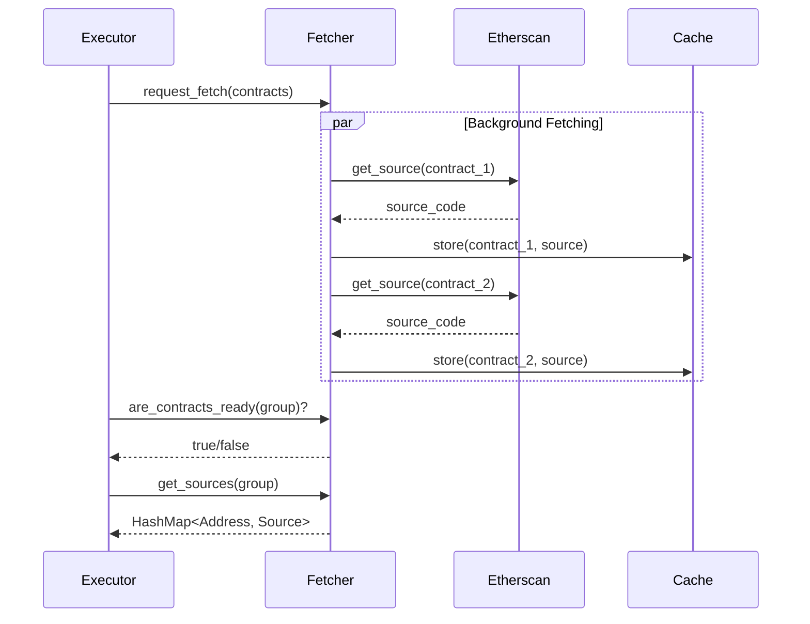
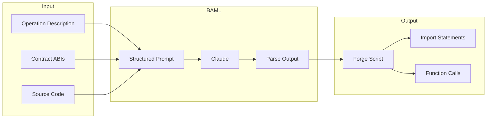
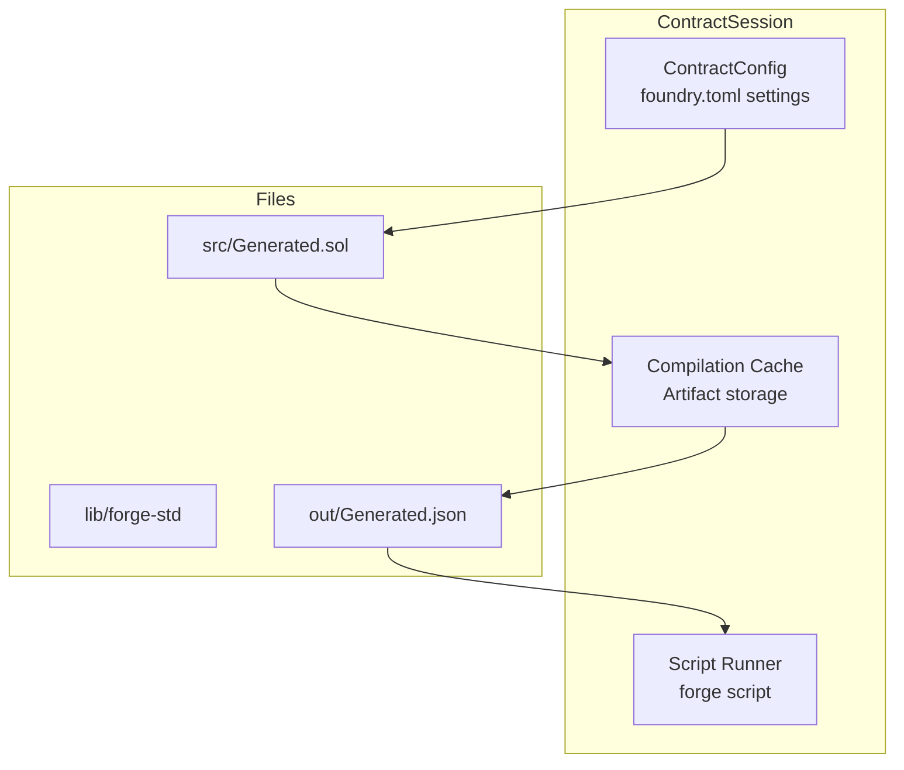
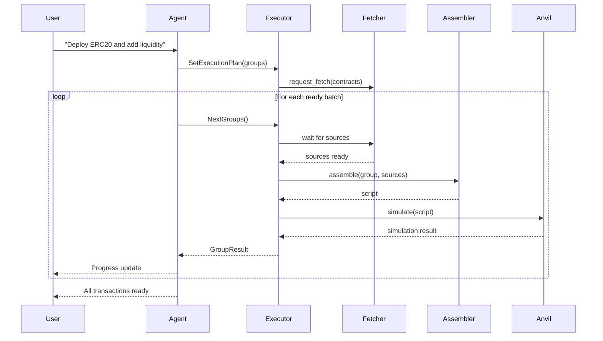

# Script Generation

AOMI can generate and execute Forge scripts from natural language intents. This guide covers the script generation pipeline from user request to broadcastable transactions.

## Overview

```mermaid
flowchart LR
    subgraph "Input"
        INTENT[User Intent<br/>"Deploy ERC20 with 1M supply"]
    end

    subgraph "Planning"
        PARSE[Parse Intent]
        PLAN[Create ExecutionPlan]
        GROUP[Group Operations]
    end

    subgraph "Generation"
        FETCH[Fetch Sources]
        ASSEMBLE[Assemble Script]
        COMPILE[Compile]
    end

    subgraph "Output"
        SIM[Simulate]
        TX[Transactions]
    end

    INTENT --> PARSE
    PARSE --> PLAN
    PLAN --> GROUP

    GROUP --> FETCH
    FETCH --> ASSEMBLE
    ASSEMBLE --> COMPILE

    COMPILE --> SIM
    SIM --> TX
```

## ForgeExecutor

The `ForgeExecutor` is the core component that orchestrates script generation with dependency-aware execution.

### Architecture



### Initialization

```rust
use aomi_scripts::{ForgeExecutor, OperationGroup};

// Create executor with operation groups
let groups = vec![
    OperationGroup {
        id: "deploy_token".into(),
        description: "Deploy ERC20 token".into(),
        contracts: vec![],  // No dependencies
        depends_on: vec![], // No dependencies
    },
    OperationGroup {
        id: "add_liquidity".into(),
        description: "Add liquidity to Uniswap".into(),
        contracts: vec![
            ("ethereum".into(), "0x...".into(), "UniswapV2Router".into()),
        ],
        depends_on: vec!["deploy_token".into()],
    },
];

let executor = ForgeExecutor::new(groups).await?;
```

## Execution Plan

### Operation Groups

Operations are organized into groups with dependencies:

```mermaid
flowchart TD
    subgraph "ExecutionPlan"
        G1[Group 1: Deploy Token<br/>depends_on: []]
        G2[Group 2: Approve Router<br/>depends_on: [1]]
        G3[Group 3: Add Liquidity<br/>depends_on: [1, 2]]
        G4[Group 4: Verify Contract<br/>depends_on: [1]]
    end

    G1 --> G2
    G1 --> G4
    G2 --> G3
```

```rust
use aomi_scripts::{ExecutionPlan, OperationGroup, GroupStatus};

#[derive(Debug, Clone)]
pub struct OperationGroup {
    /// Unique identifier
    pub id: String,

    /// Human-readable description
    pub description: String,

    /// Required contracts: (chain, address, name)
    pub contracts: Vec<(String, String, String)>,

    /// IDs of groups that must complete first
    pub depends_on: Vec<String>,
}

impl ExecutionPlan {
    /// Get indices of groups ready to execute
    pub fn next_ready_batch(&self) -> Vec<usize> {
        self.groups
            .iter()
            .enumerate()
            .filter(|(_, g)| {
                self.status[&g.id] == GroupStatus::Pending
                    && g.depends_on.iter().all(|dep| {
                        self.status[dep] == GroupStatus::Complete
                    })
            })
            .map(|(i, _)| i)
            .collect()
    }
}
```

### Group Status



## Source Fetching

### Background Fetching

The `SourceFetcher` fetches contract sources in the background while the executor prepares:



```rust
use aomi_scripts::SourceFetcher;

let fetcher = Arc::new(SourceFetcher::new());

// Submit fetch requests (non-blocking)
let contracts = vec![
    ("ethereum".into(), "0xUSDC...".into(), "USDC".into()),
    ("ethereum".into(), "0xRouter...".into(), "UniswapV2Router".into()),
];
fetcher.request_fetch(contracts);

// Check if ready (for a group)
if fetcher.are_contracts_ready(&groups).await {
    let sources = fetcher.get_sources(&groups).await;
}

// Get missing contracts for debugging
let missing = fetcher.missing_contracts(&groups).await;
```

## Script Assembly

### ScriptAssembler

The `ScriptAssembler` generates Forge scripts using BAML for structured AI output:



```rust
use aomi_scripts::{ScriptAssembler, AssemblyConfig, FundingRequirement};

let config = AssemblyConfig {
    network: "ethereum".into(),
    sender: "0xYourAddress...".into(),
    funding: FundingRequirement {
        eth_amount: "1.0".into(),
        tokens: vec![],
    },
};

let assembler = ScriptAssembler::new(config);

// Assemble script for an operation group
let script = assembler.assemble(
    &group,
    &contract_sources,
    &contract_abis,
).await?;

println!("{}", script.source_code);
```

### Generated Script Structure

```solidity
// SPDX-License-Identifier: MIT
pragma solidity ^0.8.19;

import "forge-std/Script.sol";
import "./interfaces/IERC20.sol";

contract GeneratedScript is Script {
    function run() external {
        vm.startBroadcast();

        // Step 1: Deploy token
        MyToken token = new MyToken("MyToken", "MTK", 1_000_000 ether);

        // Step 2: Approve router
        token.approve(UNISWAP_ROUTER, type(uint256).max);

        // Step 3: Add liquidity
        IUniswapV2Router(UNISWAP_ROUTER).addLiquidityETH{value: 1 ether}(
            address(token),
            500_000 ether,
            0,
            0,
            msg.sender,
            block.timestamp + 1 hours
        );

        vm.stopBroadcast();
    }
}
```

## Contract Sessions

### Compilation Cache

The `ContractSession` manages compilation state for generated scripts:



```rust
use aomi_scripts::{ContractSession, ContractConfig};

let config = ContractConfig::default();
let session = ContractSession::new(config).await?;

// Write generated script
session.write_script("Generated.sol", &script_source).await?;

// Compile
let artifacts = session.compile().await?;

// Get bytecode and ABI
let bytecode = artifacts.bytecode("GeneratedScript")?;
let abi = artifacts.abi("GeneratedScript")?;
```

## Execution Flow

### Complete Pipeline



### Executing Groups

```rust
use aomi_scripts::{ForgeExecutor, GroupResult};

let mut executor = ForgeExecutor::new(groups).await?;

// Execute groups in dependency order
loop {
    let results: Vec<GroupResult> = executor.next_groups().await?;

    if results.is_empty() {
        break; // All groups complete
    }

    for result in results {
        match result.inner {
            GroupResultInner::Success { transactions } => {
                println!("Group {} complete:", result.group_id);
                for tx in transactions {
                    println!("  TX: {:?}", tx);
                }
            }
            GroupResultInner::Failed { error } => {
                println!("Group {} failed: {}", result.group_id, error);
            }
        }
    }
}
```

## Transaction Data

### Output Format

```rust
#[derive(Debug, Clone)]
pub struct TransactionData {
    /// Target contract address
    pub to: Address,

    /// Call value in wei
    pub value: U256,

    /// Encoded calldata
    pub data: Bytes,

    /// Gas limit
    pub gas_limit: u64,

    /// Human-readable description
    pub description: String,
}

#[derive(Debug, Clone)]
pub struct GroupResult {
    pub group_id: String,
    pub inner: GroupResultInner,
}

#[derive(Debug, Clone)]
pub enum GroupResultInner {
    Success {
        transactions: Vec<TransactionData>,
    },
    Failed {
        error: String,
    },
}
```

## Tools Integration

### SetExecutionPlan Tool

```rust
use aomi_scripts::{SetExecutionPlan, ExecutionPlan};

#[tool(description = "Set the execution plan for multi-step operations")]
pub async fn set_execution_plan(
    params: SetExecutionPlanParams,
) -> Result<ExecutionPlan, ToolError> {
    let groups = params.groups.into_iter().map(|g| {
        OperationGroup {
            id: g.id,
            description: g.description,
            contracts: g.contracts,
            depends_on: g.depends_on,
        }
    }).collect();

    let executor = ForgeExecutor::new(groups).await?;
    Ok(executor.plan.clone())
}
```

### NextGroups Tool (Multi-Step)

```rust
use aomi_scripts::NextGroups;

impl MultiStepApiTool for NextGroups {
    fn call_stream(
        &self,
        request: NextGroupsParams,
        sender: Sender<Result<Value>>,
    ) -> BoxFuture<'static, Result<()>> {
        async move {
            let mut executor = get_executor(&request.plan_id)?;

            loop {
                let results = executor.next_groups().await?;

                if results.is_empty() {
                    sender.send(Ok(json!({
                        "status": "complete",
                        "message": "All groups executed"
                    }))).await?;
                    break;
                }

                for result in results {
                    sender.send(Ok(json!({
                        "status": "group_complete",
                        "group_id": result.group_id,
                        "result": result.inner,
                    }))).await?;
                }
            }

            Ok(())
        }.boxed()
    }
}
```

## Error Handling

### Common Errors

| Error | Cause | Resolution |
|-------|-------|------------|
| `SourceFetchTimeout` | Etherscan rate limited | Retry with backoff |
| `CompilationFailed` | Invalid Solidity | Check generated script |
| `SimulationReverted` | Transaction would fail | Review parameters |
| `DependencyNotMet` | Group executed out of order | Check depends_on |

### Recovery Strategies

```rust
// Retry source fetching
let sources = retry_with_backoff(|| async {
    fetcher.get_sources(&group).await
}, 3).await?;

// Handle simulation failure
match executor.next_groups().await {
    Ok(results) => { /* success */ }
    Err(e) if e.is_simulation_error() => {
        // Try with higher gas limit
        executor.set_gas_multiplier(1.5);
        executor.next_groups().await?
    }
    Err(e) => return Err(e),
}
```
