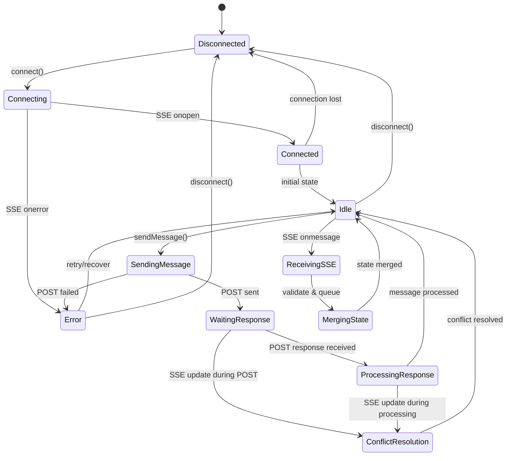
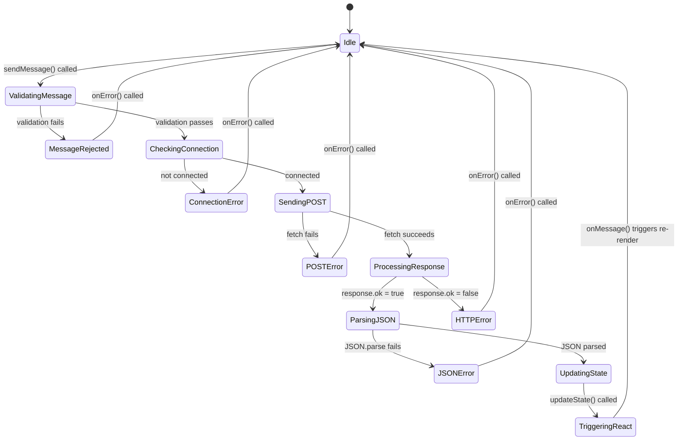
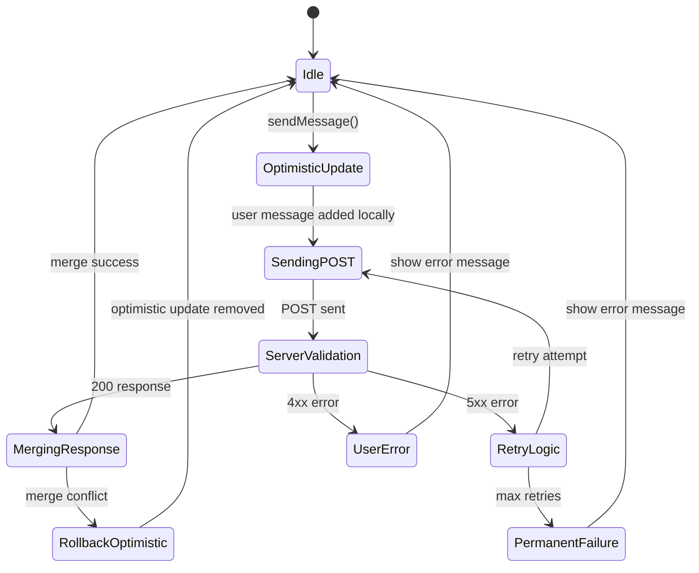
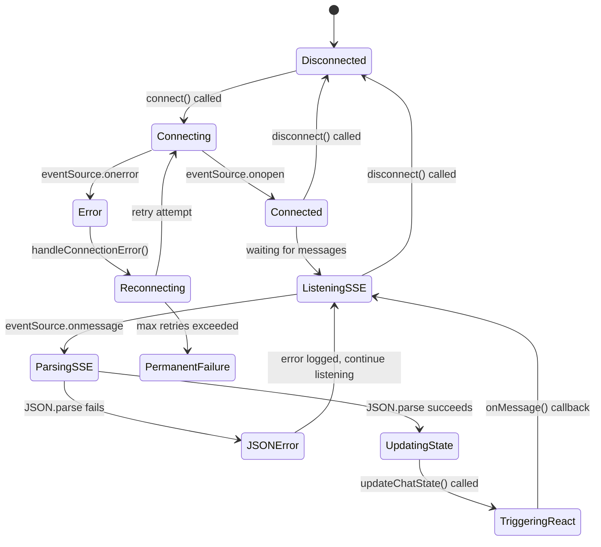

# Aomi Labs - Frontend

A TypeScript Next.js frontend for the AI-powered blockchain transaction assistant with full wallet integration.

## 🚀 Features

- **AI Chat Interface**: Real-time conversation with blockchain AI assistant
- **Wallet Transaction Flow**: Complete wallet transaction request/approval system
- **Multi-Network Support**: Mainnet, Polygon, Arbitrum, Base, Testnet, Linea
- **Terminal Interface**: Clean terminal-style UI design
- **Tab System**: README, chat, and anvil monitoring tabs
- **Responsive Design**: Mobile and desktop optimized
- **Real-time Updates**: SSE connection for live chat updates

## 🛠 Setup & Development

1. **Install dependencies**:
   ```bash
   npm install
   ```

2. **Start development server**:
   ```bash
   npm run dev
   ```

3. **Open in browser**:
   ```
   http://localhost:3000
   ```

## 💬 Chat & Transaction Flow

[Detail Documentation](/frontend/wallet-tx-flow.md)

### AI Assistant Chat
- Real-time conversation with blockchain AI assistant
- Support for complex transaction requests (swaps, transfers, liquidity)
- Network-aware responses and transaction handling
- Automatic network switching based on wallet connection

### Wallet Transaction System
1. **Transaction Request**: AI generates transaction → wallet popup appears
2. **User Approval**: User approves/rejects in MetaMask
3. **Automatic Feedback**: Rejection/success automatically sent to AI
4. **AI Response**: AI acknowledges result and suggests next steps

### Network Management
- **Auto-detection**: Detects wallet network changes
- **Smart Switching**: AI prompts for network switches when needed
- **Multi-chain**: Supports Mainnet, Polygon, Arbitrum, Base, Testnet, Linea

## 📱 Interface Tabs

- **README**: Project documentation and setup instructions
- **Chat**: Interactive conversation with AI assistant
- **Anvil**: Local blockchain monitoring and transaction logs

## 🎨 Styling

- **Tailwind CSS**: Utility-first styling
- **Custom Fonts**: Bauhaus Chez Display 2.0 support
- **Responsive**: Mobile-first responsive design
- **Animations**: Scroll reveal and slide animations
- **Dark Theme**: Terminal-style dark interface

## 🏗 Architecture

### Core Components
- **Hero.tsx**: Main UI container with wallet/chat integration
- **ChatManager**: WebSocket connection to backend, handles SSE streams
- **WalletManager**: Wallet connection and network switching logic
- **AnvilManager**: Local blockchain monitoring and logs

### State Management
- **Unified Wallet State**: Single source of truth for wallet connection status
- **Transaction Flow**: Automatic handling of wallet transaction lifecycle
- **Network Sync**: Keeps frontend and backend networks synchronized

### Transaction Handling
- **Request Detection**: Monitors AI responses for `[[WALLET_TX_REQUEST:...]]` markers
- **Wagmi Integration**: Uses `useSendTransaction` hook for MetaMask interaction
- **Error Handling**: Comprehensive user rejection and transaction failure handling
- **Feedback Loop**: Automatic success/failure reporting back to AI

## 🔧 Technical Stack

- **Next.js 15** with App Router
- **TypeScript** for type safety
- **wagmi v2** for wallet integration
- **Server-Sent Events** for real-time chat updates
- **TanStack Query** for state management
- **Tailwind CSS** for styling

## 💻 Development Commands

- `npm run dev` - Start development server (connects to backend on :8080)
- `npm run build` - Build for production
- `npm run start` - Start production server
- `npm run lint` - Run ESLint

## 🎯 Key Features

1. **Complete Transaction Flow**: AI request → wallet popup → automatic feedback
2. **Smart Network Handling**: Auto-detects wallet networks and prompts switching
3. **Error Recovery**: Handles user rejections, failed transactions, and network issues
4. **Real-time Chat**: SSE connection for instant AI responses
5. **Clean Architecture**: Separated concerns with manager classes







improved with merge




