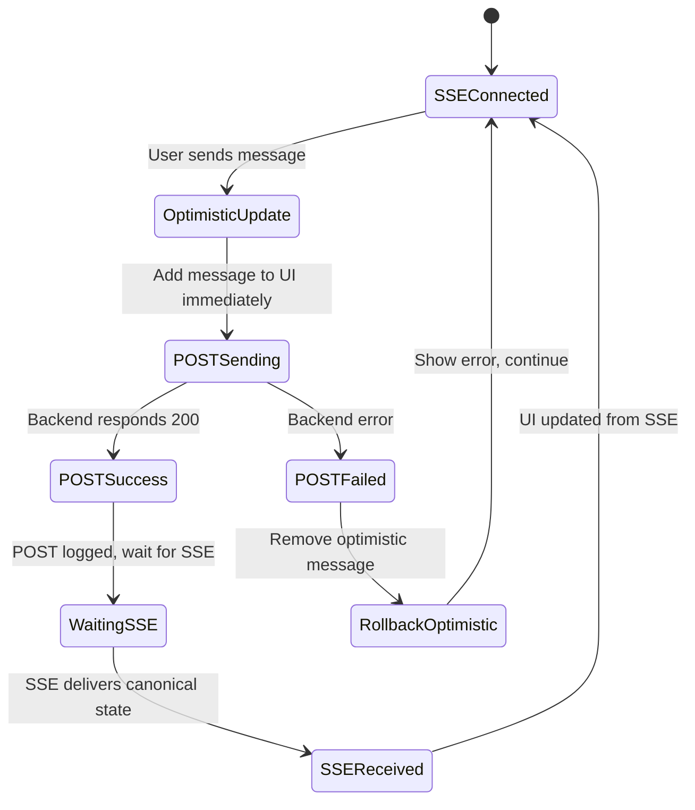

# POST + SSE Race Condition Resolution Strategy

## 🎯 **Chosen Approach: Optimistic Updates + SSE as Single Source of Truth**

### **Core Philosophy**
- **SSE Stream** = Canonical state from backend (ground truth)
- **POST Requests** = Triggers only, no state updates from response
- **Optimistic Updates** = Immediate UI feedback while waiting for SSE

## 🔄 **Flow Design**



## 📋 **Current Implementation Status**

### ✅ **Already Implemented**
- **Separate methods**: `connectSSE()`, `postMessageToBackend()`
- **POST response ignored**: `// this.updateChatState(data);` commented out
- **SSE-only state updates**: `updateChatState()` only called from SSE
- **Session isolation**: Both POST/SSE use same `session_id`

### 🔄 **Need to Implement**

#### **1. Optimistic Message Addition**
```typescript
private addOptimisticMessage(content: string): string {
  const tempId = `temp-${Date.now()}-${Math.random()}`;
  const optimisticMessage = {
    type: 'user' as const,
    content,
    timestamp: new Date().toLocaleTimeString(),
    id: tempId,
    isOptimistic: true
  };

  this.state.messages.push(optimisticMessage);
  this.onMessage(this.state.messages);
  return tempId;
}
```

#### **2. Optimistic Message Removal**
```typescript
private removeOptimisticMessage(tempId: string): void {
  this.state.messages = this.state.messages.filter(
    msg => !(msg as any).id || (msg as any).id !== tempId
  );
  this.onMessage(this.state.messages);
}
```

#### **3. Modified POST Flow**
```typescript
async postMessageToBackend(message: string): Promise<void> {
  console.log('🚀 ChatManager.postMessageToBackend called with:', message);

  if (!message || message.length > this.config.maxMessageLength) {
    this.onError(new Error('Message is empty or too long'));
    return;
  }

  // 1. OPTIMISTIC UPDATE
  const tempId = this.addOptimisticMessage(message);

  try {
    // 2. SEND POST (trigger only)
    const response = await fetch(`${this.config.backendUrl}/api/chat`, {
      method: 'POST',
      headers: { 'Content-Type': 'application/json' },
      body: JSON.stringify({ message, session_id: this.sessionId }),
    });

    if (!response.ok) {
      throw new Error(`HTTP ${response.status}: ${response.statusText}`);
    }

    const data = await response.json();
    console.log('✅ Backend respond from /api/chat:', data);
    // NO STATE UPDATE - SSE will handle it

  } catch (error) {
    // 3. ROLLBACK ON FAILURE
    this.removeOptimisticMessage(tempId);
    console.error('Failed to send message:', error);
    this.onError(error instanceof Error ? error : new Error(String(error)));
  }
}
```

#### **4. Enhanced SSE State Updates**
```typescript
private updateChatState(data: any): void {
  const oldState = { ...this.state };

  if (data.messages && Array.isArray(data.messages)) {
    // Convert backend messages to frontend format
    const serverMessages = data.messages.map((msg: any) => ({
      type: msg.sender === 'user' ? 'user' as const :
            msg.sender === 'system' ? 'system' as const :
            'assistant' as const,
      content: msg.content,
      timestamp: msg.timestamp,
      isOptimistic: false // Mark as canonical
    }));

    // FULL REPLACEMENT with canonical state
    // This removes optimistic messages and replaces with server truth
    this.state.messages = serverMessages;
  }

  // Update other state flags
  if (data.isTyping !== undefined) this.state.isTyping = data.isTyping;
  if (data.isProcessing !== undefined) this.state.isProcessing = data.isProcessing;

  // Handle wallet transactions (existing logic)
  if (data.pending_wallet_tx !== undefined) {
    // ... existing wallet logic
  }

  // Trigger React update
  this.onMessage(this.state.messages);
}
```

## 🎯 **Benefits of This Approach**

### **1. No Race Conditions**
- POST and SSE can't conflict because only SSE updates state
- POST failure is handled locally (rollback optimistic update)
- SSE provides eventual consistency

### **2. Immediate User Feedback**
- Message appears instantly when user hits send
- No waiting for network roundtrip
- Responsive UI experience

### **3. Simple Error Handling**
- POST fails → Remove optimistic message + show error
- SSE disconnects → Automatic reconnection handles recovery
- No complex state synchronization needed

### **4. Debugging Friendly**
- Clear separation: POST = trigger, SSE = state
- Easy to trace message flow
- Console logs show POST success vs SSE delivery

## 🛠️ **Implementation Plan**

### **Phase 1: Add Optimistic Updates**
1. Add `addOptimisticMessage()` method
2. Add `removeOptimisticMessage()` method
3. Update `postMessageToBackend()` to use optimistic updates

### **Phase 2: Enhance Message Tracking**
1. Add unique IDs to messages
2. Add `isOptimistic` flag to message type
3. Improve deduplication logic

### **Phase 3: Error Handling**
1. Better error messages for POST failures
2. Visual indicators for optimistic vs confirmed messages
3. Retry logic for failed POSTs

### **Phase 4: Performance Optimization**
1. Reduce SSE polling frequency if possible
2. Add message diffing to minimize re-renders
3. Implement message pagination for large chat histories

## 📝 **Current Code Structure**

### **Files Modified**
- `frontend/src/lib/chat-manager.ts` - Core logic
- `frontend/src/components/hero.tsx` - Integration

### **Key Methods**
- `connectSSE()` - SSE connection management
- `postMessageToBackend()` - POST without state update
- `updateChatState()` - SSE-triggered state updates only
- `handleSendMessage()` - UI integration

### **Next Steps**
1. Document current behavior with tests
2. Implement optimistic updates
3. Add comprehensive error handling
4. Performance testing and optimization

## 🚀 **Ready for Implementation**
This approach provides a clean separation of concerns and eliminates the complex race condition handling that would be needed with dual POST+SSE state updates.