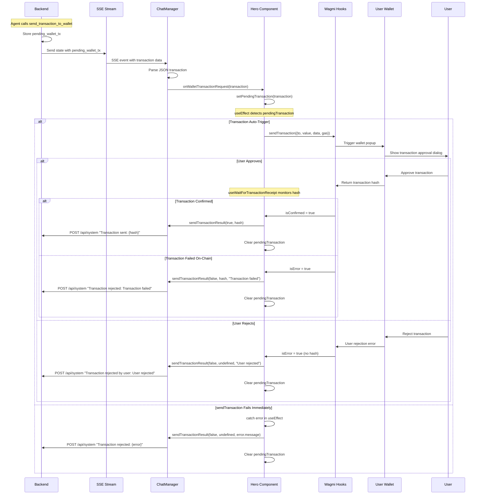

# Wallet Transaction Control Flow - Frontend

This document describes the complete control flow for wallet transactions in the frontend, including edge cases and error handling.

## 🔄 Complete Control Flow



## 🏗️ Implementation Architecture

### Key Components

1. **ChatManager (`lib/chat-manager.ts`)**
   - Handles SSE connection to backend
   - Parses `pending_wallet_tx` from backend state
   - Triggers `onWalletTransactionRequest` callback
   - Provides `sendTransactionResult()` method

2. **Hero Component (`components/hero.tsx`)**
   - Manages transaction state with `useState`
   - Uses wagmi hooks for transaction execution
   - Implements automatic triggering via `useEffect`

3. **Wagmi Hooks**
   - `useSendTransaction()` - triggers wallet popup
   - `useWaitForTransactionReceipt()` - monitors confirmation

### Critical useEffect Logic

```typescript
// Auto-trigger transaction when pendingTransaction appears
useEffect(() => {
  if (pendingTransaction && sendTransaction && !hash) {
    try {
      sendTransaction({
        to: pendingTransaction.to as `0x${string}`,
        value: BigInt(pendingTransaction.value),
        data: pendingTransaction.data as `0x${string}`,
        gas: pendingTransaction.gas ? BigInt(pendingTransaction.gas) : undefined,
      });
    } catch (error) {
      // Handle immediate sendTransaction failures
      chatManager.sendTransactionResult(false, undefined, error.message);
      chatManager.clearPendingTransaction();
      setPendingTransaction(null);
    }
  }
}, [pendingTransaction, sendTransaction, hash, chatManager]);

// Handle transaction confirmation/failure
useEffect(() => {
  if (!hash || !chatManager) return;

  if (isConfirmed) {
    chatManager.sendTransactionResult(true, hash);
    chatManager.clearPendingTransaction();
    setPendingTransaction(null);
  } else if (isError) {
    chatManager.sendTransactionResult(false, hash, 'Transaction failed');
    chatManager.clearPendingTransaction();
    setPendingTransaction(null);
  }
}, [isConfirmed, isError, hash, chatManager]);
```

## 🚨 Critical Issues & Edge Cases

### 1. **Race Condition Prevention**
- ✅ `!hash` check prevents double-triggering of `sendTransaction`
- ❌ **ISSUE**: If `sendTransaction` fails before creating hash, we could get stuck
- 🔧 **FIX NEEDED**: Add timeout or retry logic

### 2. **User Rejection vs Transaction Failure**
- ❌ **ISSUE**: `isError` doesn't distinguish between user rejection and on-chain failure
- 🔧 **FIX NEEDED**: Parse error types from wagmi to differentiate

### 3. **State Cleanup Timing**
- ✅ Transaction state is cleared in all success/error paths
- ❌ **ISSUE**: What if user closes wallet popup without rejecting?
- 🔧 **FIX NEEDED**: Add timeout for abandoned transactions

### 4. **Network Switching During Transaction**
- ❌ **ISSUE**: No handling for network changes mid-transaction
- 🔧 **FIX NEEDED**: Cancel/retry logic for network switches

### 5. **SSE Connection Loss**
- ❌ **ISSUE**: If SSE disconnects during transaction, backend loses sync
- 🔧 **FIX NEEDED**: Transaction state recovery on reconnect

### 6. **Multiple Pending Transactions**
- ❌ **ISSUE**: Backend could send multiple `pending_wallet_tx` rapidly
- 🔧 **FIX NEEDED**: Queue system or transaction rejection

## 📊 State Management

### Frontend State Flow
```
Backend State → SSE → ChatManager → Hero Component → Wagmi → Wallet → User
     ↑                                                                    ↓
     ← HTTP /api/system ← sendTransactionResult() ← Transaction Result ←--
```

### Transaction States
1. **Idle**: No pending transaction
2. **Pending**: `pendingTransaction` set, waiting for `sendTransaction`
3. **Wallet Open**: `sendTransaction` called, wallet popup shown
4. **Confirming**: Hash received, waiting for blockchain confirmation
5. **Complete**: Confirmed/failed, result sent to backend

## 🔧 Required Improvements

### High Priority
1. **Error Type Differentiation**: Distinguish user rejection from transaction failure
2. **Transaction Timeout**: Handle abandoned/stuck transactions
3. **Race Condition Handling**: Better handling of rapid multiple requests

### Medium Priority
4. **Network Change Handling**: Cancel/retry on network switches
5. **Connection Recovery**: Restore transaction state after SSE reconnect
6. **Transaction Queue**: Handle multiple simultaneous requests

### Low Priority
7. **User Feedback**: Show transaction status in UI
8. **Retry Logic**: Automatic retry for failed transactions
9. **Gas Estimation**: Dynamic gas limit calculation

## 🎯 Testing Scenarios

1. **Happy Path**: Agent → sendTransaction → user approves → confirmation → success
2. **User Rejection**: Agent → sendTransaction → user rejects → error handling
3. **Transaction Failure**: Agent → sendTransaction → user approves → on-chain failure
4. **Immediate Failure**: Agent → sendTransaction throws → immediate error
5. **Network Switch**: Agent → sendTransaction → user switches network → ???
6. **Connection Loss**: Agent → sendTransaction → SSE disconnects → ???
7. **Multiple Transactions**: Agent sends 2 rapid transactions → ???

**Critical Analysis**: The current implementation handles basic happy path and simple errors, but lacks robust handling for edge cases that are likely in real-world usage.