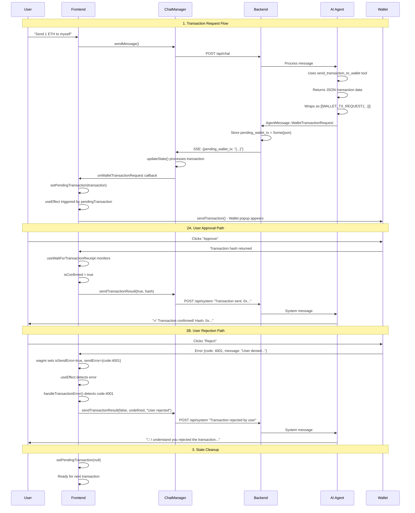

# Wallet Transaction Flow - Control & Sequence Diagrams

## 🔄 Control Flow Diagram

```
┌─────────────────┐    ┌─────────────────┐    ┌─────────────────┐
│     Frontend    │    │     Backend     │    │   AI Agent      │
│   (Hero.tsx)    │    │   (main.rs)     │    │  (agent.rs)     │
└─────────────────┘    └─────────────────┘    └─────────────────┘

1. User sends message
   │
   ├── ChatManager.sendMessage()
   │   │
   │   └── POST /api/chat
   │       │
   │       └── Backend processes → Agent
   │           │
   │           └── Agent uses send_transaction_to_wallet tool
   │               │
   │               └── Returns JSON: {"to": "0x...", "value": "1000", ...}
   │                   │
   │                   └── helpers.rs wraps: [[WALLET_TX_REQUEST:{...}]]
   │                       │
   │                       └── agent.rs detects marker → AgentMessage::WalletTransactionRequest
   │                           │
   │                           └── Backend stores: pending_wallet_tx = Some(json)
   │                               │
   │                               └── SSE stream sends to frontend

2. Frontend receives transaction
   │
   ├── ChatManager.updateState() processes pending_wallet_tx
   │   │
   │   └── onWalletTransactionRequest(transaction) callback
   │       │
   │       └── setPendingTransaction(transaction)
   │           │
   │           └── useEffect triggers → sendTransaction()
   │               │
   │               ├── ✅ User Approves
   │               │   │
   │               │   ├── Transaction confirmed
   │               │   │   └── chatManager.sendTransactionResult(true, hash)
   │               │   │       │
   │               │   │       └── POST /api/system "Transaction sent: 0x..."
   │               │   │           │
   │               │   │           └── Agent acknowledges success
   │               │   │
   │               │   └── Transaction failed
   │               │       └── chatManager.sendTransactionResult(false, hash, "Transaction failed")
   │               │
   │               └── ❌ User Rejects
   │                   │
   │                   └── wagmi isSendError + sendError → useEffect
   │                       │
   │                       └── handleTransactionError() detects code: 4001
   │                           │
   │                           └── chatManager.sendTransactionResult(false, undefined, "User rejected")
   │                               │
   │                               └── POST /api/system "Transaction rejected by user"
   │                                   │
   │                                   └── Agent acknowledges rejection

3. State cleanup
   │
   └── setPendingTransaction(null) - Clear transaction state
```

## 📋 Sequence Diagram



## 🎯 Key Implementation Details

### Frontend State Management
```typescript
// Single source of truth for wallet state
const [walletState, setWalletState] = useState({
  isConnected: false,
  address: undefined,
  chainId: undefined,
  networkName: 'testnet'
});

// Transaction state
const [pendingTransaction, setPendingTransaction] = useState<WalletTransaction | null>(null);
```

### Transaction Error Handling
```typescript
// The key fix that catches user rejections
useEffect(() => {
  if (isSendError && sendError) {
    handleTransactionError(sendError);
  }
}, [isSendError, sendError]);

const handleTransactionError = (error: any) => {
  const isUserRejection = error.code === 4001 || error.cause?.code === 4001;

  if (isUserRejection) {
    chatManager?.sendTransactionResult(false, undefined, 'User rejected transaction');
  } else {
    chatManager?.sendTransactionResult(false, undefined, error.message || 'Transaction failed');
  }
  setPendingTransaction(null);
};
```

### Backend Message Flow
```rust
// Agent detects wallet transaction marker
if text.starts_with("[[WALLET_TX_REQUEST:") && text.contains("]]") {
    let marker_end = text.rfind("]]").unwrap_or(text.len());
    let tx_request_json = &text[20..marker_end];
    let _ = sender_to_ui.send(AgentMessage::WalletTransactionRequest(tx_request_json.to_string())).await;
}

// Backend stores transaction for frontend
AgentMessage::WalletTransactionRequest(tx_json) => {
    self.pending_wallet_tx = Some(tx_json.clone());
    self.add_system_message("Transaction request sent to user's wallet. Waiting for user approval or rejection.");
}
```

## 🔧 Critical Success Factors

1. **wagmi State Watching**: Using `useEffect` to watch `isSendError` and `sendError` states catches all user rejections
2. **JSON Protocol**: Wallet tool returns JSON, helpers.rs wraps with markers, agent parses markers
3. **Automatic Cleanup**: `setPendingTransaction(null)` after every transaction outcome
4. **Error Code Detection**: Checking `error.code === 4001` for MetaMask rejections
5. **Unified State**: Single `walletState` object eliminates sync issues between managers

## 🚨 Common Failure Points

- **Missing useEffect**: `onError` callback alone doesn't catch all rejections
- **State Duplication**: Multiple wallet states can cause sync issues
- **Manual Feedback**: User shouldn't need to manually tell AI about rejections
- **Incomplete Cleanup**: Pending transactions must be cleared after outcomes
- **Network Mismatches**: Frontend and backend networks must stay synchronized