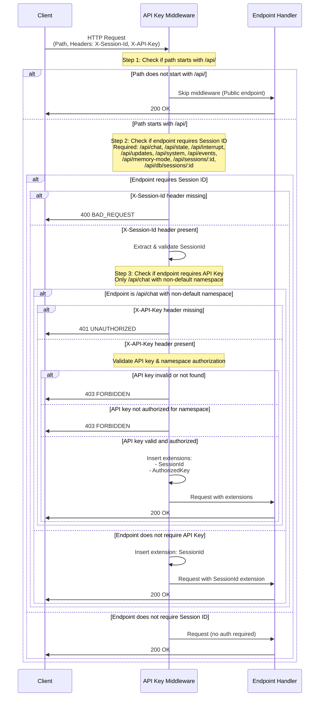

# Authentication Flow - Sequence Diagram

This document contains a simplified Mermaid sequence diagram illustrating the complete authentication and authorization flow in the AOMI backend.

## Complete Authentication Flow

