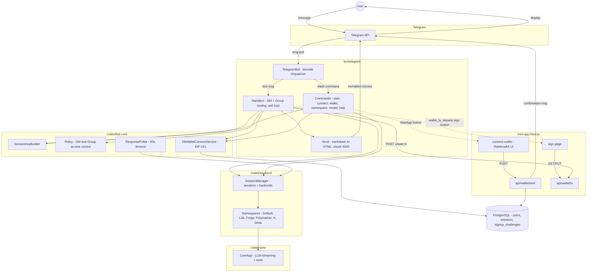

# Telegram Bot — Component Diagram

## Session key formats

| Chat Type | Format | Example |
|-----------|--------|---------|
| DM | `telegram:dm:{user_id}` | `telegram:dm:123456789` |
| Group | `telegram:group:{chat_id}` | `telegram:group:-100123456789` |
| Thread | `telegram:group:{chat_id}:thread:{thread_id}` | `telegram:group:-100123:thread:42` |
