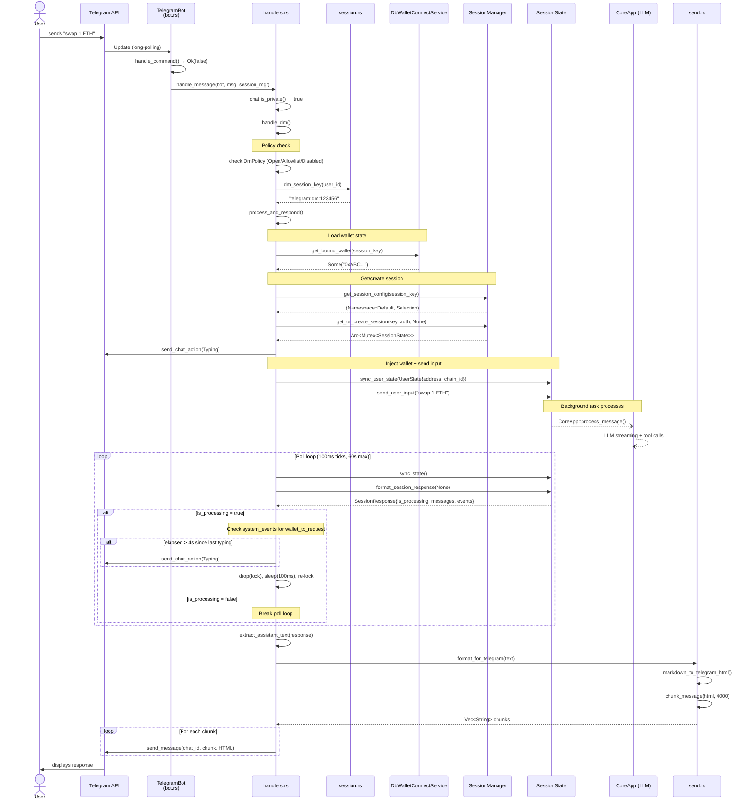
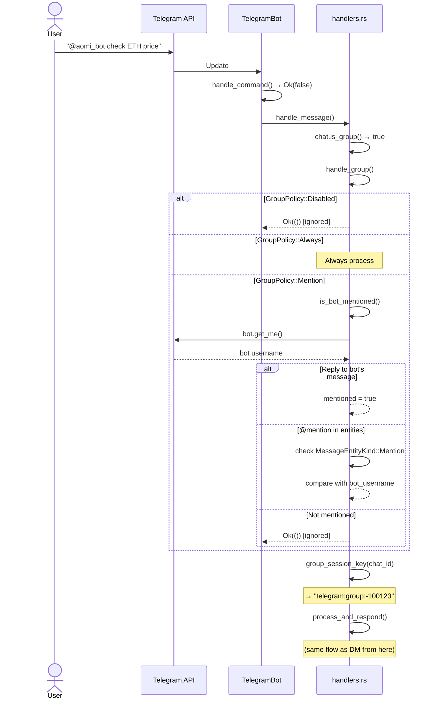
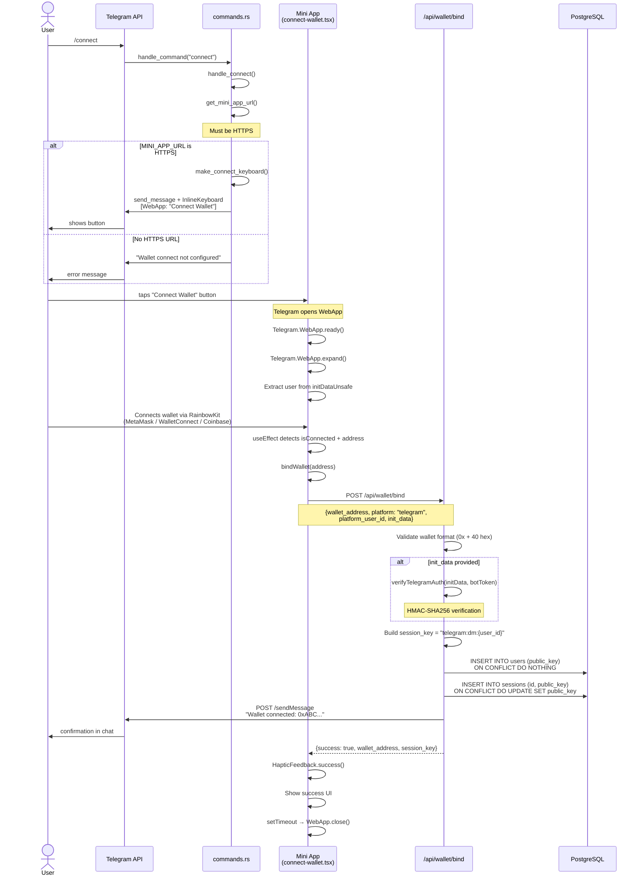
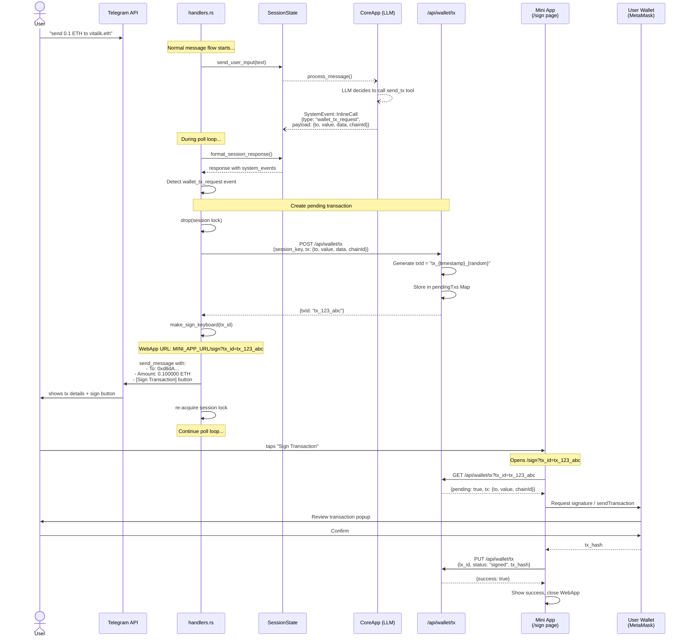
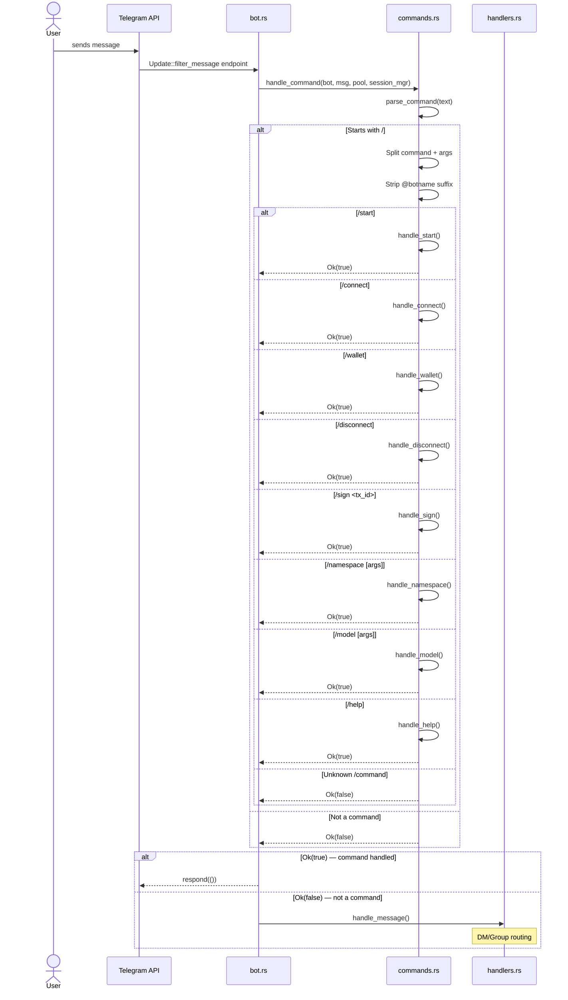
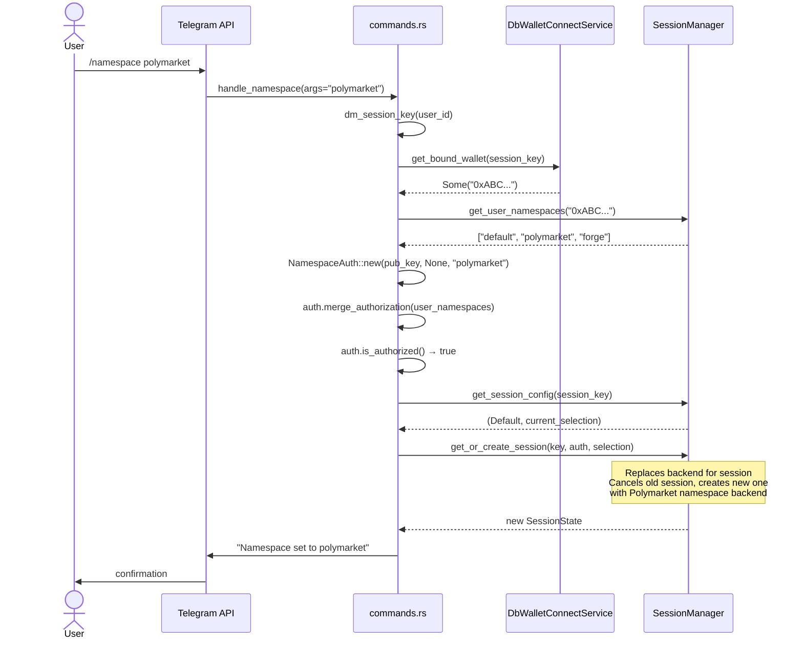

# Telegram Bot — Sequence Diagrams

## 1. DM Message Handling (Happy Path)

## 2. Group Message Handling

## 3. Wallet Connect Flow

## 4. Transaction Signing Flow

## 5. Command Routing

## 6. Namespace Switch

