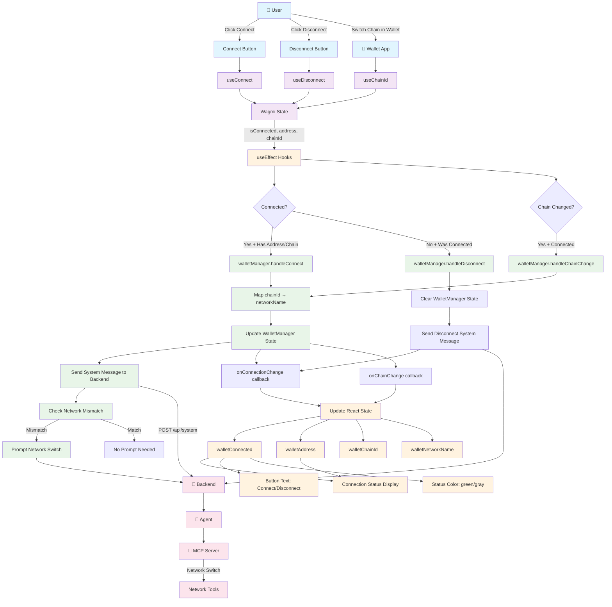

# Wallet State Management Control Flow

This document describes how wallet states are handled in the frontend, including the flow of data and control between components.

## Architecture Overview

The wallet state management is built around three main components:
- **WalletManager**: Handles wallet logic and backend communication
- **Hero Component**: React component managing UI state
- **Wagmi Hooks**: Wallet connection primitives

## Control Flow Diagram



## State Flow Details

### 1. Initial Setup
```typescript
// In Hero component useEffect
const walletMgr = new WalletManager({
  backendUrl: backendUrl,
}, {
  onConnectionChange: (isConnected, address) => {
    setWalletConnected(isConnected);
    setWalletAddress(address);
  },
  onChainChange: (chainId, networkName) => {
    setWalletChainId(chainId);
    setWalletNetworkName(networkName);
  },
  onError: (error) => {
    console.error('Wallet error:', error);
  },
});
```

### 2. Connection Flow
```typescript
// User clicks "Connect Wallet"
handleConnect() -> connect({ connector: connectors[0] })

// Wagmi updates state
isConnected: false -> true
address: undefined -> "0x123..."
chainId: undefined -> 1

// React useEffect triggers
useEffect(() => {
  if (isConnected && chainId && address) {
    walletManager.handleConnect(address, chainId);
  }
}, [isConnected, chainId, address, walletManager]);

// WalletManager processes
handleConnect(address, chainId) {
  const networkName = getChainIdToNetworkName(chainId); // "mainnet"
  this.state = { isConnected: true, address, chainId, networkName };
  this.onConnectionChange(true, address);
  this.onChainChange(chainId, networkName);
  await this.sendSystemMessage(`User connected wallet...`);
  await this.checkAndPromptNetworkSwitch();
}
```

### 3. Network Switching Flow
```typescript
// User switches chain in wallet (e.g. Metamask)
chainId: 1 -> 137 (mainnet to polygon)

// React useEffect triggers
useEffect(() => {
  if (chainId && chainId !== walletChainId) {
    walletManager.handleChainChange(chainId);
  }
}, [chainId, walletManager, walletChainId]);

// WalletManager processes
handleChainChange(chainId) {
  const networkName = getChainIdToNetworkName(chainId); // "polygon"
  this.state.chainId = chainId;
  this.state.networkName = networkName;
  this.state.hasPromptedNetworkSwitch = false; // Reset
  this.onChainChange(chainId, networkName);
  await this.sendSystemMessage(`User switched wallet to ${networkName}...`);
  await this.checkAndPromptNetworkSwitch();
}
```

### 4. Disconnection Flow
```typescript
// User clicks "Disconnect"
handleDisconnect() -> disconnect()

// Wagmi updates state
isConnected: true -> false
address: "0x123..." -> undefined

// React useEffect triggers
useEffect(() => {
  if (!isConnected && walletConnected) {
    walletManager.handleDisconnect();
  }
}, [isConnected, walletManager, walletConnected]);

// WalletManager processes
handleDisconnect() {
  this.state = { isConnected: false, address: undefined, ... };
  this.onConnectionChange(false);
  await this.sendSystemMessage('User disconnected their wallet.');
}
```

## State Variables

### WalletManager Internal State
```typescript
interface WalletState {
  isConnected: boolean;
  address?: string;
  chainId?: number;
  networkName: string;
  hasPromptedNetworkSwitch: boolean;
}
```

### React Component State
```typescript
// Derived from Wagmi hooks
const { address, isConnected } = useAccount();
const chainId = useChainId();

// Local state managed by WalletManager callbacks
const [walletConnected, setWalletConnected] = useState(false);
const [walletAddress, setWalletAddress] = useState<string | undefined>();
const [walletChainId, setWalletChainId] = useState<number | undefined>();
const [walletNetworkName, setWalletNetworkName] = useState<string>('testnet');
```

## Network Mapping

```typescript
const getChainIdToNetworkName = (chainId: number): string => {
  switch (chainId) {
    case 1: return 'mainnet';
    case 137: return 'polygon';
    case 42161: return 'arbitrum';
    case 8453: return 'base';
    case 1337: return 'testnet';
    case 31337: return 'testnet'; // Local testnets (Anvil)
    case 59140: return 'linea-sepolia';
    case 59144: return 'linea';
    default: return 'testnet';
  }
};
```

## System Message Flow

When wallet events occur, they are communicated to the backend:

```typescript
// WalletManager sends system messages
await fetch(`${this.config.backendUrl}/api/system`, {
  method: 'POST',
  headers: { 'Content-Type': 'application/json' },
  body: JSON.stringify({
    message: `User connected wallet with address ${address} on ${networkName} network`
  }),
});

// Backend processes with [[SYSTEM:]] marker
const system_message_for_agent = format!("[[SYSTEM:{}]]", request.message);
let _ = state.agent_sender.try_send(system_message_for_agent);

// Agent processes system messages in stream loop
if text.starts_with("[[SYSTEM:") && text.contains("]]") {
  let system_content = &text[9..marker_end];
  let _ = sender.send(AgentMessage::System(system_content.to_string())).await;
}
```

## Error Handling

- **Wagmi Connection Errors**: Caught by Wagmi hooks, displayed in UI
- **WalletManager Errors**: Sent to `onError` callback, logged to console
- **Backend Communication Errors**: Caught and logged, don't block UI updates
- **Network Switch Failures**: Gracefully handled, user can retry

## UI Status Display Logic

```typescript
const getConnectionStatusText = () => {
  // Wallet connection takes priority
  if (walletConnected && walletAddress) {
    return `Connected: ${walletAddress.slice(0, 6)}...${walletAddress.slice(-4)}`;
  }

  if (!walletConnected) {
    return 'Disconnected';
  }

  // Fallback to chat connection status
  // ...
};

const getConnectionStatusColor = () => {
  if (walletConnected && walletAddress) {
    return 'text-green-400'; // Green when connected
  }

  if (!walletConnected) {
    return 'text-gray-400'; // Gray when disconnected
  }

  // Fallback colors...
};
```