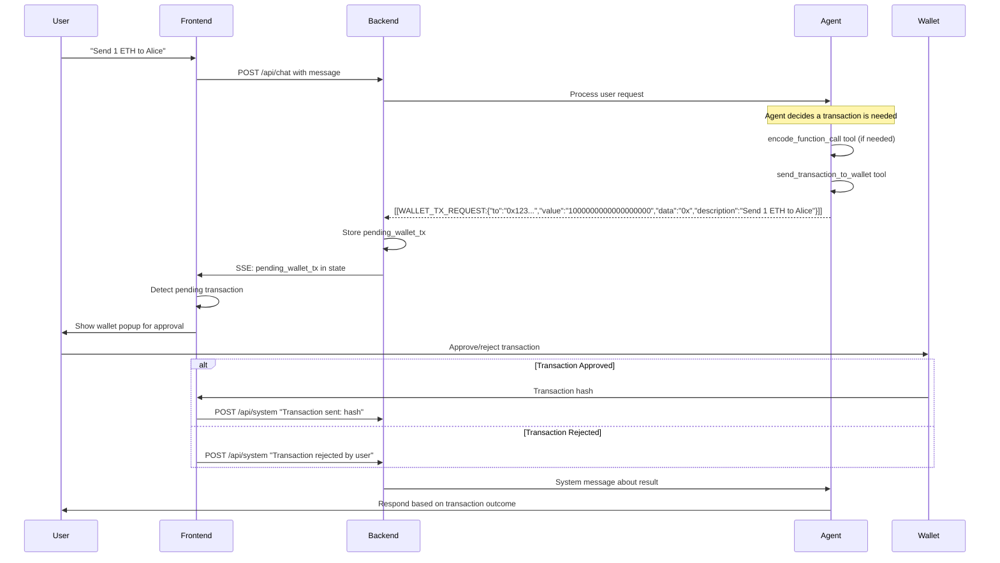

# Wallet Transaction Flow Documentation

This document describes the complete flow from agent crafting a transaction to wallet signing.

## 🔄 Complete Transaction Flow



## 🛠 Implementation Details

### 1. Agent Tools

**EncodeFunctionCall Tool:**
```rust
encode_function_call(
    function_signature = "transfer(address,uint256)",
    arguments = ["0x742d35Cc6634C0532925a3b844Bc9e7595f33749", "1000000000000000000"]
) -> "0xa9059cbb000000000000000000000000742d35cc6634c0532925a3b844bc9e7595f337490000000000000000000000000000000000000000000000000de0b6b3a7640000"
```

**SendTransactionToWallet Tool:**
```rust
send_transaction_to_wallet(
    to = "0xA0b86991c6218b36c1d19D4a2e9Eb0cE3606eB48", // USDC contract
    value = "0", // No ETH for ERC20 transfer
    data = "0xa9059cbb...", // Encoded function call
    gas_limit = Some("100000"),
    description = "Transfer 1000 USDC to Alice"
) -> "[[WALLET_TX_REQUEST:{...}]]"
```

### 2. Backend Processing

**AgentMessage Processing:**
```rust
AgentMessage::WalletTransactionRequest(tx_json) => {
    // Store for frontend to pick up via SSE
    self.pending_wallet_tx = Some(tx_json.clone());

    // Show user-friendly message in chat
    self.add_system_message("🔄 Transaction ready for wallet approval - check your wallet");
}
```

**WebStateResponse:**
```rust
pub struct WebStateResponse {
    messages: Vec<ChatMessage>,
    is_processing: bool,
    is_loading: bool,
    is_connecting_mcp: bool,
    missing_api_key: bool,
    pending_wallet_tx: Option<String>, // New field
}
```

### 3. Frontend Integration (TODO)

**Transaction Detection:**
```typescript
// In chat state polling/SSE handler
if (state.pending_wallet_tx) {
    const txRequest = JSON.parse(state.pending_wallet_tx);
    showWalletPopup(txRequest);
    clearPendingTransaction(); // Call backend to clear
}
```

**Wallet Popup Component:**
```typescript
interface WalletTxPopup {
    to: string;
    value: string;
    data: string;
    gas?: string;
    description: string;
    timestamp: string;
}

function WalletTransactionPopup({ txRequest, onApprove, onReject }) {
    return (
        <div className="wallet-popup">
            <h3>🔗 Transaction Approval Required</h3>
            <p>{txRequest.description}</p>
            <div>To: {txRequest.to}</div>
            <div>Value: {formatEther(txRequest.value)} ETH</div>
            <button onClick={() => sendTransaction(txRequest)}>Approve</button>
            <button onClick={onReject}>Reject</button>
        </div>
    );
}
```

## 🎯 Usage Examples

### Example 1: Simple ETH Transfer
**User:** "Send 0.1 ETH to 0x742d35Cc6634C0532925a3b844Bc9e7595f33749"

**Agent Flow:**
1. Agent recognizes need for ETH transfer
2. Calls `send_transaction_to_wallet`:
   - `to`: "0x742d35Cc6634C0532925a3b844Bc9e7595f33749"
   - `value`: "100000000000000000" (0.1 ETH in wei)
   - `data`: "0x" (empty for ETH transfer)
   - `description`: "Send 0.1 ETH to recipient"

### Example 2: ERC20 Token Transfer
**User:** "Transfer 100 USDC to Alice (0x123...)"

**Agent Flow:**
1. Agent looks up USDC contract address
2. Calls `encode_function_call`:
   - `function_signature`: "transfer(address,uint256)"
   - `arguments`: ["0x123...", "100000000"] (100 USDC with 6 decimals)
3. Calls `send_transaction_to_wallet`:
   - `to`: "0xA0b86991c6218b36c1d19D4a2e9Eb0cE3606eB48" (USDC contract)
   - `value`: "0"
   - `data`: encoded transfer call
   - `description`: "Transfer 100 USDC to Alice"

### Example 3: Uniswap Swap
**User:** "Swap 1 ETH for USDC on Uniswap"

**Agent Flow:**
1. Agent calculates swap parameters (deadline, slippage, etc.)
2. Calls `encode_function_call`:
   - `function_signature`: "swapExactETHForTokens(uint256,address[],address,uint256)"
   - `arguments`: ["0", ["0xC02aaA39b223FE8D0A0e5C4F27eAD9083c756Cc2", "0xA0b86991c6218b36c1d19D4a2e9Eb0cE3606eB48"], user_address, deadline]
3. Calls `send_transaction_to_wallet`:
   - `to`: "0x7a250d5630B4cF539739dF2C5dAcb4c659F2488D" (Uniswap V2 Router)
   - `value`: "1000000000000000000" (1 ETH)
   - `data`: encoded swap call
   - `description`: "Swap 1 ETH for USDC on Uniswap V2"

## 🔧 Current Status

✅ **Completed:**
- `SendTransactionToWallet` agent tool
- `[[WALLET_TX_REQUEST:]]` marker processing
- Backend state management for pending transactions
- Integration with existing `encode_function_call` tool
- SSE event system via existing state polling

🚧 **TODO:**
- Frontend transaction popup component
- Wagmi integration for transaction execution
- Transaction result feedback system
- Error handling for failed transactions
- Transaction history tracking

## 🧪 Testing

You can test the system by sending messages like:
- "Send 0.1 ETH to 0x742d35Cc6634C0532925a3b844Bc9e7595f33749"
- "Transfer 100 USDC to 0x123..."
- "Swap 1 ETH for USDC"

The agent should now use the `send_transaction_to_wallet` tool and you should see "🔄 Transaction ready for wallet approval" messages in the chat, with the `pending_wallet_tx` field populated in the API responses.